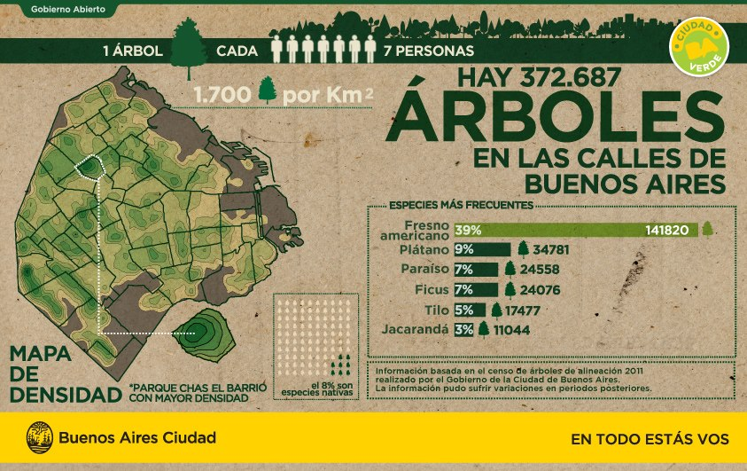

[Contenidos](../Contenidos.md) \| [Anterior (6 Contadores del módulo _collections_)](06_Contadores.md) \| [Próximo (8 Impresión con formato)](08_Formato.md)

# 2.7 Arbolado porteño

En esta sección haremos algunos ejercicios que integran los conceptos aprendidos en las clases anteriores. Vamos a manejar archivos, diccionarios, listas, contadores y el comando `zip`, entre otras cosas. Entregá lo que puedas hacer. 

## Ejercicios

Vamos a repasar las herramientas que vimos en esta clase aplicándolas a una base de datos sobre árboles en parques de la Ciudad de Buenos Aires. Para empezar, descargá el archivo CSV de "[Arbolado en espacios verdes](https://data.buenosaires.gob.ar/dataset/arbolado-espacios-verdes)" en tu carpeta `Data`. Vamos a estudiar esta base de datos y responder algunas preguntas. Guardá los ejercicios de esta sección en un archivo `arboles.py`.

### Descripción de la base

|Título de la columna|Tipo de dato|Descripción|
|:-------------:|:-------------:| ----- |
|long            | Número flotante (float) |Coordenadas para geolocalización |
|lat             | Número flotante (float) |Coordenadas para geolocalización |
|id_arbol            | Número entero (integer) |Identificador único del árbol |
|altura_tot          | Número entero (integer) |Altura del árbol (m)|
|diametro            | Número entero (integer) |Diámetro del árbol (cm) |
|inclinacio          | Número entero (integer) |Inclinación del árbol (grados) |
|id_especie          | Número entero (integer) |Identificador de la especie |
|nombre_com          | Texto (string) |Nombre común del árbol |
|nombre_cie          | Texto (string) |Nombre científico del árbol |
|tipo_folla          | Texto (string) |Tipo de follaje del árbol |
|espacio_ve          | Texto (string) |Nombre del espacio verde |
|ubicacion           | Texto (string) |Dirección del espacio verde |
|nombre_fam          | Texto (string) |Nombre de la familia del árbol |
|nombre_gen          | Texto (string) |Nombre del género del árbol |
|origen              | Texto (string) |Origen del árbol |
|coord_x             | Número flotante (float) |Coordenadas para localización |
|coord_y             | Número flotante (float) |Coordenadas para localización |

### Ejercicio 2.22: Lectura de los árboles de un parque
Definí una función `leer_parque(nombre_archivo, parque)` que abra el archivo indicado y devuelva una **lista de diccionarios** con la información del parque especificado. La función debe devolver, en una lista un diccionario con todos los datos por cada árbol del parque elegido (recordá que cada fila del csv es un árbol).

_Sugerencia: basate en la función `leer_camion()` y usá también el comando `zip` como hiciste en el_ [Ejercicio 2.19](../02_Datos/05_Secuencias.md#ejercicio-219-la-función-zip) _para combinar el encabezado del archivo con los datos de cada fila. Inicialmente no te preocupes por los tipos de datos de cada columna, pero cuando empieces a operar con una columna modifica esta función para que ese dato sea del tipo adecuado para operar._

_Observación: La columna que indica el nombre del parque en el que se encuentra el árbol se llama `'espacio_ve'` en el archivo CSV._

Probá con el parque "GENERAL PAZ" para tener un ejemplo de trabajo, debería darte una lista con 690 árboles.

### Ejercicio 2.23: Determinar las especies en un parque
Escribí una función `especies(lista_arboles)` que tome una lista de árboles como la generada en el ejercicio anterior y devuelva el conjunto de especies (la columna `'nombre_com'` del archivo) que figuran en la lista.

_Sugerencia: Usá el comando `set` como en la [Sección 2.4](../02_Datos/04_Contenedores.md#conjuntos)._

### Ejercicio 2.24: Contar ejemplares por especie
Usando contadores como en el [Ejercicio 2.21](../02_Datos/06_Contadores.md#ejercicio-221-contadores), escribí una función `contar_ejemplares(lista_arboles)` que, dada una lista como la que generada con `leer_parque()`, devuelva un diccionario en el que las especies (recordá, es la columna `'nombre_com'` del archivo) sean las claves y tengan como valores asociados la cantidad de ejemplares en esa especie en la lista dada.

Luego, combiná esta función con `leer_parque()` y con el método `most_common()` para informar las cinco especies más frecuentes en cada uno de los siguientes parques:

- 'GENERAL PAZ'
- 'ANDES, LOS'
- 'CENTENARIO'

**Resultados** de cantidad por especie en tres parques:

General Paz | Los Andes | Centenario
-------------------------|-----------|--------------
Casuarina: 97 |Jacarandá: 117|Plátano: 137
Tipa blanca: 54|Tipa blanca: 28|Jacarandá: 45
Eucalipto: 49|Ciprés: 21|Tipa blanca: 42
Palo borracho rosado: 44 |Palo borracho rosado: 18|Palo borracho rosado: 41
Fenix: 40|Lapacho: 12|Fresno americano: 38

### Ejercicio 2.25: Alturas de una especie en una lista
Escribí una función `obtener_alturas(lista_arboles, especie)` que, dada una lista de árboles como la anterior y una especie de árbol (un valor de la columna `'nombre_com'` del archivo), devuelva una lista con las alturas (columna `'altura_tot'`) de los ejemplares de esa especie en la lista.

_Observación: Acá sí, fijate de devolver las alturas como números (de punto flotante) y no como cadenas de caracteres. Podés hacer esto modificando `leer_parque`_.

Usala para calcular la altura promedio y altura máxima de los 'Jacarandá' en los tres parques mencionados.

**Resultados** de alturas de Jacarandás en tres parques:

Medida | General Paz | Los Andes | Centenario
-------|------------------|-----------|--------------
max  |16.0 |25.0  | 18.0
prom |10.2 |10.54 | 8.96

### Ejercicio 2.26: Inclinación promedio por especie de una lista
Escribí una función `obtener_inclinaciones(lista_arboles, especie)` que, dada una especie de árbol y una lista de árboles como la anterior, devuelva una lista con las inclinaciones (columna `'inclinacio'`) de los ejemplares de esa especie.

### Ejercicio 2.27: Especie con el ejemplar más inclinado
Combinando la función `especies()` con `obtener_inclinaciones()` escribí una función `especimen_mas_inclinado(lista_arboles)` que, dada una lista de árboles devuelva la especie que tiene el ejemplar más inclinado y su inclinación.

Correlo para los tres parques mencionados anteriormente.

**Resultados.** Deberías obtener, por ejemplo, que en el Parque Centenario hay un _Falso Guayabo_ inclinado 80 grados.

### Ejercicio 2.28: Especie con más inclinada en promedio
Volvé a combinar las funciones anteriores para escribir la función `especie_promedio_mas_inclinada(lista_arboles)` que, dada una lista de árboles devuelva la especie que en promedio tiene la mayor inclinación y el promedio calculado..

**Resultados.** Deberías obtener, por ejemplo, que los _Álamos Plateados_ del Parque Los Andes tiene un promedio de inclinación de 25 grados.

**Preguntas extras:** ¿Qué habría que cambiar para obtener la especie con un ejemplar más inclinado de toda la ciudad y no solo de un parque? ¿Podrías dar la latitud y longitud de ese ejemplar? ¿Y dónde se encuentra (lat,lon) el ejemplar más alto? ¿De qué especie es?

[Contenidos](../Contenidos.md) \| [Anterior (6 Contadores del módulo _collections_)](06_Contadores.md) \| [Próximo (8 Impresión con formato)](08_Formato.md)

