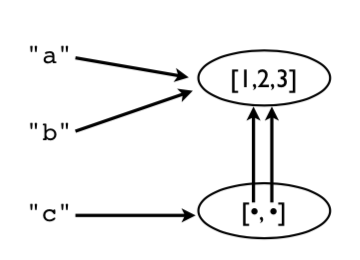

[Contenidos](../Contenidos.md) \| [Anterior (4 Comprensión de listas)](04_Comprension_Listas.md) \| [Próximo (6 Arbolado porteño y comprensión de listas)](06_Arboles2_LC.md)

# 3.5 Objetos


En esta sección introducimos algunos conceptos sobre el modelo de objeto interno de Python y discutimos algunos temas relacionados con el manejo de memoria, copias de variable y verificación de tipos.

### Asignaciones

Muchas operaciones en Python están relacionadas con *asignar* o *guardar* valores.

```python
a = valor         # Asignación a una variable
s[n] = valor      # Asignación a una lista
s.append(valor)   # Agregar a una lista
d['key'] = valor  # Agregar a una diccionario
```

*Ojo: las operaciones de asignación **nunca hacen una copia** del valor asignado.*
Las asignaciones son simplemente copias de las referencias (o copias del puntero, si preferís).

### Ejemplo de asignación

Considerá este fragmento de código.

```python
a = [1,2,3]
b = a
c = [a,b]
```

A continuación te mostramos en un gráfico las operaciones de memoria suyacentes. En este ejemplo, hay solo un objeto lista `[1,2,3]`, pero hay cuatro referencias a él.



Esto significa que al modificar un valor modificamos *todas* las referencias.

```python
>>> a.append(999)
>>> a
[1,2,3,999]
>>> b
[1,2,3,999]
>>> c
[[1,2,3,999], [1,2,3,999]]
>>>
```

Observá cómo un cambio en la lista original desencadena cambios en todas las demás variables (ouch!). Esto es porque no se hizo ninguna copia. Todos son punteros a la misma cosa.

Esto es lo mismo que pasaba en el [Ejercicio 3.5](../03_Listas_y_Listas/02_Bugs.md#ejercicio-35-pisando-memoria).


### Reasignar valores

La reasignación de valores *nunca* sobreescribe la memoria ocupada por un valor anterior.

```python
a = [1,2,3]
b = a
a = [4,5,6]

print(a)      # [4, 5, 6]
print(b)      # [1, 2, 3]    Mantiene el valor original
```

Acordate: **Las variables son nombres, no ubicaciones en la memoria.**

### Peligros

Si no te explican esto, tarde o temprano te trae problemas. Un típico ejemplo es cuando cambiás un dato pensando que es una copia privada y, sin querer, esto corrompe los datos en otra parte del programa.

*Comentario: Esta es una de las razones por las que los tipos de datos primitivos (int,  float, string) son immutables (de sólo lectura).*

### Identidad y referencias

Podés usar el operador `is` (es) para verificar si dos valores corresponden al mismo objeto.

```python
>>> a = [1,2,3]
>>> b = a
>>> a is b
True
>>>
```

`is` compara la identidad del objeto (que está representada por un número entero). Esta identidad también la podés obtener usando `id()`.

```python
>>> id(a)
3588944
>>> id(b)
3588944
>>>
```

Observación: Para ver si dos valores son iguales, es mejor usar el `==`. El comportamiento de `is` puede dar resultados inesperados:

```python
>>> a = [1,2,3]
>>> b = a
>>> c = [1,2,3]
>>> a is b
True
>>> a is c
False
>>> a == c
True
>>>
```

### Copias superficiales

Las listas y diccionarios tienen métodos para hacer copias (no meras referencias, sino duplicados):

```python
>>> a = [2,3,[100,101],4]
>>> b = list(a) # Hacer una copia
>>> a is b
False
```

Ahora `b` es una nueva lista. 

```python
>>> a.append(5)
>>> a
[2, 3, [100, 101], 4, 5]
>>> b
[2, 3, [100, 101], 4]
```

A pesar de esto, los elementos de `a` y de `b` siguen siendo compartidos.

```python
>>> a[2].append(102)
>>> b[2]
[100,101,102]
>>>
>>> a[2] is b[2]
True
>>>
```

En este ejemplo, la lista interna `[100, 101, 102]` es compartida por ambas variables. La copia que hicimos con el comando `b = list(a)` es un *copia superficial* (superficial en el sentido de *poco profunda*, en inglés se dice *shallow copy*).
Mirá este gráfico.


La lista interna sigue siendo compartida.

### Copias profundas

A veces vas a necesitar hacer una copia de un objeto así como de todos los objetos que contenga. Llamamos a esto una *copia pofunda* (*deep copy*). Podés usar la función `deepcopy` del módulo `copy` para esto:

```python
>>> a = [2,3,[100,101],4]
>>> import copy
>>> b = copy.deepcopy(a)
>>> a[2].append(102)
>>> b[2]
[100,101]
>>> a[2] is b[2]
False
>>>
```

### Nombre, valores y tipos

Los nombres de variables no tienen un tipo asociado. Sólo son nombres. Pero los valores sí tienen un tipo subyacente.

```python
>>> a = 42
>>> b = 'Hello World'
>>> type(a)
<type 'int'>
>>> type(b)
<type 'str'>
```

`type()` te dice el tipo del valor.

### Verificación de tipos

Podés verificar si un objeto es una instancia de cierto tipo.

```python
if isinstance(a, list):
    print('a es una lista')
```

O incluso si su tipo está entre varios tipos.

```python
if isinstance(a, (list,tuple)):
    print('a una lista o una tupla')
```

*Cuidado: Demasiadas verificaciones de tipos pueden resultar en un código excesivamente complejo. Típicamente lo usás para evitar errores comunes cometidos por otres usuaries de tu código.*

### Todo es un objeto

Números, cadenas, listas, funciones, excepciones, clases, instancias, etc. son todos objetos. Esto significa que pueden ser nombrados, pueden ser pasados como datos, ubicados en contenedores, etc. sin restricciones. No hay objetos especiales en Python. Todos los objetos viajan en primera clase.

Un ejemplo simple:

```python
>>> import math
>>> items = [abs, math, ValueError ]
>>> items
[<built-in function abs>,
  <module 'math' (builtin)>,
  <type 'exceptions.ValueError'>]
>>> items[0](-45)
45
>>> items[1].sqrt(2)
1.4142135623730951
>>> try:
        x = int('not a number')
    except items[2]:
        print('Failed!')
Failed!
>>>
```

Acá, `items` es una lista que tiene una función, un módulo y una excepción. Sí, éste es un ejemplo raro. Pero es un ejemplo al fin. Podés usar los elementos de la lista en lugar de los nombres originales:

```python
items[0](-45)       # abs
items[1].sqrt(2)    # math
except items[2]:    # ValueError
```

Con un gran poder viene siempre una gran responsabilidad. Que puedas no significa que debas hacer este tipo de cosas.

## Ejercicios

En estos ejercicios mostramos algo de la potencia que tiene el hecho de que todos los objetos sean de la misma jerarquía.

### Ejercicio 3.15: Datos de primera clase
En el archivo `Data/camion.csv`, leímos datos organizados en columnas que se ven así:

```csv
nombre,cajones,precio
"Lima",100,32.20
"Naranja",50,91.10
...
```

En las clases anteriores, usamos el módulo `csv` para leer el archivo, pero tuvimos que hacer conversiones de tipo. Por ejemplo:

```python
for row in rows:
    nombre = row[0]
    cajones = int(row[1])
    precio = float(row[2])
```

Este tipo de conversiones puede hacerse de una manera más inteligente usando algunas operaciones de listas.

Hagamos una lista de Python con los nombres de las funciones de conversión que necesitamos para convertir cada columna al tipo apropiado:

```python
>>> types = [str, int, float]
>>>
```

Podés crear esta lista porque en Python todos los objetos son de la misma clase (de primera clase, digamos). Por lo tanto, si querés tener funciones en una lista, no pasa nada. Los elementos de la lista que creaste son funciones que convierten un valor `x` a un tipo dado (`str(x)`, `int(x)`, `float(x)`).

Ahora, leé una fila de datos del archivo anterior:

```python
>>> import csv
>>> f = open('Data/camion.csv')
>>> rows = csv.reader(f)
>>> headers = next(rows)
>>> row = next(rows)
>>> row
['Lima', '100', '32.20']
>>>
```

Como ya dijimos, con esta fila no podemos hacer operaciones porque los tipos son incorrectos. Por ejemplo:

```python
>>> row[1] * row[2]
Traceback (most recent call last):
  File "<stdin>", line 1, in <module>
TypeError: can't multiply sequence by non-int of type 'str'
>>>
```

Sin embargo, los datos pueden aparearse con los tipos especificados en `types`. Por ejemplo:

```python
>>> types[1]
<type 'int'>
>>> row[1]
'100'
>>>
```

Probá convertir uno de los valores:

```python
>>> types[1](row[1])     # Es equivalente a int(row[1])
100
>>>
```

Probá con otro:

```python
>>> types[2](row[2])     # Equivalente a float(row[2])
32.2
>>>
```

Probá calcular usando los tipos convertidos:

```python
>>> types[1](row[1])*types[2](row[2])
3220.0000000000005
>>>
```

Hagamos un Zip de la lista de tipos con la de datos y veamos el resultado:

```python
>>> r = list(zip(types, row))
>>> r
[(<type 'str'>, 'Lima'), (<type 'int'>, '100'), (<type 'float'>,'32.20')]
>>>
```

Se puede ver que esto aparea una función de conversión de tipos con un valor. Por ejemplo, `int` está en un par con el valor `'100'`.

Esta lista zipeada es útil si querés realizar conversiones de todos los valores. Por ejemplo:

```python
>>> converted = []
>>> for func, val in zip(types, row):
          converted.append(func(val))
...
>>> converted
['Lima', 100, 32.2]
>>> converted[1] * converted[2]
3220.0000000000005
>>>
```

Asegurate de entender lo que está pasando en el código de arriba. En el ciclo la variable `func` va tomando los valores de las funciones de conversión de tipos (`str`, `int`, `float`) y la variable `val` va tomando los valores de los datos en la fila: `'Lima'`, `'100'`, `'32.2'`.  La expresión `func(val)` convierte los tipos de cada dato.

El código de arriba puede comprimirse en una sola instrucción usando comprensión de listas.

```python
>>> converted = [func(val) for func, val in zip(types, row)]
>>> converted
['Lima', 100, 32.2]
>>>
```

### Ejercicio 3.16: Diccionarios
¿Te acordás que la función `dict()` te permite hacer fácilmente un diccionario si tenés una secuencia de tuplas con claves y valores? Hagamos un diccionario usando el encabezado de las columnas:

```python
>>> headers
['nombre', 'cajones', 'precio']
>>> converted
['Lima', 100, 32.2]
>>> dict(zip(headers, converted))
{'precio': 32.2, 'nombre': 'Lima', 'cajones': 100}
>>>
```

Si estás en sintonía con la comprensión de listas podés escribir una sola línea usando comprensión de diccionarios:

```python
>>> { name: func(val) for name, func, val in zip(headers, types, row) }
{'precio': 32.2, 'name': 'Lima', 'cajones': 100}
>>>
```

### Ejercicio 3.17: Fijando ideas
Usando las técnicas de este ejercicio, vas a poder escribir instrucciones que conviertan fácilmente campos como los de nuestro archivo en un diccionario de Python.

Para ilustrar esto, supongamos que leés un archivo de datos de la siguiente forma:

```python
>>> f = open('Data/dowstocks.csv')
>>> rows = csv.reader(f)
>>> headers = next(rows)
>>> row = next(rows)
>>> headers
['name', 'price', 'date', 'time', 'change', 'open', 'high', 'low', 'volume']
>>> row
['AA', '39.48', '6/11/2007', '9:36am', '-0.18', '39.67', '39.69', '39.45', '181800']
>>>
```

Convirtamos estos datos usando un truco similar:

```python
>>> types = [str, float, str, str, float, float, float, float, int]
>>> converted = [func(val) for func, val in zip(types, row)]
>>> record = dict(zip(headers, converted))
>>> record
{'volume': 181800, 'name': 'AA', 'price': 39.48, 'high': 39.69,
'low': 39.45, 'time': '9:36am', 'date': '6/11/2007', 'open': 39.67,
'change': -0.18}
>>> record['name']
'AA'
>>> record['price']
39.48
>>>
```

Bonus: ¿Cómo modificarías este ejemplo para transformar la fecha (`date`) en una tupla como `(6, 11, 2007)`?

Es importante que entiendas lo que hicimos en este ejercicio. Volveremos sobre esto más adelante.

[Contenidos](../Contenidos.md) \| [Anterior (4 Comprensión de listas)](04_Comprension_Listas.md) \| [Próximo (6 Arbolado porteño y comprensión de listas)](06_Arboles2_LC.md)

