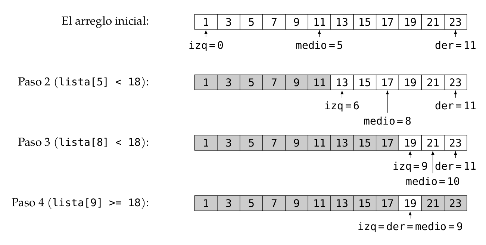

[Contenidos](../Contenidos.md) \| [Anterior (3 Módulos)](03_Modulos.md) \| [Próximo (5 Complejidad de algoritmos)](05_Complejidad.md)

# 5.4 Búsqueda binaria

Hace un par de clases vimos la búsqueda secuencial de un elemento en una lista.
Si la lista está previamente ordenada,
¿podemos encontrar una manera más eficiente de buscar elementos sobre ella?


## Búsqueda sobre listas ordenadas

Si la lista está ordenada, hay una modificación muy simple que podemos hacer sobre el algoritmo de búsqueda lineal: si estamos buscando el elemento `e` en una lista que está ordenada de menor a mayor, en cuanto encontremos algún elemento mayor a `e` podemos estar seguros de que `e` no está en la lista, por lo que no es necesario continuar recorriendo el resto.

### Ejercicio 5.10: Búsqueda lineal sobre listas ordenadas.

Modificá la función `busqueda_lineal(lista, e)`  de la [Sección 3.3](../03_Listas_y_Listas/03_IteradoresLista.md#búsqueda-lineal) para el caso de listas ordenadas, de forma que la función pare cuando encuentre un elemento mayor a `e`. Llamá a tu nueva función `busqueda_lineal_lordenada(lista,e)` y guardala en el archivo `busqueda_en_listas.py`.

En el peor caso, ¿cuál es nuestra nueva hipótesis sobre comportamiento del
algoritmo? ¿Es realmente más eficiente?

### Búsqueda binaria

¿Podemos hacer algo mejor? Trataremos de aprovechar el hecho de que la lista
está ordenada y vamos a hacer algo distinto: nuestro espacio de búsqueda se
irá achicando a segmentos cada vez menores de la lista original.
La idea es descartar segmentos de la lista donde el valor seguro que no puede
estar:

* Consideramos como segmento inicial de búsqueda a la lista completa.

* Analizamos el punto medio del segmento (el valor central); si es el valor
buscado, devolvemos el índice del punto medio.

* Si el valor central es mayor al buscado, podemos descartar el segmento
que está desde el punto medio hacia la derecha.

* Si el valor central es menor al buscado, podemos descartar el segmento
que está desde el punto medio hacia la izquierda.

* Una vez descartado el segmento que no nos interesa, volvemos a analizar
el segmento restante, de la misma forma.

* Si en algún momento el segmento a analizar tiene longitud 0
significa que el valor buscado no se encuentra en la lista.


Para señalar la porción del segmento que se está analizando a cada paso,
utilizaremos dos variables (`izq` y `der`) que
contienen la posición de inicio y la posición de fin del segmento que se
está considerando. De la misma manera usaremos la varible `medio`
para contener la posición del punto medio del segmento.

A continuación ilustramos qué pasa cuando se busca
el valor 18 en la lista `[1, 3, 5, 7, 9, 11, 13, 15, 17, 19, 21, 23]`.


Ejemplo de una búsqueda usando el algoritmo de búsqueda binaria.
Como no se encontró al valor buscado, devuelve -1.


El siguiente fragmento de código muestra una implementación de
este algoritmo, incluyendo una instrucción de depuración (debug) con `print` para verificar su funcionamiento.

```python
def busqueda_binaria(lista, x, verbose = False):
    '''Búsqueda binaria
    Precondición: la lista está ordenada
    Devuelve -1 si x no está en lista;
    Devuelve p tal que lista[p] == x, si x está en lista
    '''
    if verbose:
        print(f'[DEBUG] izq |der |medio')
    pos = -1 # Inicializo respuesta, el valor no fue encontrado
    izq = 0
    der = len(lista) - 1
    while izq <= der:
        medio = (izq + der) // 2
        if verbose:
            print(f'[DEBUG] {izq:3d} |{der:>3d} |{medio:3d}')
        if lista[medio] == x:
            pos = medio     # elemento encontrado!
        if lista[medio] > x:
            der = medio - 1 # descarto mitad derecha
        else:               # if lista[medio] < x:
            izq = medio + 1 # descarto mitad izquierda
    return pos
```


A continuación varias ejecuciones de prueba:

```python
>>> busqueda_binaria([1, 3, 5], 0, verbose = True)
[DEBUG] izq |der |medio
[DEBUG]   0 |  2 |  1
[DEBUG]   0 |  0 |  0
-1
>>> busqueda_binaria([1, 3, 5], 1, verbose = True)
[DEBUG] izq |der |medio
[DEBUG]   0 |  2 |  1
[DEBUG]   0 |  0 |  0
0
>>> busqueda_binaria([1, 3, 5], 2, verbose = True)
[DEBUG] izq |der |medio
[DEBUG]   0 |  2 |  1
[DEBUG]   0 |  0 |  0
-1
>>> busqueda_binaria([1, 3, 5], 3, verbose = True)
[DEBUG] izq |der |medio
[DEBUG]   0 |  2 |  1
[DEBUG]   2 |  2 |  2
1
>>> busqueda_binaria([1, 3, 5], 5, verbose = True)
[DEBUG] izq |der |medio
[DEBUG]   0 |  2 |  1
[DEBUG]   2 |  2 |  2
2
>>> busqueda_binaria([1, 3, 5], 6, verbose = True)
[DEBUG] izq |der |medio
[DEBUG]   0 |  2 |  1
[DEBUG]   2 |  2 |  2
-1
>>> busqueda_binaria([], 0, verbose = True)
[DEBUG] izq |der |medio
-1
>>> busqueda_binaria([1], 1, verbose = True)
[DEBUG] izq |der |medio
[DEBUG]   0 |  0 |  0
0
>>> busqueda_binaria([1], 3, verbose = True)
[DEBUG] izq |der |medio
[DEBUG]   0 |  0 |  0
-1
>>> busqueda_binaria([1, 3, 5, 7, 9, 11, 13, 15, 17, 19, 21, 23],18, verbose = True)
[DEBUG] izq |der |medio
[DEBUG]   0 | 11 |  5
[DEBUG]   6 | 11 |  8
[DEBUG]   9 | 11 | 10
[DEBUG]   9 |  9 |  9
-1
```

**Pregunta**: En la línea `medio = (izq + der) // 2` efectuamos la división usando el operador `//` en lugar de `/`. ¿Qué pasaría su usáramos `/`?
    
### ¿Cuántas comparaciones hace este programa?

Para responder esto pensemos en el peor caso, es decir, que se descartaron
varias veces partes del segmento para finalmente llegar a un segmento vacío y
el valor buscado se encontró en este último paso o directamente no se encontraba en la lista.

En cada paso el segmento se divide por la mitad y se desecha una de esas
mitades, y en cada paso se hace una comparación con el valor buscado. Por lo
tanto, la cantidad de comparaciones que hacen con el valor buscado es
aproximadamente igual a la cantidad de pasos necesarios para llegar a un
segmento de tamaño 1.
Veamos el caso más sencillo para razonar, y supongamos que la longitud de la
lista es una potencia de 2, digamos `len(lista)`*= 2^k*:

1. Antes del primer paso, el segmento a tratar es de tamaño *2^k*.
2. Antes del segundo paso, el segmento a tratar es de tamaño *2^(k-1)*.
3. Antes del tercer paso, el segmento a tratar es de tamaño *2^(k-2)*.
...
4. Antes del paso *k*, el segmento a tratar es de tamaño *2^(k-k)=2^0=1*.


Por lo tanto este programa hace a lo sumo (en el peor caso) *k* comparaciones con el valor buscado cuando `len(lista)`*= 2^k*.
Pero si despejamos *k* de la ecuación anterior, podemos ver que este programa
realiza aproximadamente `log2(len(lista))` comparaciones.

Cuando `len(lista)` no es una potencia de 2 el razonamiento es menos
prolijo, pero también vale que este programa realiza aproximadamente
`log2(len(lista))` comparaciones. Concluimos entonces que:

### Comparación entre ambos métodos

Veamos un ejemplo para entender cuánto más eficiente es la búsqueda binaria.
Supongamos que tenemos una lista con un millón de elementos.

1. El algoritmo de búsqueda lineal hará una cantidad de operaciones proporcional a un millón; es decir que en el peor caso hará 1,000,000 comparaciones, y en un caso promedio, 500,000 comparaciones.
2. El algoritmo de búsqueda binaria hará como máximo *log2(1,000,000)*
comparaciones, o sea ¡no más que 20 comparaciones!.

*Conclusión*: Si una lista está previamente ordenada, podemos utilizar el
algoritmo de búsqueda binaria, cuyo comportamiento es proporcional al
*logaritmo* de la cantidad de elementos de la lista, y por lo tanto
muchísimo más eficiente que la búsqueda lineal, espcialmente si la lista es larga.

### Ejercicio 5.11: Búsqueda binaria
Modificando la función `busqueda_binaria(lista, x)` adecuadamente, definí una función `donde_insertar(lista, x)` de forma que reciba una lista ordenada y un elemento y devuelva la posición de ese elemento en la lista (si se encuentra en la lista) o la posición donde se podría insertar el elemento para que la lista permanezca ordenada (si no está en la lista).

Por ejemplo: el elemento `3` podría insertarse en la posición 2 en la lista `[0,2,4,6]` para mantenerla ordenada. Por lo tanto, el llamado `donde_insertar([0,2,4,6], 3)` deberá devolver `2`, al igual que el llamado `donde_insertar([0,2,4,6], 4)`.

Guarda tu modificación en un archivo `bbin.py`.


[Contenidos](../Contenidos.md) \| [Anterior (3 Módulos)](03_Modulos.md) \| [Próximo (5 Complejidad de algoritmos)](05_Complejidad.md)

