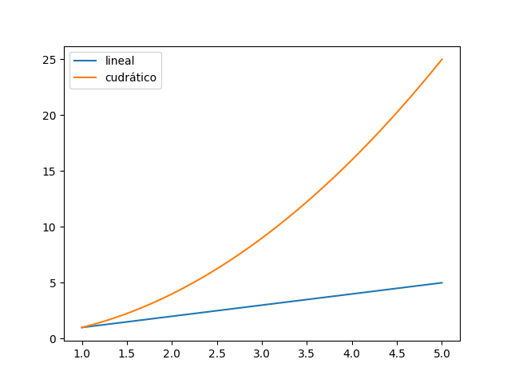

[Contenidos](../Contenidos.md) \| [Anterior (4 Búsqueda binaria)](04_BusqBinaria.md) \| [Próximo (6 Gráficos de complejidad)](06_gráficos_de_complejidad.md)

# 5.5 Complejidad de algoritmos

### Resumen de algoritmos de Búsqueda

1. La búsqueda de un elemento en una secuencia es un
algoritmo básico pero importante. El problema que intenta resolver puede
plantearse de la siguiente manera: Dada una secuencia de valores y un
valor, devolver el índice del valor en la secuencia, si se encuentra, de no
encontrarse el valor en la secuencia señalarlo apropiadamente.

2. Una de las formas de resolver el problema es mediante la **búsqueda lineal**, que consiste en ir revisando uno a uno los elementos de
la secuencia y comparándolos con el elemento a buscar.  Este algoritmo no
requiere que la secuencia se encuentre ordenada, la cantidad de comparaciones
que realiza es proporcional a `len(secuencia)`.

3. Cuando la secuencia sobre la que se quiere buscar está ordenada, se
puede utilizar el algoritmo de **búsqueda binaria**.  Al estar ordenada
la secuencia, se puede desacartar en cada paso la mitad de los elementos,
quedando entonces con una eficiencia algorítmica proporcional a
`log2(len(secuencia))`.

El análisis del comportamiento de un algoritmo puede ser muy engañoso
si se tiene en cuenta el mejor caso, por eso suele ser mucho más
ilustrativo tener en cuenta el **peor caso**.  En algunos casos
particulares podrá ser útil tener en cuenta, además, el **caso promedio**.

## Complejidad de algoritmos

En las ciencias de la computación, el análisis de algoritmos es el proceso que permite determinar  la complejidad de un algoritmo. Esta complejidad está típicamente medida en unidades de tiempo, o, análogamente, en la cantidad de operaciones que realiza el procesador antes de dar la respuesta. Esto permite comparar la eficiencia de diferentes algoritmos. Optimizar la eficiencia de los algoritmos es central en la tarea de un buen programador. Un algoritmo
ineficiente puede no servir para nada. Esto es obvio en algoritmos que corren en tiempo real (imaginemos un algoritmo que conduce un vehículo y tarda demasiado en detectar a un peatón), pero también es importante en otros algoritmos. 

Escribir programas eficientes no es una tarea sencilla. Muchas veces, las soluciones más directas no son las más eficientes. Los algoritmos más eficientes suelen aprovechar sutilezas que no son simples de comprender de un vistazo. En muchos casos los programadores deben incrementar la complejidad conceptual de un algoritmo para disminuír la complejidad computacional.

Por ejemplo, buscar la posición de un número en una lista clave recorriendo la lista lugar a lugar (búsqueda secuencial) demanda una canatidad de operaciones proporcional a la longitud de la lista (por cada elemento de la lista hacemos algunas operaciones fijas: comparar el elemento contra la clave, incrementar un contador, etc). Solemos decir que el algoritmo de búsqueda secuencial tiene un complejidad lineal en la longitud de la lista (ya que toma un tiempo `f(n)`, donde `f` es una función lineal en n, la cantidad de elementos de la lista). No vamos a preocuparnos aquí si `f (n) = 3 · n + 5` ó `f (n) = 2 · n + 18`. No nos importan las constantes: simplemente diremos que f (n) es lineal en n. En la literatura esto se escribe `f(n) = O(n)` y see lee *'la función f tiene orden n'*, o *'f es un O de n'*.




En cambio, la búsqueda binaria que vimos anteriormente, si bien es conceptualmente más compleja, resulta mucho más eficiente. Dada una clave y una lista ordenada, este algoritmo aprovecha el orden de la lista para no tener que comparar la clave con todos los elementos. En un primer paso compara con el elemento central de la lista y descarta toda una mitad de la lista realizando una sola comparación. No es obvio cómo calcular la complejidad de este método, pero explicamos que si la lista tiene longitud n = 2^k, el
algoritmo de búsqueda binaria realiza a lo sumo log2(n) + 1 = k + 1 comparaciones antes de dar la respuesta (hacé un ejemplo con n = 2^3 = 8 o n = 2^4 = 16 para convencerte). En general, procediendo de esta forma el algoritmo encuentra la posición de la clave en `O(log2(n))` pasos. Decimos en este caso que el algoritmo requiere tiempo logarítmico.

Comparando la funcion `f(n) = n` con `g(n) = log2(n)` para valores grandes de n resulta claro que la búsqueda binaria es mucho más eficiente que la búsqueda secuencial para listas ordendas. En la próxima sección te vamos a proponer que hagas esta comparación gráficamente.

### Un algoritmo cuadrático

Para dar un último ejemplo, supongamos que dada una lista de numeros (de longitud n) y un valor m queremos ver si m = p · q con p y q en la lista dada. Consideremos el siguiente algoritmo:
```python
for p in lista :
    for q in lista :
        if m == p * q :
            print ( " %d= %d* %d " %(m, p , q ) )
```
Este algoritmo realiza una comparación ( `m == p*q` ) para cada elemento p y cada elemento q de la lista. Es decir, realiza `n*n = n^2` comparaciones. Es un algoritmo cuadrático. Su complejidad es O(n^2). 

### Complejidad en el peor caso

El término análisis de algoritmos fue acuñado por Donald Knuth, uno de los fundadores de las ciencias de la computación. El análisis de algoritmos es una parte de la teoría de la complejidad computacional que no solo estudia la complejidad de los algoritmos sino de los problemas computacionales (la pregunta general de la teoría de la complejidad no sería cuál es la complejidad de la búsqueda secuencial o binaria, sino cuál es la complejidad mínima que puede tener un algoritmo que realice la tarea de buscar un elemento
en una lista ordenada). En general, y sin mencionarlo, hablamos de la complejidad en el peor caso de un algoritmo. En algunos casos puede ocurrir que la búsqueda secuencial sea más eficiente que la búsqueda binaria (por ejemplo, considerá el caso en que el elemento buscado es justo el primer elemento de la lista, ¿cuánto tarda cada método?). Al hablar de la complejidad de una algoritmo (salvo que se mencione otra cosa) hablamos del tiempo que tarda ese algoritmo en el peor caso posible.

### Estructuras de datos y Tipos Abstractos de Datos

El diseño de un algoritmo eficiente para resolver un problema requiere comprender profundamente los datos que este algoritmo manipulará para poder diseñar adecuadamente las estructuras de datos que los contendrán. El diseño de algoritmos eficientes requiere del diseño simultáneo de algoritmos y estructuras de datos adecuadas. Diferentes estructuras de datos son adecuadas para diferentes tipos de aplicaciones y algunas estructuras están diseñadas especialmente para un problema concreto. Una estructura de datos eficiente puede ser la clave para el diseño de un algoritmo eficiente.

La estructura lógica de las estructuras de datos se llaman Tipos Abstractos de Datos (TAD). Estos TAD son el modelo matemático de las estructuras de datos. Un TAD es una abstracción del tipo de datos: define su comportamiento desde el punto de vista de le usuarie pero no dice cómo lo hace, no se mete en la implementación. Una estructura de datos concreta surge idealemente de la  implementación de un TAD.

## Ejercicios:

### Ejercicio 5.12: Insertar un elemento en una lista
Uno de los problemas de la búsqueda binaria es que requiere que la lista esté ordenada. Si la lista se encuentra ordenada podemos mantener el orden evitando adjuntar nuevos elementos de forma desordenada.

Usando lo que hiciste en el [Ejercicio 5.11](../05_Organización_y_Complejidad/04_BusqBinaria.md#ejercicio-511-búsqueda-binaria), agregale al archivo `bbin.py` una función `insertar(lista, x)` que reciba una lista ordenada y un elemento. Si el elemento se encuentra en la lista solamente devuelve su posición; si no se encuentra en la lista, lo inserta en la posición correcta para mantener el orden. En este segundo caso, también debe devolver su posición.

### Ejercicio 5.13: Cálcular la complejidad de dos resoluciones de `propagar`
Ahora que tenés algunas herramientas teóricas más, volvé a leer las dos versiones de `propagar` del [Ejercicio 4.3](../04_Random_Plt_Dbg/01_Debugger.md#ejercicio-43-propagar-por-vecinos) y el [Ejercicio 4.4](../04_Random_Plt_Dbg/01_Debugger.md#ejercicio-44-propagar-por-como-el-auto-fantástico) y compará sus complejidades.

### Secuencias binarias

Para nosotres, una **secuencia binaria** es una lista que contiene solo 0’s y 1’s. Por ejemplo `s = [0, 1, 0, 0, 1]` es una secuencia binaria de longitud 5. La *primera* secuencia binaria de esa longitud es `[0, 0, 0, 0, 0]`, mientras que *la última* es `[1, 1, 1, 1, 1]`. Cada secuencia tiene una *siguiente* (salvo la última). No vamos a dar una definición precisa, pero escencialmente las secuencias pueden pensarse como representando números enteros en base dos y *la siguiente* secuencia es la que representa al siguiente número. Por convención, diremos que la secuencia siguiente de la última es la primera.

Ejemplos:
```
[0, 0, 0, 0, 0]   ->   [0, 0, 0, 0, 1]
[0, 0, 1, 1, 0]   ->   [0, 0, 1, 1, 1]
[0, 0, 1, 1, 1]   ->   [0, 1, 0, 0, 0]
[1, 1, 1, 1, 1]   ->   [0, 0, 0, 0, 0]
```

La función `incrementar(s)` calcula la secuencia siguiente de una secuencia dada:
```python
def incrementar(s):
    carry = 1
    l = len(s)
    
    for i in range(l-1,-1,-1):
        if (s[i] == 1 and carry == 1):
            s[i] = 0
            carry = 1
        else:
            s[i] = s[i] + carry
            carry = 0
    return s
```

### Ejercicio 5.14: Complejidad de `incrementar()`
Si tomamos `n = len(s)` podemos tratar de medir la complejidad de la función `incrementar()` en términos de la longitud `n` de la secuencia. ¿Te parece que `incrementar()` es una función lineal, cuadrática, logarítmica o exponencial? ¿Por qué?

### Ejercicio 5.15: Un ejemplo más complejo
Por último, escribí una funcion `listar_secuencias(n)` que devuelva una lista con  **todas** las secuencias binarias de longitud `n` comenzando con la primera (`[0]*n`) y usando en cada paso la función `incrementar()` definida más arriba. ¿Cuántas listas hay de longitud `n`? ¿Y de longitud `n+1`?

¿Podés correr `listar_secuencias(15)`? ¿Y `listar_secuencias(20)`? ¿Hasta cúanto llegas a correr en un tiempo razonable? 

¿Te parece que `listar_secuencias(n)` es una función lineal, cuadrática, logarítmica o exponencial en `n`? ¿Por qué?


[Contenidos](../Contenidos.md) \| [Anterior (4 Búsqueda binaria)](04_BusqBinaria.md) \| [Próximo (6 Gráficos de complejidad)](06_gráficos_de_complejidad.md)

