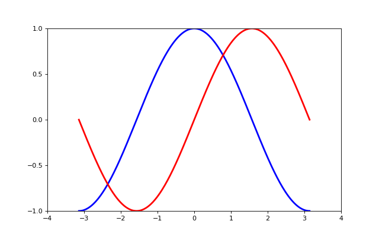
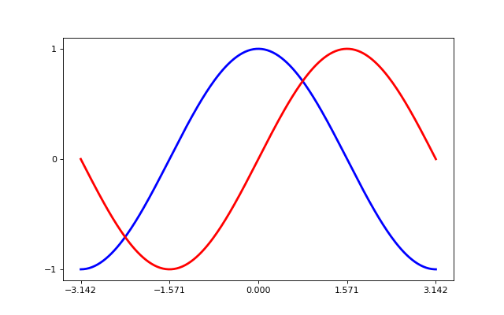
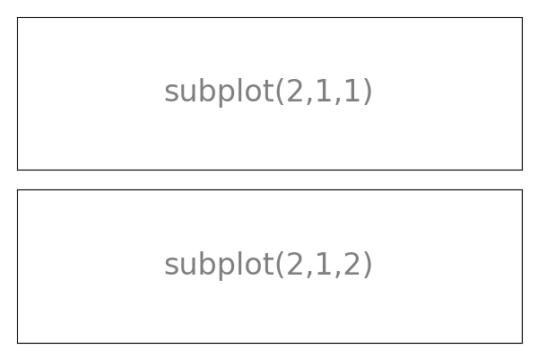

[Contenidos](../Contenidos.md) \| [Anterior (3 Documentación y estilo**)](03_Documentar_y_Estilo.md) \| [Próximo (5 Gráficos del azar***)](05_gráficos_del_azar.md)

# 6.4 Matplotlib básico

plots de lineas, una intro completa a traducir:
[esto](https://scipy-lectures.org/intro/matplotlib/index.html)

##  Matplotlib: plotting

##  Introduction
 Matplotlib is probably the most used Python package for 2D-graphics. It provides both a quick way to visualize data from Python and publication-quality figures in many formats. We are going to explore matplotlib in interactive mode covering most common cases.


##  pyplot
 pyplot provides a procedural interface to the matplotlib object-oriented plotting library. It is modeled closely after Matlab™. Therefore, the majority of plotting commands in pyplot have Matlab™ analogs with similar arguments. Important commands are explained with interactive examples.

```python
from matplotlib import pyplot as plt
```


## Simple plot
 In this section, we want to draw the cosine and sine functions on the same plot. Starting from the default settings, we’ll enrich the figure step by step to make it nicer.
First step is to get the data for the sine and cosine functions:

```python
import numpy as np

X = np.linspace(-np.pi, np.pi, 256)
C, S = np.cos(X), np.sin(X)
```

X is now a numpy array with 256 values ranging from -π to +π (included). C is the cosine (256 values) and S is the sine (256 values).

### 1.5.2.1. Plotting with default settings


 Matplotlib comes with a set of default settings that allow customizing all kinds of properties. You can control the defaults of almost every property in matplotlib: figure size and dpi, line width, color and style, axes, axis and grid properties, text and font properties and so on.

```python
import numpy as np
import matplotlib.pyplot as plt

X = np.linspace(-np.pi, np.pi, 256)
C, S = np.cos(X), np.sin(X)

plt.plot(X, C)
plt.plot(X, S)

plt.show()
```

### 1.5.2.2. Instantiating defaults


In the script below, we’ve instantiated (and commented) all the figure settings that influence the appearance of the plot.

 The settings have been explicitly set to their default values, but now you can interactively play with the values to explore their affect (see Line properties and Line styles below).

```python
import numpy as np
import matplotlib.pyplot as plt

# Create a figure of size 8x6 inches, 80 dots per inch
plt.figure(figsize=(8, 6), dpi=80)

# Create a new subplot from a grid of 1x1
plt.subplot(1, 1, 1)

X = np.linspace(-np.pi, np.pi, 256)
C, S = np.cos(X), np.sin(X)

# Plot cosine with a blue continuous line of width 1 (pixels)
plt.plot(X, C, color="blue", linewidth=1.0, linestyle="-")

# Plot sine with a green continuous line of width 1 (pixels)
plt.plot(X, S, color="green", linewidth=1.0, linestyle="-")

# Set x limits
plt.xlim(-4.0, 4.0)

# Set x ticks
plt.xticks(np.linspace(-4, 4, 9))

# Set y limits
plt.ylim(-1.0, 1.0)

# Set y ticks
plt.yticks(np.linspace(-1, 1, 5))

# Save figure using 72 dots per inch
# plt.savefig("exercise_2.png)", dpi=72)

# Show result on screen
plt.show()
```

### 1.5.2.3. Changing colors and line widths


 First step, we want to have the cosine in blue and the sine in red and a slighty thicker line for both of them. We’ll also slightly alter the figure size to make it more horizontal.

```python
...
plt.figure(figsize=(10, 6), dpi=80)
plt.plot(X, C, color="blue", linewidth=2.5, linestyle="-")
plt.plot(X, S, color="red",  linewidth=2.5, linestyle="-")
...
```

### 1.5.2.4. Setting limits


 Current limits of the figure are a bit too tight and we want to make some space in order to clearly see all data points.

```python
...
plt.xlim(X.min() * 1.1, X.max() * 1.1)
plt.ylim(C.min() * 1.1, C.max() * 1.1)
...
```

### 1.5.2.5. Setting ticks


 Current ticks are not ideal because they do not show the interesting values (+/-π,+/-π/2) for sine and cosine. We’ll change them such that they show only these values.

```python
...
plt.xticks([-np.pi, -np.pi/2, 0, np.pi/2, np.pi])
plt.yticks([-1, 0, +1])
...
```

### 1.5.2.6. Setting tick labels


 Ticks are now properly placed but their label is not very explicit. We could guess that 3.142 is π but it would be better to make it explicit. When we set tick values, we can also provide a corresponding label in the second argument list. Note that we’ll use latex to allow for nice rendering of the label.

```python
...
plt.xticks([-np.pi, -np.pi/2, 0, np.pi/2, np.pi],
          [r'$-\pi$', r'$-\pi/2$', r'$0$', r'$+\pi/2$', r'$+\pi$'])

plt.yticks([-1, 0, +1],
          [r'$-1$', r'$0$', r'$+1$'])
...
```

### 1.5.2.7. Moving spines


 Spines are the lines connecting the axis tick marks and noting the boundaries of the data area. They can be placed at arbitrary positions and until now, they were on the border of the axis. We’ll change that since we want to have them in the middle. Since there are four of them (top/bottom/left/right), we’ll discard the top and right by setting their color to none and we’ll move the bottom and left ones to coordinate 0 in data space coordinates.

```python
...
ax = plt.gca()  # gca stands for 'get current axis'
ax.spines['right'].set_color('none')
ax.spines['top'].set_color('none')
ax.xaxis.set_ticks_position('bottom')
ax.spines['bottom'].set_position(('data',0))
ax.yaxis.set_ticks_position('left')
ax.spines['left'].set_position(('data',0))
...
```

### 1.5.2.8. Adding a legend


 Let’s add a legend in the upper left corner. This only requires adding the keyword argument label (that will be used in the legend box) to the plot commands.

```python
...
plt.plot(X, C, color="blue", linewidth=2.5, linestyle="-", label="cosine")
plt.plot(X, S, color="red",  linewidth=2.5, linestyle="-", label="sine")

plt.legend(loc='upper left')
...
```

### 1.5.2.9. Annotate some points


 Let’s annotate some interesting points using the annotate command. We chose the 2π/3 value and we want to annotate both the sine and the cosine. We’ll first draw a marker on the curve as well as a straight dotted line. Then, we’ll use the annotate command to display some text with an arrow.

```python
...

t = 2 * np.pi / 3
plt.plot([t, t], [0, np.cos(t)], color='blue', linewidth=2.5, linestyle="--")
plt.scatter([t, ], [np.cos(t), ], 50, color='blue')

plt.annotate(r'$cos(\frac{2\pi}{3})=-\frac{1}{2}$',
             xy=(t, np.cos(t)), xycoords='data',
             xytext=(-90, -50), textcoords='offset points', fontsize=16,
             arrowprops=dict(arrowstyle="->", connectionstyle="arc3,rad=.2"))

plt.plot([t, t],[0, np.sin(t)], color='red', linewidth=2.5, linestyle="--")
plt.scatter([t, ],[np.sin(t), ], 50, color='red')

plt.annotate(r'$sin(\frac{2\pi}{3})=\frac{\sqrt{3}}{2}$',
             xy=(t, np.sin(t)), xycoords='data',
             xytext=(+10, +30), textcoords='offset points', fontsize=16,
             arrowprops=dict(arrowstyle="->", connectionstyle="arc3,rad=.2"))
...
```

### 1.5.2.10. Devil is in the details


 The tick labels are now hardly visible because of the blue and red lines. We can make them bigger and we can also adjust their properties such that they’ll be rendered on a semi-transparent white background. This will allow us to see both the data and the labels.

```python
...
for label in ax.get_xticklabels() + ax.get_yticklabels():
    label.set_fontsize(16)
    label.set_bbox(dict(facecolor='white', edgecolor='None', alpha=0.65))
...
```

## 1.5.3. Figures, Subplots, Axes and Ticks

A “figure” in matplotlib means the whole window in the user interface. Within this figure there can be “subplots”.

 So far we have used implicit figure and axes creation. This is handy for fast plots. We can have more control over the display using figure, subplot, and axes explicitly. While subplot positions the plots in a regular grid, axes allows free placement within the figure. Both can be useful depending on your intention. We’ve already worked with figures and subplots without explicitly calling them. When we call plot, matplotlib calls gca() to get the current axes and gca in turn calls gcf() to get the current figure. If there is none it calls figure() to make one, strictly speaking, to make a subplot(111). Let’s look at the details.

### 1.5.3.1. Figures
 A figure is the windows in the GUI that has “Figure #” as title. Figures are numbered starting from 1 as opposed to the normal Python way starting from 0. This is clearly MATLAB-style. There are several parameters that determine what the figure looks like:


Argument | Default  | Description
--- | --- | ---
num | 1 |  number of figure
figsize |figure.figsize | figure size in inches (width, height)
dpi | figure.dpi | resolution in dots per inch
facecolor |  figure.facecolor  |  color of the drawing background
edgecolor |  figure.edgecolor  |  color of edge around the drawing background
frameon | True |   draw figure frame or not

As with other objects, you can set figure properties also setp or with the set_something methods.

When you work with the GUI you can close a figure by clicking on the x in the upper right corner. But you can close a figure programmatically by calling close. Depending on the argument it closes (1) the current figure (no argument), (2) a specific figure (figure number or figure instance as argument), or (3) all figures ("all" as argument).

```python
plt.close(1)     # Closes figure 1
```

### 1.5.3.2. Subplots
 With subplot you can arrange plots in a regular grid. You need to specify the number of rows and columns and the number of the plot. Note that the gridspec command is a more powerful alternative.



### 1.5.3.3. Axes
Axes are very similar to subplots but allow placement of plots at any location in the figure. So if we want to put a smaller plot inside a bigger one we do so with axes.


### 1.5.4.2. Scatter Plots


Starting from the code below, try to reproduce the graphic taking care of marker size, color and transparency.

Hint Color is given by angle of (X,Y).
```python
n = 1024
X = np.random.normal(0,1,n)
Y = np.random.normal(0,1,n)
plt.scatter(X,Y)
```

Click on figure for solution.

### 1.5.4.3. Bar Plots


Starting from the code below, try to reproduce the graphic by adding labels for red bars.

Hint You need to take care of text alignment.
```python
n = 12
X = np.arange(n)
Y1 = (1 - X / float(n)) * np.random.uniform(0.5, 1.0, n)
Y2 = (1 - X / float(n)) * np.random.uniform(0.5, 1.0, n)

plt.bar(X, +Y1, facecolor='#9999ff', edgecolor='white')
plt.bar(X, -Y2, facecolor='#ff9999', edgecolor='white')

for x, y in zip(X, Y1):
    plt.text(x + 0.4, y + 0.05, '%.2f' % y, ha='center', va='bottom')

plt.ylim(-1.25, +1.25)
```

Click on figure for solution.


### 1.5.4.9. Multi Plots


Starting from the code below, try to reproduce the graphic.

Hint You can use several subplots with different partition.
```python
plt.subplot(2, 2, 1)
plt.subplot(2, 2, 3)
plt.subplot(2, 2, 4)
```

Click on figure for solution.

### 1.5.4.10. Polar Axis


Hint You only need to modify the axes line
Starting from the code below, try to reproduce the graphic.

```python
plt.axes([0, 0, 1, 1])

N = 20
theta = np.arange(0., 2 * np.pi, 2 * np.pi / N)
radii = 10 * np.random.rand(N)
width = np.pi / 4 * np.random.rand(N)
bars = plt.bar(theta, radii, width=width, bottom=0.0)

for r, bar in zip(radii, bars):
    bar.set_facecolor(plt.cm.jet(r / 10.))
    bar.set_alpha(0.5)
```

Click on figure for solution.


[Contenidos](../Contenidos.md) \| [Anterior (3 Documentación y estilo**)](03_Documentar_y_Estilo.md) \| [Próximo (5 Gráficos del azar***)](05_gráficos_del_azar.md)

