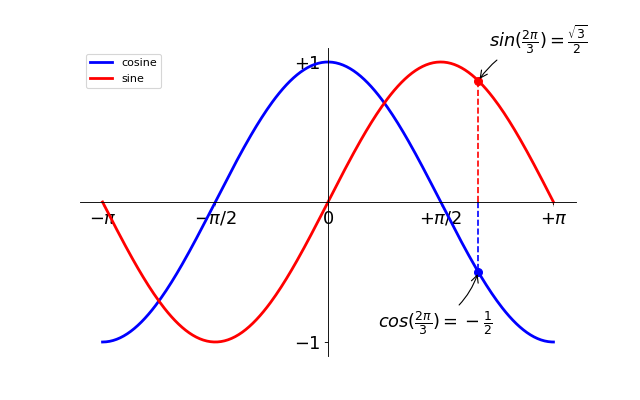

[Contenidos](../Contenidos.md) \| [Anterior (5 Estilos de codeo)](05_Estilo.md) \| [Próximo (7 Cierre de la sexta clase)](07_Cierre.md)

# 6.6 La biblioteca matplotlib

Matplotlib es probablemente la biblioteca de Python más usada para crear gráficos en 2D, también llamados plots. Provee una forma rápida de graficar datos en varios formatos de alta calidad que pueden ser compartidos y/o publicados. En esta sección vamos a ver los usos  más comunes de matplotlib.

##  pyplot
*pyplot* proporciona una interfase a la biblioteca de matplotlib. Pyplot está diseñada siguiendo el estilo de Matlab y la mayoría de los comandos para graficar en pyplot tienen análogos en Matlab con argumentos similares. Explicaremos las instrucciones más importantes con ejemplos interactivos. 

```python
from matplotlib import pyplot as plt
```

## Un plot simple 
Para empezar, vamos a plotear las funciones _seno_ y _coseno_ en el mismo gráfico. Partiendo de la configuración básica, vamos a ir cambiando el gráfico paso por paso para que quede como queremos.

Primero hay que obtener los datos para graficar:

```python
import numpy as np

X = np.linspace(-np.pi, np.pi, 256)
C, S = np.cos(X), np.sin(X)
```

Ahora tenemos un array de numpy con 256 valores que van desde -π a +π (incluído). C tiene los valores del coseno (256 valores) y S tiene los valores del seno (256 valores).

### El ploteo estándar


En Matplotlib los gráficos tienen una configuración por omisión. Cambiándolas podés configurar muchas propiedades del gráfico. Podés cambiar el tamaño de la figura, los DPI (viene de dots per inch, puntos por pulgada, y determina la resolución), el tamaño, color y estilo del trazo, las propiedades de los ejes y el cuadriculado, los textos y sus propiedades, etc. 
 

```python
import numpy as np
import matplotlib.pyplot as plt

X = np.linspace(-np.pi, np.pi, 256)
C, S = np.cos(X), np.sin(X)

plt.plot(X, C)
plt.plot(X, S)

plt.show()
```

### Un gráfico básico

En el siguiente script, hemos explicitado y comentado todas las propiedades de una figura que influyen en la apariencia de un gráfico.

Cada propiedad se configuró a un valor típico y cercano al valor por omisión. Podés modificarlos y jugar con ellos para ver sus efectos sobre el gráfico. Sobre propiedades y estilos de las líneas hablaremos luego.


```python
import numpy as np
import matplotlib.pyplot as plt

# Crea una figura nueva, de 8x6 pulgadas, con 80 puntos por pulgada
plt.figure(figsize=(8, 6), dpi=80)

# Crea un nuevo subplot, en una grilla de 1x1
plt.subplot(1, 1, 1)

X = np.linspace(-np.pi, np.pi, 256)
C, S = np.cos(X), np.sin(X)

# Plotea el coseno con una línea azul contínua de ancho 1 (en pixeles)
plt.plot(X, C, color="blue", linewidth=1.0, linestyle="-")

# Plotea el seno con una línea verde contínua de ancho 1 (en pixeles)
plt.plot(X, S, color="green", linewidth=1.0, linestyle="-")

# Rango del eje x
plt.xlim(-4.0, 4.0)

# Ponemos marcas (ticks) en el eje x
plt.xticks(np.linspace(-4, 4, 9))

# Rango del eje y
plt.ylim(-1.0, 1.0)

# Ponemos marcas (ticks) en el eje y
plt.yticks(np.linspace(-1, 1, 5))

# Podemos grabar el gráfico (con 72 dpi)
# plt.savefig("ejercicio_2.png)", dpi=72)

# Mostramos el resultado en pantalla
plt.show()
```


Los gráficos que genera matplotlib son muy flexibles, te dejamos [un machete](https://github.com/matplotlib/cheatsheets/blob/master/cheatsheets.pdf) resumiendo las variaciones más usuales.

A continuación presentamos detalles técnicos de esta biblioteca tan útil. No hace falta que te los aprendas (igual te los vas a olvidar), ni que pruebes todas las combinaciones. Podés volver a esta página o a la [documentación](https://matplotlib.org/) cuando lo necesites. Iguál mirá los ejercicios al final de esta sección, te pediremos que entregues el segundo.

## Detalles de un plot simple

### Cómo cambiar los colores y ancho de los trazos


 Ahora vamos a modificar el gráfico para que quede un poco mejor. Primero, queremos trazar el coseno en azul y el seno en rojo, y ambos con una línea algo más gruesa. Además, vamos a cambiar un poco el tamaño de la figura para hacerla apaisada. Corré el siguiente código y compará el resultado con la figura anterior.

```python
...
plt.figure(figsize=(10, 6), dpi=80)
plt.plot(X, C, color="blue", linewidth=2.5, linestyle="-")
plt.plot(X, S, color="red",  linewidth=2.5, linestyle="-")
...
```


### Límites de los ejes

 El rango de valores de los ejes es un poco angosto y necesitamos más espacio alrededor para ver claramente todos los puntos. 

```python
...
plt.xlim(X.min() * 1.1, X.max() * 1.1)
plt.ylim(C.min() * 1.1, C.max() * 1.1)
...
```


### Marcas en los ejes

Así como están, las marcas sobre los ejes no son lo más útil. Sería bueno destacar los valores interesantes para seno y coseno (+/-π,+/-π/2). Cambiémoslos para mostrar únicamente esos valores.

```python
...
plt.xticks([-np.pi, -np.pi/2, 0, np.pi/2, np.pi])
plt.yticks([-1, 0, +1])
...
```


### Texto de las marcas en los ejes

Las marcas en los ejes ahora están donde los queremos, pero el texto no es muy explícito. Aunque podemos darnos cuenta que 3.142 es π sería mejor dejarlo explícito.

Al definir un valor para las marcas en los ejes podemos proveer un texto en la segunda lista de argumentos para usar como etiqueta. Fijate que vamos a usar [_LaTeX_](https://es.wikipedia.org/wiki/LaTeX) para hacer que los símbolos tengan mejor pinta (otro de los geniales inventos de Donald Knuth, el mismo acuñó el término *análisis de algoritmos*).

```python
...
plt.xticks([-np.pi, -np.pi/2, 0, np.pi/2, np.pi],
          [r'$-\pi$', r'$-\pi/2$', r'$0$', r'$+\pi/2$', r'$+\pi$'])

plt.yticks([-1, 0, +1],
          [r'$-1$', r'$0$', r'$+1$'])
...
```


### Movamos el contorno

 El contorno es el conjunto de líneas que delimitan el área de graficación y que unen todas las marcas en los ejes. Podemos ubicarlas en cualquier posición y, hasta ahora, han estado en el extremo de cada eje. Cambiemos eso, así las ubicamos en el centro. Como hay cuatro (arriba, abajo, izquierda y derecha) vamos a esconder dos de ellas dándoles color `none` y vamos a mover la de abajo y la de la izquierda a la posición 0 del espacio de coordenadas. 

```python
...
ax = plt.gca()  # gca es 'get current axis' ó 'tomar eje actual'
ax.spines['right'].set_color('none')
ax.spines['top'].set_color('none')
ax.xaxis.set_ticks_position('bottom')
ax.spines['bottom'].set_position(('data',0))
ax.yaxis.set_ticks_position('left')
ax.spines['left'].set_position(('data',0))
...
```


### Pongámosle un título

 Pongámosle nombres a los trazos al gráfico en la esquina superior izquierda. Para esto alcanza con agregar a la instrucción `plot` la palabra clave `label` y ese texto será usado para el recuadro con los nombres. 

```python
...
plt.plot(X, C, color="blue", linewidth=2.5, linestyle="-", label="coseno")
plt.plot(X, S, color="red",  linewidth=2.5, linestyle="-", label="seno")

plt.legend(loc='upper left')
...
```


### Algunos puntos interesantes 

 Vamos a marcar algunos puntos interesantes usando el comando `annotate`. Elegimos el valor 2π/3 y queremos marcar tanto el seno como el coseno. Vamos a dibujar una marca en la curva y una línea recta punteada. Además, vamos a usar `annotate` para mostrar texto y una flecha para destacar el valor de las funciones. 

```python
...

t = 2 * np.pi / 3
plt.plot([t, t], [0, np.cos(t)], color='blue', linewidth=2.5, linestyle="--")
plt.scatter([t, ], [np.cos(t), ], 50, color='blue')

plt.annotate(r'$cos(\frac{2\pi}{3})=-\frac{1}{2}$',
             xy=(t, np.cos(t)), xycoords='data',
             xytext=(-90, -50), textcoords='offset points', fontsize=16,
             arrowprops=dict(arrowstyle="->", connectionstyle="arc3,rad=.2"))

plt.plot([t, t],[0, np.sin(t)], color='red', linewidth=2.5, linestyle="--")
plt.scatter([t, ],[np.sin(t), ], 50, color='red')

plt.annotate(r'$sin(\frac{2\pi}{3})=\frac{\sqrt{3}}{2}$',
             xy=(t, np.sin(t)), xycoords='data',
             xytext=(+10, +30), textcoords='offset points', fontsize=16,
             arrowprops=dict(arrowstyle="->", connectionstyle="arc3,rad=.2"))
...
```


### El diablo está en los detalles


 Notá (vas a tener que mirar muy de cerca) que los ejes tapan los trazos de las funciones seno y coseno, y éstas tapan los valores escritos sobre los ejes. Si esto fuera una publicación quedaría feo.

 Podemos hacer más grandes las marcas y los textos y ajustar sus propiedades de modo que tengan sean semi-transparentes. Esto nos permitirá ver un poco mejor los datos y los textos. 

```python
...
for label in ax.get_xticklabels() + ax.get_yticklabels():
    label.set_fontsize(16)
    label.set_bbox(dict(facecolor='white', edgecolor='None', alpha=0.65))
...
```



## Figuras, subplots, ejes y marcas (ticks)

En matplotlib el término "figura" se refiere a toda la ventana que conforma la interfase al usuarie. Dentro de esta ventana o figura pueden existir diversos subplots.

Hasta acá dibujamos gráficos y creamos sus ejes de forma implícita. Esto es bueno para obtener ploteos rápidos. Pero podemos controlar mejor la apariencia de la figura que generamos si definimos todo en forma explícita. Podemos definir la figura, los subplots y los ejes.

Mientras que *subplot* ubica a sus plots en posiciones espaciadas regularmente (una grilla) uno puede ubicar los *ejes* libremente en la figura. Ambas cosas pueden ser útiles, depende de qué estés buscando.

Aunque trabajamos con figuras y subplots sin llamarlos explicitamente, es bueno saber que al invocar `plot()` matplotlib llama a `gca()` (get current axes) para obtener acceso a los ejes, y `gca()` a su vez llama a `gcf()` (get current figure) para obtener acceso a la figura. Si no existe tal figura, llama a `figure()` para crearla o más estrictamente hablando, para crear un un único subplot (el número 1 en una grilla de 1x1). Aunque no pidamos explícitamente crear una figura, ésta es creada cuando la necesitamos. Veamos un poco los detalles.

### Figuras

Una "figura" es la ventana en la interfase al usuarie que lleva como título "Figura #". Las figuras se enumeran comenzando en 1. Varios parámetros  determinan la pinta que tiene una figura: 

Argumento | Por Omisión  | Descripción
--- | --- | ---
num | 1 |  número de figura
figsize |figure.figsize | tamaño de figura en pulgadas (ancho, alto)
dpi | figure.dpi | resolución en puntos por pulgada
facecolor |  figure.facecolor  |  color del fondo
edgecolor |  figure.edgecolor  |  color del borde rodeando el fondo
frameon | True |   dibujar un recuadro para la figura ?

Si estás trabajando en una interfaz gráfica podés cerrar una figura clickeando en la `X` de la ventana. Tambien podés cerrar una ventana desde tu programa llamando al método close(). Dependiendo del parámetro que le pases va a cerrar la figura con que estás trabajando (sin argumentos), una figura específica (como argumento le pasás el número de figura) o todas las figuras (el argumento es "all"). 

```python
plt.close(1)     # Cierra la figura 1
```

A pesar de que en casi todo el mundo usamos el sistema métrico, increíblemente el imperialismo llega al punto que no hay un modo directo de especificar distancias o tamaños en centímetros en matplotlib. Podemos usar una función auxiliar como ésta para convertir una distancia de *cm* a *pulgadas*:

```python
def cm2inch(value):
    return value/2.54

fig = plt.figure(figsize=(cm2inch(12.8), cm2inch(9.6)))
```


### Subplots
Podés disponer tus plots en una grilla de intervalos regulares si usás `subplots`. Sólo tenés que especificar el número de filas, el de columnas y finalmente el número de subplot para activar el subplot correspondiente.

Ejemplo:


Ejemplo:


Ejemplo:


### Ejes
Podés usar los ejes para ubicar los plots en cualquier lugar de la figura. Si queremos poner un pequeño gráfico como inserto en uno más grande, lo podemos hacer moviendo sus ejes.

Ejemplo:


Ejemplo:


## Ejercicios:
Solo te pedimos que entregues el segundo ejercicio, los otros son optativos.

### Ejercicio 6.9: Subplots fuera de una grilla
Modificá el siguiente código para reproducir el gráfico que se muestra. Prestá atención a cómo se numeran los subplots. 

```python
import matplotlib.pyplot as plt

fig = plt.figure()
plt.subplot(2, 1, 1) # define la figura de arriba
plt.plot([0,1,2],[0,1,0]) # dibuja la curva
plt.xticks([]), plt.yticks([]) # saca las marcas

plt.subplot(2, 2, 3) # define la primera de abajo, que sería la tercera si fuera una grilla regular de 2x2
plt.plot([0,1],[0,1])
plt.xticks([]), plt.yticks([])

plt.subplot(2, 2, 4) # define la segunda de abajo, que sería la cuarta figura si fuera una grilla regular de 2x2
plt.plot([0,1],[1,0])
plt.xticks([]), plt.yticks([])

plt.show()
```


### Ejercicio 6.10: Caminatas al azar

Una [caminata al azar](https://es.wikipedia.org/wiki/Camino_aleatorio) o *random walk* es una formalización matemática de la trayectoria que resulta de hacer sucesivos pasos aleatorios. Por ejemplo, la ruta trazada por una molécula mientras viaja por un líquido o un gas, el camino que sigue un animal en su búsqueda de comida, el precio de una acción fluctuante y la situación financiera de un jugador pueden tratarse, bajo ciertas hipótesis, como una caminata aleatoria.

El siguiente código genera una caminata al azar de `N` pasos de largo y la grafica.

```python
import numpy as np
import matplotlib.pyplot as plt

def randomwalk(largo):
    pasos=np.random.randint (-1,2,largo)    
    return pasos.cumsum()

N = 100000

plt.plot(randomwalk(N))
plt.show()
```

En este ejercicio te pedimos:

1. Modificá el código anterior para ponerles nombres a los ejes ("tiempo" y distancia al origen") y al gráfico. 
2. Graficá 12 trayectorias en la misma figura, con diferentes colores.
3. Usá la estructura de subplots sugerida en el [Ejercicio 6.9](../06_Plt_Especificacion_y_Documentacion/06_Matplotlib.md#ejercicio-69-subplots-fuera-de-una-grilla) para graficar tres pubplots en una figura:
    * Arriba, grande, 12 trayectorias aleatorias como en el inciso anterior
    * Abajo a la izquierda la trayectoria que más se aleja del origen.
    * Abajo a la derecha la trayectoria que menos se aleja del origen.

Ojo, cuando decimos la que más o menos se aleja, nos referimos a *en algún momento*, no necesariamente a la que termina más cerca o más lejos.

Guardá tu solución del inciso 3 en el archivo `random_walk.py`. Debería verse aproximadamente como este plot:


## Optativos:

Los siguientes ejercicios profundizan en algunos estilos particulares y son optativos. Si querés ver las soluciones exactas a algunos de estos ejercicios y otros problemas más, podés consultar [acá](https://scipy-lectures.org/intro/matplotlib/index.html#other-types-of-plots-examples-and-exercises).

### Ejercicio 6.11: Gráficos de barras
Modificá el siguiente código para generar un gráfico similar al que se muestra: tenés que agregar etiquetas para las barras rojas cuidando la alineación del texto.

```python
n = 12 
X = np.arange(n)
Y1 = (1 - X / float(n)) * np.random.uniform(0.5, 1.0, n)
Y2 = (1 - X / float(n)) * np.random.uniform(0.5, 1.0, n)
plt.bar(X, +Y1, facecolor='#9999ff', edgecolor='white')
plt.bar(X, -Y2, facecolor='#ff9999', edgecolor='white')
for x, y in zip(X, Y1):
    plt.text(x + 0.4, y + 0.05, '%.2f' % y, ha='right', va='bottom')
plt.ylim(-1.25, +1.25)
```


### Ejercicio 6.12: Coordenadas polares
A partir de este código, generá un gráfico como el siguiente.

```python
plt.axes([0, 0, 1, 1])

N = 20
theta = np.arange(0., 2 * np.pi, 2 * np.pi / N)
radii = 10 * np.random.rand(N)
width = np.pi / 4 * np.random.rand(N)
bars = plt.bar(theta, radii, width=width, bottom=0.0)

for r, bar in zip(radii, bars):
    bar.set_facecolor(plt.cm.jet(r / 10.))
    bar.set_alpha(0.5)
```


_Pista_: sólo necesitás modifcar los ejes en la primera línea. Fijate que hay un parámetro `polar` que tiene por omisión valor `False`.

### Ejercicio 6.13: Setear el color de un scatter plot
Modificá el código que sigue para generar un gráfico similar al que se muestra, prestando atención a los límites, el tamaño de las marcas, el color, y la transparencia de los trazos.

```python
n = 1024
X = np.random.normal(0,1,n)
Y = np.random.normal(0,1,n)
plt.scatter(X,Y)
```


_Pista_: El color depende del ángulo que forma el vector (X,Y) con los ejes. Hay diversas formas de calcularlo.


[Contenidos](../Contenidos.md) \| [Anterior (5 Estilos de codeo)](05_Estilo.md) \| [Próximo (7 Cierre de la sexta clase)](07_Cierre.md)

