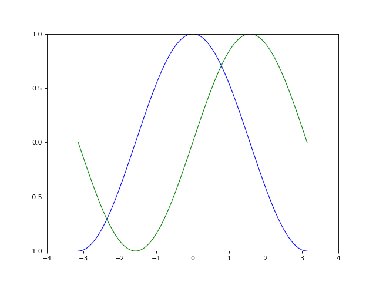
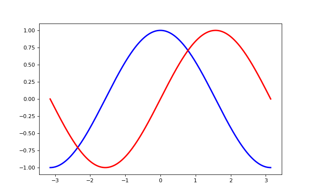
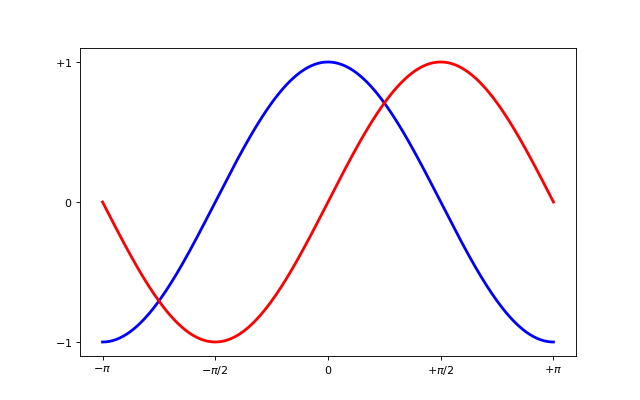
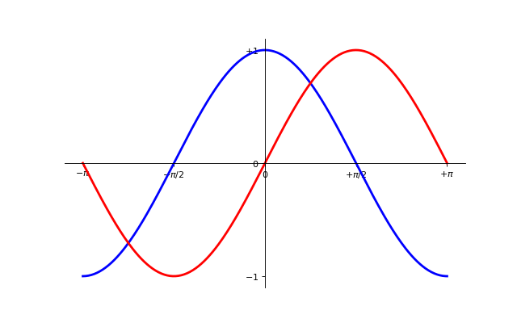
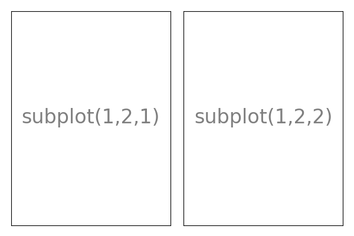
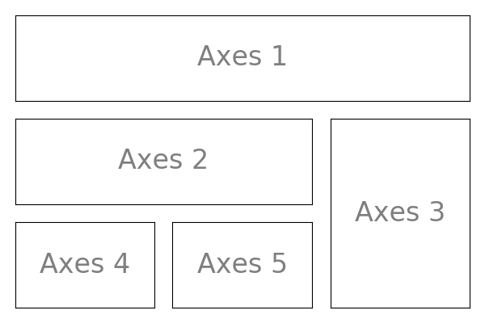
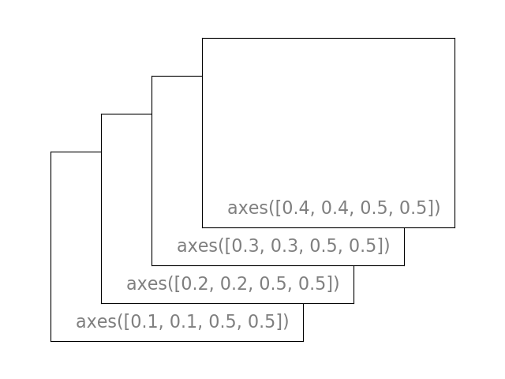

[Contenidos](../Contenidos.md) \| [Anterior (5 Documentación y estilo**)](05_Documentar_y_Estilo.md) \| [Próximo (7 Gráficos del azar***)](07_gráficos_del_azar.md)

# 6.6 Matplotlib básico

plots de lineas, una intro completa a traducir:
[esto](https://scipy-lectures.org/intro/matplotlib/index.html)

##  Matplotlib: plotting

##  Introducción

Matplotlib es probablemente el paquete de Python mas usado para crear gráficos en 2D. Provee una forma rápida de graficar los datos como gráficos en varios formatos de alta calidad listos para ser presentados y publicados. En esta sección vamos a explorar matplotlib en modo interactivo y ver los casos mas comunes.

##  pyplot
 *pyplot* proporciona una interfase a la biblioteca de matplotlib, que es orientada a objetos como todo en Python. Pyplot está diseñada siguiendo el producto Matlab™. Por lo tanto la mayoría de los comandos para graficar en pyplot tienen análogos en Matlab™ con argumentos similares. Explicaremos las instrucciones mas importantes con ejemplos interactivos. 

```python
from matplotlib import pyplot as plt
```


## Simple plot
Para empezar, vamos a plotear las funciones _seno()_ y _coseno()_ en el mismo grafico. Partiendo de la configuración básica, vamos a ir cambiando el gráfico paso por paso para que quede como queremos.

Primero hay que obtener los datos para graficar:

```python
import numpy as np

X = np.linspace(-np.pi, np.pi, 256)
C, S = np.cos(X), np.sin(X)
```

Ahora tenemos un array de numpy con 256 valores que van desde -π a +π (incluído). C tiene los valores del coseno (256 valores) y S tiene los valores del seno (256 valores).

### 1.5.2.1. El ploteo estándard


En Matplotlib los gráficos tienen una configuración por omisión. Cambiándolas podés configurar muchas propiedades del gráfico. Podés cambiar el tamaño de la figura, los DPI (dots per inch, puntos por pulgada), el tamaño, color y estilo del trazo, las propiedades de los ejes y el cuadriculado, los textos y sus propiedades, etc. 
 
 [oski]: # (Matplotlib comes with a set of default settings that allow customizing all kinds of properties. You can control the defaults of almost every property in matplotlib: figure size and dpi, line width, color and style, axes, axis and grid properties, text and font properties and so on.)

```python
import numpy as np
import matplotlib.pyplot as plt

X = np.linspace(-np.pi, np.pi, 256)
C, S = np.cos(X), np.sin(X)

plt.plot(X, C)
plt.plot(X, S)

plt.show()
```

### 1.5.2.2. El gráfico básico



En el siguiente script, hemos explicitado y comentado todos las propiedades de una figura que influyen en la apariencia de un gráfico.

Cada propiedad se configuró a su valor por omisión, de modo que sepas cuáles son los valores "normales" y puedas jugar con ellos para ver sus efectos sobre el plot. Sobre propiedades y estilos de las líneas hablaremos luego.

[oski] : #(In the script below, we’ve instantiated and commented all the figure settings that influence the appearance of the plot.

 The settings have been explicitly set to their default values, but now you can interactively play with the values to explore their affect [see Line properties and Line styles below].)


```python
import numpy as np
import matplotlib.pyplot as plt

# Crea una figura nueva, de 8x6 pulgadas, con 80 puntos por pulgada
plt.figure(figsize=(8, 6), dpi=80)

# Crea un nuevo subplot, en una grilla de 1x1
plt.subplot(1, 1, 1)

X = np.linspace(-np.pi, np.pi, 256)
C, S = np.cos(X), np.sin(X)

# Plotea el coseno con una línea azul contínua de ancho 1 (en pixeles)
plt.plot(X, C, color="blue", linewidth=1.0, linestyle="-")

# Plotea el seno con una línea verde contínua de ancho 1 (en pixeles)
plt.plot(X, S, color="green", linewidth=1.0, linestyle="-")

# Rango del eje x
plt.xlim(-4.0, 4.0)

# Ponemos marcas (ticks) en el eje x
plt.xticks(np.linspace(-4, 4, 9))

# Rango del eje y
plt.ylim(-1.0, 1.0)

# Ponemos marcas (ticks) en el eje y
plt.yticks(np.linspace(-1, 1, 5))

# Podemos grabar el gráfico usando 72 dpi
# plt.savefig("ejercicio_2.png)", dpi=72)

# Mostrar el resultado en pantalla
plt.show()
```

### 1.5.2.3. Como cambiar los colores y ancho de los trazos


 Ahora vamos a modificar el gráfico para que quede un poco mejor. Primero, queremos trazar el coseno en azul y el seno en rojo, y ambos con una línea algo más gruesa. Además, vamos a cambiar un poco el tamaño de la figura para hacerla mas apaisada. Corré el siguiente código y compará el resultado con la figura anterior.

```python
...
plt.figure(figsize=(10, 6), dpi=80)
plt.plot(X, C, color="blue", linewidth=2.5, linestyle="-")
plt.plot(X, S, color="red",  linewidth=2.5, linestyle="-")
...
```

### 1.5.2.4. Límites de los ejes


 El rango de valores de los ejes es un poco angosto y necesitamos más espacio alrededor para ver claramente todos los puntos. 

```python
...
plt.xlim(X.min() * 1.1, X.max() * 1.1)
plt.ylim(C.min() * 1.1, C.max() * 1.1)
...
```

### 1.5.2.5. Marcas en los ejes


Así como están, las marcas sobre los ejes no son lo mas útil. Sería bueno destacar los valores interesantes para seno y coseno (+/-π,+/-π/2). Cambiémoslos para mostrar únicamente ésos valores.

```python
...
plt.xticks([-np.pi, -np.pi/2, 0, np.pi/2, np.pi])
plt.yticks([-1, 0, +1])
...
```

### 1.5.2.6. Texto de las marcas en los ejes


Las marcas en los ejes ahora están donde los queremos, pero el texto no es muy explícito. Aunque podemos darnos cuenta que 3.142 es π sería mejor dejarlo explícito.

Al definir un valor para las marcas en los ejes podemos proveer un texto en la segunda lista de argumentos para usar como etiqueta. Fijate que vamos a usar [_LaTeX_](https://www.latex-project.org/) para hacer que los símbolos tengan mejor pinta.

```python
...
plt.xticks([-np.pi, -np.pi/2, 0, np.pi/2, np.pi],
          [r'$-\pi$', r'$-\pi/2$', r'$0$', r'$+\pi/2$', r'$+\pi$'])

plt.yticks([-1, 0, +1],
          [r'$-1$', r'$0$', r'$+1$'])
...
```

### 1.5.2.7. Movamos el contorno


 El contorno es el conjunto de líneas que delimitan el área de graficación y que unen todas las marcas en los ejes. Podemos ubicarlas en cualquier posición y, hasta ahora, han estado en el extremo de cada eje. Cambiemos éso, así las ubicamos en el centro. Como hay cuatro (arriba, abajo, izquierda y derecha) vamos a esconder dos de ellas dándoles color `none` y vamos a mover la de abajo y la de la izquierda a la posición 0 del espacio de coordenadas. 

```python
...
ax = plt.gca()  # gca es 'get current axis' ó 'tomar eje actual'
ax.spines['right'].set_color('none')
ax.spines['top'].set_color('none')
ax.xaxis.set_ticks_position('bottom')
ax.spines['bottom'].set_position(('data',0))
ax.yaxis.set_ticks_position('left')
ax.spines['left'].set_position(('data',0))
...
```

### 1.5.2.8. Pongámosle título


 Pongámosle nombres a los trazos al gráfico en la esquina superior izquierda. Para ésto alcanza con agregar a la instrucción 'plot' la palabra clave 'label' y ese texto será usado para el recuadro con los nombres. 

```python
...
plt.plot(X, C, color="blue", linewidth=2.5, linestyle="-", label="cosine")
plt.plot(X, S, color="red",  linewidth=2.5, linestyle="-", label="sine")

plt.legend(loc='upper left')
...
```

### 1.5.2.9. Algunos puntos interesantes 


 Vamos a marcar alguno puntos interesantes usando el comando 'annotate'. Elegimos el valor 2π/3 y queremos marcar tanto el seno como el coseno. Vamos a dibujar una marca en la curva y un línea recta punteada. Además, vamos a usar 'annotate' para mostrar texto y una flecha para destacar el valor de las funciones. 

```python
...

t = 2 * np.pi / 3
plt.plot([t, t], [0, np.cos(t)], color='blue', linewidth=2.5, linestyle="--")
plt.scatter([t, ], [np.cos(t), ], 50, color='blue')

plt.annotate(r'$cos(\frac{2\pi}{3})=-\frac{1}{2}$',
             xy=(t, np.cos(t)), xycoords='data',
             xytext=(-90, -50), textcoords='offset points', fontsize=16,
             arrowprops=dict(arrowstyle="->", connectionstyle="arc3,rad=.2"))

plt.plot([t, t],[0, np.sin(t)], color='red', linewidth=2.5, linestyle="--")
plt.scatter([t, ],[np.sin(t), ], 50, color='red')

plt.annotate(r'$sin(\frac{2\pi}{3})=\frac{\sqrt{3}}{2}$',
             xy=(t, np.sin(t)), xycoords='data',
             xytext=(+10, +30), textcoords='offset points', fontsize=16,
             arrowprops=dict(arrowstyle="->", connectionstyle="arc3,rad=.2"))
...
```

### 1.5.2.10. El diablo está en los detalles


 Apenas si podemos ver las marcas negras originales sobre los ejes porque los trazos azul y rojo los esconden. Podemos hacerlos mas grandes y ajustar sus propiedades de modo que tengan un fondo blanco semi-transparente. Esto nos permitirá ver un poco mejor los datos y los textos. 

 [oski]: # ( ---- la verdad es que la diferencia es casi imperceptible ----The tick labels are now hardly visible because of the blue and red lines. We can make them bigger and we can also adjust their properties such that they’ll be rendered on a semi-transparent white background. This will allow us to see both the data and the labels. )

```python
...
for label in ax.get_xticklabels() + ax.get_yticklabels():
    label.set_fontsize(16)
    label.set_bbox(dict(facecolor='white', edgecolor='None', alpha=0.65))
...
```

## 1.5.3. Figures, Subplots, Axes and Ticks

A “figure” in matplotlib means the whole window in the user interface. Within this figure there can be “subplots”.

 So far we have used implicit figure and axes creation. This is handy for fast plots. We can have more control over the display using figure, subplot, and axes explicitly. While subplot positions the plots in a regular grid, axes allows free placement within the figure. Both can be useful depending on your intention. We’ve already worked with figures and subplots without explicitly calling them. When we call plot, matplotlib calls gca() to get the current axes and gca in turn calls gcf() to get the current figure. If there is none it calls figure() to make one, strictly speaking, to make a subplot(111). Let’s look at the details.

### 1.5.3.1. Figures
 A figure is the windows in the GUI that has “Figure #” as title. Figures are numbered starting from 1 as opposed to the normal Python way starting from 0. This is clearly MATLAB-style. There are several parameters that determine what the figure looks like:


Argument | Default  | Description
--- | --- | ---
num | 1 |  number of figure
figsize |figure.figsize | figure size in inches (width, height)
dpi | figure.dpi | resolution in dots per inch
facecolor |  figure.facecolor  |  color of the drawing background
edgecolor |  figure.edgecolor  |  color of edge around the drawing background
frameon | True |   draw figure frame or not

As with other objects, you can set figure properties also setp or with the set_something methods.

When you work with the GUI you can close a figure by clicking on the x in the upper right corner. But you can close a figure programmatically by calling close. Depending on the argument it closes (1) the current figure (no argument), (2) a specific figure (figure number or figure instance as argument), or (3) all figures ("all" as argument).

```python
plt.close(1)     # Closes figure 1
```

### 1.5.3.2. Subplots
 With subplot you can arrange plots in a regular grid. You need to specify the number of rows and columns and the number of the plot. Note that the gridspec command is a more powerful alternative.






### 1.5.3.3. Axes
Axes are very similar to subplots but allow placement of plots at any location in the figure. So if we want to put a smaller plot inside a bigger one we do so with axes.





### 1.5.4.2. Scatter Plots


Starting from the code below, try to reproduce the graphic taking care of marker size, color and transparency.

Hint Color is given by angle of (X,Y).
```python
n = 1024
X = np.random.normal(0,1,n)
Y = np.random.normal(0,1,n)
plt.scatter(X,Y)
```

Click on figure for solution.

### 1.5.4.3. Bar Plots


Starting from the code below, try to reproduce the graphic by adding labels for red bars.

Hint You need to take care of text alignment.
```python
n = 12
X = np.arange(n)
Y1 = (1 - X / float(n)) * np.random.uniform(0.5, 1.0, n)
Y2 = (1 - X / float(n)) * np.random.uniform(0.5, 1.0, n)

plt.bar(X, +Y1, facecolor='#9999ff', edgecolor='white')
plt.bar(X, -Y2, facecolor='#ff9999', edgecolor='white')

for x, y in zip(X, Y1):
    plt.text(x + 0.4, y + 0.05, '%.2f' % y, ha='center', va='bottom')

plt.ylim(-1.25, +1.25)
```

Click on figure for solution.


### 1.5.4.9. Multi Plots


Starting from the code below, try to reproduce the graphic.

Hint You can use several subplots with different partition.
```python
plt.subplot(2, 2, 1)
plt.subplot(2, 2, 3)
plt.subplot(2, 2, 4)
```

Click on figure for solution.

### 1.5.4.10. Polar Axis


Hint You only need to modify the axes line
Starting from the code below, try to reproduce the graphic.

```python
plt.axes([0, 0, 1, 1])

N = 20
theta = np.arange(0., 2 * np.pi, 2 * np.pi / N)
radii = 10 * np.random.rand(N)
width = np.pi / 4 * np.random.rand(N)
bars = plt.bar(theta, radii, width=width, bottom=0.0)

for r, bar in zip(radii, bars):
    bar.set_facecolor(plt.cm.jet(r / 10.))
    bar.set_alpha(0.5)
```

Click on figure for solution.


[Contenidos](../Contenidos.md) \| [Anterior (5 Documentación y estilo**)](05_Documentar_y_Estilo.md) \| [Próximo (7 Gráficos del azar***)](07_gráficos_del_azar.md)

