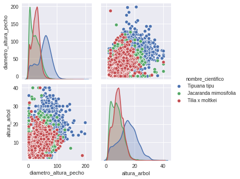

[Contenidos](../Contenidos.md) \| [Anterior (3 Ordenar archivos en Python)](03_Ordenando_archivos.md) \| [Próximo (5 Series temporales)](05_Series_Temporales.md)

# 7.4 Introducción a Pandas

La  biblioteca Pandas es una extensión de NumPy para manipulación y análisis de datos. En particular, ofrece estructuras de datos y operaciones para manipular tablas de datos (numéricos y de otros tipos) y series temporales. Se distribuye como software libre.

Ésta es una breve introducción a [Pandas](https://pandas.pydata.org/docs/getting_started/index.html). Para información más completa, te recomendamos consultar [la documentación oficial](https://pandas.pydata.org/docs/user_guide/10min.html).

Esta biblioteca tiene dos tipos de datos fundamentales: los `DataFrames` que almacenan tablas de datos y las `series` que contienen secuencias de datos.

## Lectura de datos

Pandas permite leer diversos formatos de tablas de datos directamente. Probá el siguiente código, para leer un archivo CSV:

```python
import pandas as pd
import os

directorio = 'Data'
archivo = 'arbolado-en-espacios-verdes.csv'
fname = os.path.join(directorio,archivo)
df = pd.read_csv(fname)
```

La variable `df` es de tipo `DataFrame` y contiene todos los datos del archivo csv estructurados adecuadamente.

Con `df.head()` podés ver las primeras líneas de datos. Si a `head` le pasás un número como parámetro podés seleccionar cuántas líneas querés ver. Análogamente con `df.tail(n)` verás las últimas `n` líneas de datos.

```python
>>> df.head()

   long       lat      id_arbol ...          origen       coord_x       coord_y
0 -58.477564 -34.645015    1  ...           Exótico  98692.305719  98253.300738
1 -58.477559 -34.645047    2  ...           Exótico  98692.751564  98249.733979
2 -58.477551 -34.645091    3  ...           Exótico  98693.494639  98244.829684
3 -58.478129 -34.644567    4  ...  Nativo/Autóctono  98640.439091  98302.938142
4 -58.478121 -34.644598    5  ...  Nativo/Autóctono  98641.182166  98299.519997
```


Usando `df.columns` pandas te va a devolver un índice con los nombres de las columnas del DataFrame. Recordá que en la [Sección 2.7](../02_Datos/07_Arboles1.md#descripción-de-la-base) describimos la base de datos. A su vez, `df.index` te mostrará el índice. En este caso el índice es numérico y se corresponde con el número de la línea leida del archivo. En principio no es muy interesante para analizar cuestiones de árboles, simplemente tenemos las filas numeradas. Veremos otros ejemplos donde el índice puede contener información vital (una categoría, un timestamp, etc).

```python
>>> df.columns
Index(['long', 'lat', 'id_arbol', 'altura_tot', 'diametro', 'inclinacio',
       'id_especie', 'nombre_com', 'nombre_cie', 'tipo_folla', 'espacio_ve',
       'ubicacion', 'nombre_fam', 'nombre_gen', 'origen', 'coord_x',
       'coord_y'],
      dtype='object')
>>> df.index
RangeIndex(start=0, stop=51502, step=1)
```

Otra herramienta útil para inspeccionar los datos recién levantados es `describe()`. Para ver mejor una parte, podemos seleccionar algunas columnas de interés antes de pedirle la descripción.

```python
>>> df[['altura_tot', 'diametro', 'inclinacio']].describe()
         altura_tot      diametro    inclinacio
count  51502.000000  51502.000000  51502.000000
mean      12.167100     39.395616      3.472215
std        7.640309     31.171205      7.039495
min        0.000000      1.000000      0.000000
25%        6.000000     18.000000      0.000000
50%       11.000000     32.000000      0.000000
75%       18.000000     54.000000      5.000000
max       54.000000    500.000000     90.000000
```

## Selección

Una de las operaciones primitivas más importantes es la selección de fragmentos de las tablas de datos, ya sean filas, columnas o rangos de filas y columnas.

Por ejemplo con `df['nombre_com']` veremos la columna (que es una serie) de nombres comunes de los árboles en la base. Podemos usar `unique` para ver una vez cada nombre:

```python
>>> df['nombre_com'].unique()
array(['Washingtonia (Palmera washingtonia)', 'Ombú', 'Catalpa', 'Ceibo',
       'Brachichiton (Árbol botella, Brachichito)', 'Álamo plateado',
       'Acacia de constantinopla', 'Acacia', 'Roble sedoso (Grevillea)',
        ...
       'Jazmín del Paraguay', 'Plumerillo rojo', 'Árbol fuccia',
       'Canela de venado', 'Boj cepillo', 'Caranday'], dtype=object)
```

Podemos preguntar cuáles se llaman de cierta manera ('Ombú' en este caso), como hacíamos con los ndarrays en numpy:

```python
>>> df['nombre_com'] == 'Ombú'
0        False
1        False
2        False
3         True
...
```

Observá que esto generó una serie. Podemos sumar los `True` de esta serie para contar la cantidad de Ombús:

```python
>>> (df['nombre_com'] == 'Ombú').sum()
590
```

Si queremos hacer lo mismo para otras especies podemos usar `value_counts()`

```python
>>> cant_ejemplares = df['nombre_com'].value_counts()
>>> cant_ejemplares.head(10)
Eucalipto               4112
Tipa blanca             4031
Jacarandá               3255
Palo borracho rosado    3150
Casuarina               2719
Fresno americano        2166
Plátano                 1556
Ciprés                  1467
Ceibo                   1149
Pindó                   1068
Name: nombre_com, dtype: int64
```

De esta forma obtenemos, en orden decreciente, los nombres comunes y las cantidades de las especies más frecuentes en la base de datos.

### Filtros booleanos

La serie booleana que obtuvimos con `df['nombre_com'] == 'Ombú'` puede usarse para seleccionar esas filas del DataFrame. Probemos con Jacarandá:

```python
>>> df_jacarandas = df[df['nombre_com'] == 'Jacarandá']
```

Análogamente, podemos seleccionar algunas columnas de interés y generar vistas (ojo, en estos casos no estamos copiando la información):

```python
>>> cols = ['altura_tot', 'diametro', 'inclinacio']
>>> df_jacarandas = df_jacarandas[cols]
>>> df_jacarandas.tail()
       altura_tot  diametro  inclinacio
51104           7        97           4
51172           8        28           8
51180           2        30           0
51207           3        10           0
51375          17        40          20

>>> df_jacarandas.describe()
        altura_tot     diametro   inclinacio
count  3255.000000  3255.000000  3255.000000
mean     10.369585    28.804301     6.549923
std       5.905744    19.166388     8.459921
min       1.000000     1.000000     0.000000
25%       6.000000    14.000000     0.000000
50%      10.000000    25.000000     4.000000
75%      15.000000    41.000000    10.000000
max      49.000000   159.000000    70.000000
```

Observá que cuando le pedimos los últimos datos de `df_jacarandas` nos mostró los últimos 5 jacarandás de la base de datos, respetando los números de índice de la tabla original (..., 51207, 51375).

Si vas a querer modificar `df_jacarandas` es conveniente crear una copia de los datos de `df` en lugar de simplemente una vista. Esto se puede hacer con el método `copy()` como en el siguiente ejemplo.

```python
>>> df_jacarandas = df[df['nombre_com'] == 'Jacarandá'][cols].copy()
```

### Scatterplots

Pandas también permite [hacer gráficos bonitos](https://pandas.pydata.org/docs/user_guide/visualization.html). Es realmente sencillo:

```python
df_jacarandas.plot.scatter(x = 'diametro', y = 'altura_tot')
```

Hay otro módulo para hacer gráficos que interactúa muy bien con pandas y se llama [Seaborn](https://seaborn.pydata.org/). Está basado en matplotlib, y ofrece una interfaz de alto nivel para realizar gráficos estadísticos atractivos e informativos. En criollo: "usar pandas para manejar los datos y seaborn para visualizarlos, es la posta".

Fijate que seaborn entiende los DataFrames y las columnas y su sintaxis es muy similar a la de pandas:

```python
import seaborn as sns

sns.scatterplot(data = df_jacarandas, x = 'diametro', y = 'altura_tot')
```

### Filtros por índice y por posición

Como ya mencionamos, el índice de `df` no tiene una semántica interesante. Veamos, en cambio, que la serie que generamos con `cant_ejemplares = df['nombre_com'].value_counts()` sí lo tiene:

```python
>>> cant_ejemplares.index
Index(['Eucalipto', 'Tipa blanca', 'Jacarandá', 'Palo borracho rosado',
       'Casuarina', 'Fresno americano', 'Plátano', 'Ciprés', 'Ceibo', 'Pindó',
       ...
       'Naranjo dulce', 'Peltophorum', 'Ligustrina de California',
       'Afrocarpus', 'Caranday', 'Esterculea', 'Boj cepillo', 'Sesbania',
       'Ligustrum', 'Árbol del humo'],
      dtype='object', length=337)
```

`cant_ejemplares` es una serie (es como un DataFrame de una sola columna). Tiene los nombres de las especies como índice y sus respectivas cantidades como dato asociado.

Podemos acceder a una fila de un DataFarme o una Serie tanto a través de su posición como a través de su índice. Para acceder con el índice usá `loc[]` como en los siguientes ejemplos:

```python
>>> df.loc[165]
long                                                   -58.4684
lat                                                    -34.6648
id_arbol                                                    166
altura_tot                                                    5
diametro                                                     10
inclinacio                                                    0
id_especie                                                   11
nombre_com                                            Jacarandá
nombre_cie                                Jacarandá mimosifolia
tipo_folla                        Árbol Latifoliado Caducifolio
espacio_ve                                        INDOAMERICANO
ubicacion     LACARRA, Av. - ESCALADA, Av. - CASTAÑARES, Av....
nombre_fam                                         Bignoniáceas
nombre_gen                                            Jacarandá
origen                                         Nativo/Autóctono
coord_x                                                 99534.3
coord_y                                                 96061.8
Name: 165, dtype: object

>>> cant_ejemplares.loc['Eucalipto']
4112
```

Para acceder por número de posición usá `iloc`, como se muestra a continuación.

```python
>>> df_jacarandas.iloc[0]
altura_tot     5
diametro      10
inclinacio     0
Name: 165, dtype: int64
```

Observá que esto nos devuelve los datos de la primera fila de `df_jacarandas` que corresponde al índice 165 (lo dice en la última línea). También podemos acceder a rebanadas (slices) usando `iloc`:

```python
>>> cant_ejemplares.iloc[0:3]
Eucalipto      4112
Tipa blanca    4031
Jacarandá      3255
Name: nombre_com, dtype: int64
```

Por otra parte, podemos seleccionar tanto filas como columnas, si separamos con comas las respectivas selecciones:

```python
>>> df_jacarandas.iloc[-5:,2]
51104     4
51172     8
51180     0
51207     0
51375    20
Name: inclinacio, dtype: int64
```

Esto nos devuelve los datos correspondientes a las últimas 5 filas y a la tercera columna ('inclinacio'). Fijate que siempre vienen acompañados del índice.

### Selección de una columna

Si queremos seleccionar una sola columna podemos especificarla por medio de su nombre. Recordemos que al tomar una sola columna obtenemos una serie en lugar de un DataFrame:

```python
>>> df_jacarandas_diam = df_jacarandas['diametro']
>>> type(df_jacarandas)
pandas.core.frame.DataFrame
>>> type(df_jacarandas_diam)
pandas.core.series.Series
```

## Series temporales en Pandas

Pandas tiene un gran potencial para el manejo de series temporales. Es muy sencillo crear índices con fechas y frecuencias seleccionadas.

```python
>>> pd.date_range('20200923', periods = 7)
DatetimeIndex(['2020-09-23', '2020-09-24', '2020-09-25', '2020-09-26',
               '2020-09-27', '2020-09-28', '2020-09-29'],
              dtype='datetime64[ns]', freq='D')

>>> pd.date_range('20200923 14:00', periods = 7)
DatetimeIndex(['2020-09-23 14:00:00', '2020-09-24 14:00:00',
               '2020-09-25 14:00:00', '2020-09-26 14:00:00',
               '2020-09-27 14:00:00', '2020-09-28 14:00:00',
               '2020-09-29 14:00:00'],
              dtype='datetime64[ns]', freq='D')

>>> pd.date_range('20200923 14:00', periods = 6, freq = 'H')
DatetimeIndex(['2020-09-23 14:00:00', '2020-09-23 15:00:00',
               '2020-09-23 16:00:00', '2020-09-23 17:00:00',
               '2020-09-23 18:00:00', '2020-09-23 19:00:00'],
              dtype='datetime64[ns]', freq='H')

```

Luego, podés usar esos índices junto con datos para armar series temporales o DataFrames:

```python
>>> pd.Series([1, 2, 3, 4, 5, 6], index = pd.date_range('20200923 14:00', periods = 6, freq = 'H'))
2020-09-23 14:00:00    1
2020-09-23 15:00:00    2
2020-09-23 16:00:00    3
2020-09-23 17:00:00    4
2020-09-23 18:00:00    5
2020-09-23 19:00:00    6
Freq: H, dtype: int64
```

### Caminatas al azar

Volviendo al tema de las caminatas al azar, podemos hacer una caminata de dos horas dando un paso por minuto a partir del comienzo de esta clase con el siguiente comando:

```python
import numpy as np

idx = pd.date_range('20200923 14:00', periods = 120, freq = 'min')
s1 = pd.Series(np.random.randint(-1,2,120), index = idx)
s2 = s1.cumsum()
```

Observá que estamos usando random del módulo numpy, no de random. La función `np.random.randint(-1,2,120)` genera un array de longitud 120 con valores -1, 0, 1 (no incluye extremo derecho del rango de valores).

Podemos ver el gráfico sencillamente:
```python
s2.plot()
```

O usar una [media móvil](https://es.wikipedia.org/wiki/Media_m%C3%B3vil) (rolling mean) para suavizar los datos:

```python
w = 5 # ancho en minutos de la ventana
s3 = s2.rolling(w).mean()
s3.plot()
```
Podés ver ambas curvas en un mismo gráfico para ver más claramente el efecto del suavizado:

```python
df_series_23 = pd.DataFrame([s2, s3]).T  # armo un dataframe con ambas series
df_series_23.plot()
```

Fijate que los datos de la curva suavizada empiezan más tarde, porque al principio no hay datos sobre los cuales hacer promedio. El parámetro  `min_periods = 1` del método `rolling` te permite controlar esto. Probalo.


### Ejemplo: 12 personas caminando 8 horas

En el siguiente ejemplo creamos un índice que contenga un elemento por minuto a partir del comienzo de la clase y durante 8 horas. Armamos también una lista de nombres.

```python
horas = 8
idx = pd.date_range('20200923 14:00', periods = horas*60, freq = 'min')
nombres = ['Pedro', 'Santiago', 'Juan', 'Andrés','Bartolomé','Tiago','Isca','Tadeo','Mateo','Felipe','Simón','Tomás']
```

Luego usamos el módulo random de numpy para generar pasos para cada persona a cada minuto. Los acumulamos con `cumsum` y los acomodamos en un DataFrame, usando el índice generado antes y poniéndoles nombres adecuados a cada columna:

```python
df_walks = pd.DataFrame(np.random.randint(-1,2,[horas*60,12]).cumsum(axis=0), index = idx, columns = nombres)
df_walks.plot()
```

Ahora suavizamos los datos, usando `min_periods` para no perder los datos de los extremos.

```python
w = 45
df_walk_suav = df_walks.rolling(w, min_periods = 1).mean() # datos suavizados
nsuav = ['S_' + n for n in nombres]
df_walk_suav.columns = nsuav # cambio el nombre de las columnas
                             # para los datos suavizados
df_walk_suav.plot()
```

### Guardando datos

Guardar una serie o un DataFrame en el disco es algo realmente sencillo. Probá, por ejemplo, el efecto del comando `df_walk_suav.to_csv('caminata_apostolica.csv')`.

## Incorporando el Arbolado lineal

### Ejercicio 7.7: Lectura y selección
Vamos a trabajar ahora con el archivo ['arbolado-publico-lineal-2017-2018.csv'](https://data.buenosaires.gob.ar/dataset/arbolado-publico-lineal). Descargalo y guardalo en tu directorio 'Data/'.

Levantalo y armá un DataFrame `df_lineal` que tenga solamente las siguiente columnas:

```python
cols_sel = ['nombre_cientifico', 'ancho_acera', 'diametro_altura_pecho', 'altura_arbol']
```

Imprimí las diez especies más frecuentes con sus respectivas cantidades.

Trabajaremos con las siguientes especies seleccionadas:

```python
especies_seleccionadas = ['Tilia x moltkei', 'Jacaranda mimosifolia', 'Tipuana tipu']
```

Una forma de seleccionarlas es la siguiente:

```python
df_lineal_seleccion = df_lineal[df_lineal['nombre_cientifico'].isin(especies_seleccionadas)]
```

### Ejercicio 7.8: Boxplots
El siguiente comando realiza un [boxplot](https://es.wikipedia.org/wiki/Diagrama_de_caja) de los diámetros de los árboles agrupados por especie.

```python
df_lineal_seleccion.boxplot('diametro_altura_pecho', by = 'nombre_cientifico')
```
Realizá un gráfico similar pero de los altos en lugar de los diámetros de los árboles.

### Ejemplo de pairplot

Otro gráfico interesante que resume muy bien la información es el *pairplot* de seaborn que es una grilla cuadrada de subplots.

Probá el siguiente código:

```python
sns.pairplot(data = df_lineal_seleccion[cols_sel], hue = 'nombre_cientifico')
```




El gráfico va a tener una fila (y columna) por cada variable numérica en el DataFrame pasado como `data`. En la diagonal del gŕafico, va a haber kdeplots (kernel density estimation plots, una versión suavizada de los histogramas) y fuera de la diagonal scatterplots combinando todos los pares de variables (cada combinación aparece dos veces, una sobre y otra debajo de la diagonal).

El `hue` selecciona la variable categórica a usar para distinguir subgrupos y asociarles colores. En la diagonal de este ejemplo (y en los scatterplots también) se ve por ejemplo que las Tipas suelen ser más anchas y más altas que los Tilos y los Jacarandás.

Pregunta: ¿Por qué el ancho_acera no tiene lugar en el gráfico?

*Te recomendamos pegarle una mirada a [esta página](http://seaborn.pydata.org/introduction.html) donde vas a poder ver un poco más sobre el potencial de seaborn.*

### Ejercicio 7.9: Comparando especies en parques y en veredas
Al comienzo de la materia estuvimos trabajando con el dataset de árboles en parques. Ahora estuvimos analizando otro dataset: el de árboles en veredas.
Ahora queremos estudiar si hay diferencias entre los ejemplares de una misma especie según si crecen en un sitio o en otro. Queremos hacer un boxplot del diámetro a la altura del pecho para las Tipas (su nombre científico es *tipuana tipu*), que crecen en ambos tipos de ambiente. Para eso tendremos que juntar datos de dos bases de datos diferentes.

Nos vamos en meter en un lío. El GCBA usa en un dataset 'altura_tot', 'diametro' y 'nombre_cie' para las alturas, diámetros y nombres científicos de los ejemplares, y en el otro dataset usa 'altura_arbol', 'diametro_altura_pecho' y 'nombre_cientifico' para los mismos datos.

Es más, los nombres científicos varían de un dataset al otro. 'Tipuana Tipu' se transforma en 'Tipuana tipu' y 'Jacarandá mimosifolia' en 'Jacaranda mimosifolia'. Obviamente son cambios menores pero suficientes para desalentar al usuarie desprevenide.

En este ejercicio te proponemos los siguientes pasos para comparar los diámetros a la altura del pecho de las tipas en ambos tipos de entornos. Guardá este trabajo en un archivo `arbolado_parques_veredas.py`.

1. Abrí ambos datasets a los que llamaremos df_parques y df_veredas.
2. Para cada dataset armate otro seleccionando solamente las filas correspondientes a las tipas (llamalos df_tipas_parques y df_tipas_veredas, respectivamente) y las columnas correspondientes al diametro a la altura del pecho y alturas. Hacelo como copias (usando `.copy()` como hicimos más arriba) para poder trabajar en estos nuevos dataframes sin modificar los dataframes grandes originales. Renombrá las columnas que muestran la altura y el diámetro a la altura del pecho para que se llamen igual en ambos dataframes, para ello explorá el comando [`rename`](https://pandas.pydata.org/pandas-docs/stable/reference/api/pandas.DataFrame.rename.html).
3. Agregale a cada dataframe (df_tipas_parques y df_tipas_veredas) una columna llamada 'ambiente' que en un caso valga siempre 'parque' y en el otro caso 'vereda'.
4. Juntá ambos datasets con el comando `df_tipas = pd.concat([df_tipas_veredas, df_tipas_parques])`. De esta forma tenemos en un mismo dataframe la información de las tipas distinguidas por ambiente.
5. Creá un boxplot para los diámetros a la altura del pecho de la tipas distinguiendo los ambientes (`boxplot('diametro_altura_pecho',by = 'ambiente')`).
6. Repetí para alturas.
7. ¿Qué tendrías que cambiar para repetir el análisis para otras especies? ¿Convendría definir una función?


[Contenidos](../Contenidos.md) \| [Anterior (3 Ordenar archivos en Python)](03_Ordenando_archivos.md) \| [Próximo (5 Series temporales)](05_Series_Temporales.md)

