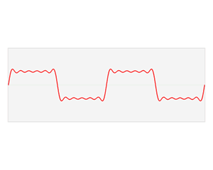
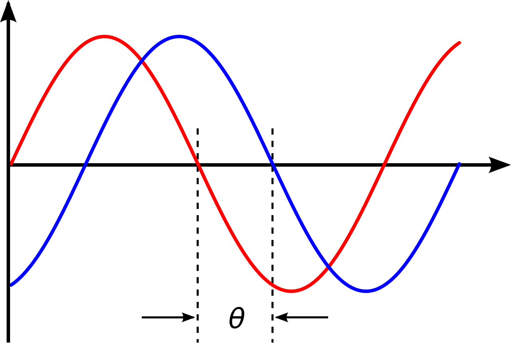
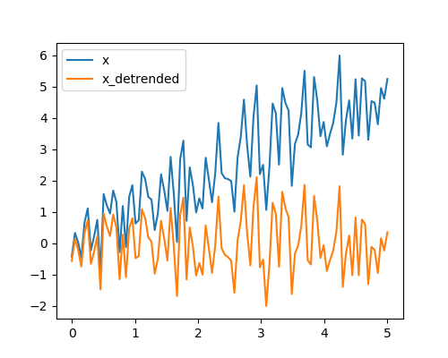
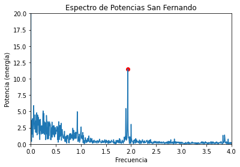

[Contenidos](../Contenidos.md) \| [Anterior (4 Introducción a Pandas)](04_Pandas.md) \| [Próximo (6 Cierre de la séptima)](06_Cierre.md)

# 7.5 Series temporales

Para esta Sección contamos con el valioso aporte de [Octavio Bruzzone](https://inta.gob.ar/personas/bruzzone.octavio). Octavio da dos cursos de posgrado excelentes sobre Series Temporales en Python. Uno se enfoca en los análisis en el dominio del tiempo y el otro en el dominio de las frecuencias. Generosamente nos compartió algunas ideas para este trabajo práctico.

## Análisis y visualización de series temporales.

En este práctico vamos a visualizar y analizar datos de mareas en el Río de la Plata. Tiene una primera parte que esperamos que todes hagan y una segunda parte, más larga y compleja, optativa. Trabajá en el archivo `mareas_fft.py`.

Para comenzar, copiate [el archivo](./OBS_SHN_SF-BA.csv) con datos de mareas en los puertos de San Fernando y Buenos Aires a tu carpeta `Data`

## Lectura de archivos temporales


```python
import pandas as pd

df = pd.read_csv('Data/OBS_SHN_SF-BA.csv')
```

Observá los datos:

```python
>>> df.head()
                  Time  H_SF   H_BA
0  2011-01-01 00:00:00   NaN   92.0
1  2011-01-01 01:00:00   NaN  110.0
2  2011-01-01 02:00:00   NaN  124.0
3  2011-01-01 03:00:00   NaN  132.0
4  2011-01-01 04:00:00   NaN  136.0

>>> df.index
RangeIndex(start=0, stop=35064, step=1)
```

Este archivo tiene alturas del agua en el puerto de San Fernando (columna `H_SF`) y en el puerto de Buenos Aires (columna `H_BA`) medidas en centímetros.
Tiene un dato por hora (columna `Time`) durante cuatro años.
En los primeros registros se observa algo muy frecuente con este tipo de archivos: tiene muchos datos faltantes.

El índice de un dataframe nos da información de su estructura. En este caso, está representando el número de línea del archivo que leímos. Pero un índice puede aportarnos más información relevante para nuestro problema, por lo que la propuesta es que el índice debería ser el instante en le que se tomó cada muestra ('Time').

Para esto tenemos que decirle a la función `read_csv` dos cosas:
* por un lado que use la columna 'Time' como índice (index_col = ['Time']) y
* por el otro que la interprete como un timestamp (parse_dates = True).


```python
df = pd.read_csv('Data/OBS_SHN_SF-BA.csv', index_col=['Time'], parse_dates=True)
```

Observá la diferencia:

```python
>>> df.head()
                     H_SF   H_BA
Time
2011-01-01 00:00:00   NaN   92.0
2011-01-01 01:00:00   NaN  110.0
2011-01-01 02:00:00   NaN  124.0
2011-01-01 03:00:00   NaN  132.0
2011-01-01 04:00:00   NaN  136.0

>>> df.index
DatetimeIndex(['2011-01-01 00:00:00', '2011-01-01 01:00:00',
               ...
               '2014-12-31 22:00:00', '2014-12-31 23:00:00'],
              dtype='datetime64[ns]', name='Time', length=35064, freq=None)
```

Que el índice sea temporal nos da una versatilidad genial para trabajar con estos datos.
Probá por ejemplo los siguientes comandos:

```python
>>> df['1-18-2014 9:00':'1-18-2014 18:00']
                     H_SF  H_BA
Time
2014-01-18 09:00:00  85.0  67.0
2014-01-18 10:00:00  79.0  60.0
2014-01-18 11:00:00  73.0  49.0
2014-01-18 12:00:00  65.0  43.0
2014-01-18 13:00:00  59.0  36.0
2014-01-18 14:00:00  53.0  29.0
2014-01-18 15:00:00  48.0  22.0
2014-01-18 16:00:00  42.0  18.0
2014-01-18 17:00:00  36.0  33.0
2014-01-18 18:00:00  40.0  67.0
```

Probá también `df['2-19-2014']` (observá que el formato de fechas que se usa es el de EEUU), y `df['12-25-2014':]`.

## Ondas de marea en el Río de la Plata

Grafiquemos estos últimos datos:

```python
df['12-25-2014':].plot()
```

<p align="center">

</p>

Acá se ven tres fenómenos interesantes:
* Hay 14 picos en 7 días, esto corresponde a la frecuencia _semidiurna_ de las mareas. Cada poco más de 12hs tenemos un ciclo con pleamar y bajamar. Dos ciclos por día.
* Por otra parte, se ve que las mareas en San Fernando están retrasadas respecto a las de Buenos Aires.
Esto se debe a que las ondas de marea vienen del océano atlántico y se propagan por el estuario del río de la Plata, pasando primero por Buenos Aires y llegando luego, con retraso, a San Fernando. En ciertas condiciones esta onda de mareas puede llegar a la ciudad de Rosario, aunque se va atenuando en su viaje desde el atlántico.

* Finalmente, hay una marcada diferencia entre la altura registrada en San Fernando y la de Buenos Aires. Esto se debe a que las dos escalas, a partir de las que se registran los datos, tienen ceros que no están nivelados.

En este práctico nos proponemos estudiar la propagación de esta *onda de marea* que es generada por la atracción gravitacional que ejercen la luna y el sol sobre el agua. Vamos a usar una transformada de Fourier que nos permite estudiar las frecuencias predominantes en la serie de alturas. Las mareas se verán claramente porque estos efectos astronómicos son regulares y tienen frecuencias invariantes.

## Vientos y ondas de tormenta en el Río de la Plata

Si miramos un gráfico un poco más extendido en el tiempo vamos a ver que las alturas no solo fluctúan con las mareas semidiurnas sino que la componente meteorológica (vientos principalmente, que generan *ondas de tormenta*) modifica las alturas de manera muy considerable.

El siguiente comando genera un gráfico entre el 15 de octubre de 2014 y el 15 de diciembre del mismo año.

```python
df['10-15-2014':'12-15-2014'].plot()
```

<p align="center">

</p>


En ese gráfico se puede observar cómo una sudestada a principios de noviembre elevó el nivel del estuario más de un metro durante casi tres días. Las dos fotos que siguen son justamente de esa sudestada. Fueron tomadas el primero de noviembre por Gustavo Castaing.

<p align="center">
 
</p>


Así como el viento del sudeste empuja el agua del mar hacia adentro del estuario y genera crecidas, los vientos del norte o el oeste también impulsan desplazamientos del agua del estuario, en este caso generando bajantes. En las siguientes dos fotos puede verse una bajante capturada por Juan Pablo Martínez Bigozzi el 19 de junio del 2019.

<p align="center">
 
</p>

La transformada de Fourier no resultará muy útil para ver estas *ondas de tormenta*. Como carecen de regularidad, no aparecerán claramente en el espectro de frecuencias.

### Ejercicio 7.10: 
Trabajemos con una copia de este fragmento:

```python
dh = df['12-25-2014':].copy()
```

Podemos desplazar (shift en inglés) una Serie de Pandas usando el método `ds.shift(pasos)`. Además, podemos subir o bajar su gráfico sumando una constante a todas las mediciones `ds + cte`.

Finalmente podemos unir dos series en un DataFrame de manera muy simple, para poder graficarlas juntas. Si concatenamos estas operaciones obtenemos algo así:

```python
delta_t = 0 # tiempo que tarda la marea entre ambos puertos
delta_h = 0 # diferencia de los ceros de escala entre ambos puertos
pd.DataFrame([dh['H_SF'].shift(delta_t) - delta_h, dh['H_BA']]).T.plot()
```

<p align="center">

</p>


Buscá los valores de `delta_t` (es un número entero, son pasos) y `delta_h` (puede tener decimales, es un float) que hacen que los dos gráficos se vean lo más similares posible.

Guardá tu código en el archivo `mareas_a_mano.py` para entregar.

### Correlación con desplazamientos

El siguiente código calcula y grafica el [coeficiente de correlación *r* de Pearson](https://es.wikipedia.org/wiki/Coeficiente_de_correlaci%C3%B3n_de_Pearson) entre la serie de alturas en Buenos Aires y la de San Fernando desplazada temporalmente.

```python
import numpy as np
import pandas as pd
from scipy.stats import pearsonr
import matplotlib.pyplot as plt

# Levanto las dos series
df=pd.read_csv('Data/OBS_SHN_SF-BA.csv',index_col=['Time'],parse_dates=True)
# Me quedo con un fregmento
dh=df['10-01-2014':].copy()

# Selecciono los intervalos que voy a usar para desplazar SF
shifts = np.arange(-12,13)
# Genero un vector donde guardar los coeficientes de correlacion para cada deslpazamiento
corrs = np.zeros(shifts.shape)
for i, sh in enumerate(shifts):
    #guardo el coeficiente de correlación r entre de SF desplazada con BA original.
    corrs[i] = pearsonr(dh['H_SF'].shift(sh)[12:-12],dh['H_BA'][12:-12])[0]
# ploteo los resultados   
plt.plot(shifts, corrs)
```

### Ejercicio 7.11: Interpolación
Este ejemplo muestra una manera de interplolar la serie de manera de poder usar desplazamientos menores a una hora.

```python
# Cada cuarto de hora
df=pd.read_csv('Data/OBS_SHN_SF-BA.csv',index_col=['Time'],parse_dates=True)
dh =df['10-01-2014':].copy() #ultimo trimestre
freq_horaria = 4 # 4 para 15min, 60 para 1min
cant_horas = 24
N = cant_horas * freq_horaria
#resampleo cada tantos minutos
dh = dh.resample(f'{int(60/freq_horaria)}T').mean()
#rellenos los NaNs suavemente
dh =dh.interpolate(method='quadratic')
# genero vector de desplazamientos (enteros)
ishifts = np.arange(-N,N+1)
# y su desplamiento horario asociado
shifts=ishifts/freq_horaria
# finalmente calculo las correlaciones correspondientes
corrs = np.zeros(shifts.shape)
for i, sh in enumerate(ishifts):
    corrs[i] = pearsonr(dh['H_SF'].shift(sh)[N:-N],dh['H_BA'][N:-N])[0]
# y grafico
plt.plot(shifts, corrs)
```

El comando `np.argmax(corrs)` se puede usar para devolver la coordenada de la máxima correlación. Esa posición del vector `shifts` indicará a cuántas horas corresponde ese desplazamiento. Si lo corremos con esta interpolación cada 15 minutos propuesta en el código, obtendremos que la onda tarda una hora en llegar a San Fernando. Usando una interpolación más fina, ¿podés estimar el desfazaje en minutos? A nosotros nos dio 57 minutos.


## Parte optativa

En lo que sigue vamos a usar herramientas matemáticas para hacer un análisis similar al que hicimos recién de manera *artesanal*. Para una onda sinusoidal, el desplazamiento horizontal corresponde a una diferencia de fase y el desplazamiento vertical es simplemente una constante aditiva. Vamos a descomponer la serie de alturas observadas del agua por medio de la transformada de Fourier.

Las ondas de marea se mueven lentamente y tardan cierto tiempo en llegar de un puerto a otro. En lo que sigue vamos a ver cómo calcular el tiempo que le toma a esta onda en desplazarse de Buenos Aires hasta San Fernando.

**Lo que sigue es optativo**.

## Análisis por medio de transformadas de Fourier

La transformada de Fourier descompone una señal en una suma de senos y cosenos (sinusoides) con diferentes frecuencias y amplitudes.

Esta animación ilustra gráficamente el proceso de la transformada de Fourier.

<p align="center">

</p>

La transformada da, para cada frecuencia, un número complejo `a + bi` que puede pensarse como un vector `(a,b)` en el plano. La parte real va a multiplicar un coseno con la frecuencia indicada y la parte imaginaria un seno con la misma frecuencia. La magnitud (o amplitud, o potencia) de la señal en esa frecuencia se corresponde con el largo del vector `(a, b)`.

<p align="center">

</p>

La fase (o desplazamiento del máximo respecto del origen de las coordenadas), se corresponde con ángulo que forma este vector `(a, b)` con el semieje de los reales positivos.

<p align="center">

</p>

Aquí, la variable theta (θ) representa el desplazamiento de fase de la curva azul (respecto a la roja que tiene desplazamiento nulo). Esta *fase* suele medirse en radianes, correspondiendo 2*π a un ciclo completo de desfasaje.

Vamos a aplicar estas herramientas al análisis de la propagación de la onda de marea por el estuario del plata.


### Preparación de módulos y datos

Vamos a usar los siguientes módulos:

```python
from scipy import signal # para procesar señales
import numpy as np
import matplotlib.pyplot as plt
```

Seleccionemos las dos series como vectores de numpy (con el método `to_numpy()`).

```python
inicio = '2014-01'
fin = '2014-06'
alturas_sf = df[inicio:fin]['H_SF'].to_numpy()
alturas_ba = df[inicio:fin]['H_BA'].to_numpy()
```

Primero definamos una función que calcule la transformada de Fourier para datos horarios y considerando como unidad de frecuencia los días (descartamos la mitad de los coeficientes de la transformada porque los datos son reales y no complejos). Podés tomarla como una caja negra por ahora...

```python
def calcular_fft(y, freq_sampleo = 24.0):
    '''y debe ser un vector con números reales
    representando datos de una serie temporal.
    freq_sampleo está seteado para considerar 24 datos por unidad.
    Devuelve dos vectores, uno de frecuencias 
    y otro con la transformada propiamente.
    La transformada contiene los valores complejos
    que se corresponden con respectivas frecuencias.'''
    N = len(y)
    freq = np.fft.fftfreq(N, d = 1/freq_sampleo)[:N//2]
    tran = (np.fft.fft(y)/N)[:N//2]
    return freq, tran
```

Para poder analizar una onda por medio de su transformada de Fourier, es necesario que la onda sea periódica. Puede pasar que no sea el caso y que una onda tenga tendencia lineal, en ese caso podríamos usar la función `scipy.signal.detrend()`.

<p align="center">

</p>

En nuestro caso supondremos que la marea media se mantuvo estable a lo largo del período de estudio, así que no tenemos que hacerle este procesamiento intermedio.


### Espectro de potencia y de ángulos para San Fernando

Primero calculamos la transformada de las alturas de San Fernando.

```python
freq_sf, fft_sf = calcular_fft(alturas_sf)
```

Si quisiéramos graficar `freq_sf` contra `fft_sf` no podríamos ver mucho ya que `fft_sf` contiene números complejos.

La potencia (o amplitud) para cada frecuencia se calcula como el módulo del número complejo correspondiente (para la frecuencia `freq_sf[i]` y la potencia es `abs(fft_sf[i])`). Al graficar esto podemos ver la amplitud de los sinusoides para cada frecuencia. Este gráfico se llama el *espectro de potencias* de la onda original.

```python
plt.plot(freq_sf, np.abs(fft_sf))
plt.xlabel("Frecuencia")
plt.ylabel("Potencia (energía)")
plt.show()
```

<p align="center">

</p>


A simple vista se observan dos picos, uno en frecuencia 0 (constante relacionada con el cero de escala) y otro pico cercano a la frecuencia 2 (frecuencia semidiurna) que está relacionado con la onda de mareas.

El pico en la primera posición efectivamente se corresponde con la frecuencia 0 y su amplitud es:

```python
>>> freq_sf[0]
0.0
>>> np.abs(fft_sf[0])
111.83
```

A partir de esto podemos decir que las alturas del río en San Fernando durante este período oscilan alrededor de los 111.8 cm de altura.

Para analizar precisamente el pico semidiurno podemos usar `find_peaks` que provee`scipy.signal` para evitar hacerlo a ojo. Vamos a pedir aquellos picos que tengan al menos cierta diferencia con su entorno (prominencia), un buen valor para esto es el 8. Podés probar otros valores y observar el resultado.

```python
>>> print(signal.find_peaks(np.abs(fft_sf), prominence = 8))
(array([350]), {'prominences': array([11.4554514]), 'left_bases': array([307]), 'right_bases': array([2109])})
```

Esta respuesta nos indica que hay un pico con la prominencia solicitada (al menos 8), que tiene un magnitud de 11.45 y que corresponde a la posición 350 del vector.

```python
>>> freq_sf[350]
1.93
```

La frecuencia relacionada con esa posición es cercana a dos, como ya habíamos observado en el gráfico (dos ciclos por día). Podemos distinguir los picos agregando un punto rojo y mirando más de cerca el área de interés:

```python
plt.plot(freq_sf, np.abs(fft_sf))
plt.xlabel("Frecuencia")
plt.ylabel("Potencia (energía)")
plt.xlim(0,4)
plt.ylim(0,20)
# me quedo solo con el último pico
pico_sf = signal.find_peaks(np.abs(fft_sf), prominence = 8)[0][-1]
# es el pico a analizar, el de la onda de mareas
# marco ese pico con un circulito rojo
plt.scatter(freq_sf[pico_sf], np.abs(fft_sf)[pico_sf], facecolor = 'r')
plt.show()
```

<p align="center">

</p>

Estos gráficos permiten interpretar que si descomponemos la curva de alturas en San Fernando como suma de sinusoidales, el sinusoide con frecuencia 1.93 tiene una magnitud considerablemente llamativa. No es casualidad que este sea un punto distinguido: se trata de la frecuencia de las mareas lunares.

Ahora viene la parte un poco más sutíl: **el análisis de las fases**. Si conocemos la fase de estas componentes en dos puertos distintos, podremos estimar el tiempo que tarda en desplazarse la marea de uno a otro.

Para calcular la fase (entre -π y π) de dicha componente (la que ubicamos en la posición 350) en el puerto de San Fernando, podemos simplemente usar `np.angle()` y pasarle el número complejo en cuestión:

<p align="center">

</p>

```python
>>> ang_sf = np.angle(fft_sf)[pico_sf]
>>> print(ang_sf)
1.4849
```


Obtenemos un valor cercano a pi/2. Recordemos que 2*pi corresponde a un desfasaje de un ciclo completo de la curva. Como nuestra curva de estudio tiene una frecuencia diaria ligeramente inferior a 2 (freq_sf[350]~1.93), 2*pi corresponde a 24/1.93 horas ~ 12.44 horas. Por lo tanto la fase obtenida con angSF[350] corresponde a un retardo de


```python
>>> ang_sf * 24 / (2 * np.pi * freq_sf[350])
2.93
```

Es decir, este sinusoide está desfasado poco menos de 3hs respecto al seno _neutro_.

### Espectro de potencia y de ángulos para Buenos Aires

Repitamos velozmente el procedimiento para el puerto de Buenos Aires y analicemos las diferencias.

```python
freq_ba, fft_ba = calcular_fft(alturas_ba)
plt.plot(freq_ba, np.abs(fft_ba))
plt.xlabel("Frecuencia")
plt.ylabel("Potencia (energía)")
plt.xlim(0,4)
plt.ylim(0,20)
# me quedo solo con el último pico
pico_ba = signal.find_peaks(np.abs(fft_ba), prominence = 8)[0][-1]
#se grafican los picos como circulitos rojos
plt.scatter(freq_ba[pico_ba], np.abs(fft_ba)[pico_ba], facecolor='r')
plt.title("Espectro de Potencias Bs.As.")
plt.show()
```


Si buscamos la constante alrededor de la que oscilan las mareas según el nivel del puerto de Buenos Aires obtenemos:

```python
>>> np.abs(fft_ba[0])
88.21
```

Con este resultado es sencillo obtener una estimación para la diferencia de alturas de los ceros de escala entre ambos puertos.

_Pregunta 1:_ ¿Cuál es la diferencia de altura media entre los puertos obtenida de esta forma? 

_Pregunta 2:_ ¿De qué otra forma se puede estimar el valor medio de un puerto? ¿Cuánto da la diferencia con este otro método?

Por otra parte, si observamos que el espectro de potencia vemos que los picos en ambos puertos son súmamente similares.

```python
>>> print(signal.find_peaks(np.abs(fft_ba), prominence=8))
(array([350]), {'prominences': array([12.67228046]), 'left_bases': array([279]), 'right_bases': array([1000])})
```

Las mareas de Buenos Aires tiene una componente de máxima amplitud en la  frecuencia 1.93 (misma que San Fernando) y con una magnitud de 12.67 (bastante similar a la magnitud correspondiente en San Fernando). Resta estudiar la fase de la curva de los datos de `df_ba` en esta frecuencia para poder determinar con precisión la diferencia de fase entre ambos puertos para ondas de marea. Primero calculamos el ángulo de la componente correspondiente y luego lo convertimos en horas usando el factor `ang2h`:

```python
>>> ang_ba = np.angle(fft_ba)[pico_ba]
>>> print(ang_ba)
1.96
>>> freq = freq_ba[pico_ba]
>>> ang2h = 24 / (2*np.pi*freq)
>>> ang_ba * ang2h
3.8786004708135566
```

Por lo tanto, el retardo de la onda de mareas puede calcularse usando
```python
(ang_ba - ang_sf) * ang2h
```

### Ejercicio 7.12: Desfasajes
En la Pregunta 1 estimaste el desfasaje vertical entre los ceros de escala de los puertos analizados.
Ahora tenés que estimar el desfasaje temporal de las ondas de marea entre ambos puertos.
¿A cuántos minutos corresponde aproximadamente el tiempo que tarda la onda de mareas en llegar del puerto de Buenos Aires al de San Fernando?

Usá estos datos para volver a hacer el gráfico del [Ejercicio 7.10](../07_Fechas_Carpetas_y_Pandas/05_Series_Temporales.md#ejercicio-710) (vas a tener que redondear a horas enteras el delay temporal).

## Un poco más avanzados:

### Ejercicio 7.13: Otros puertos
Usando el [archivo con datos del Puerto de Zárate](./OBS_Zarate_2013A.csv), estimá el tiempo (expresado en horas y minutos) que le toma a la onda de marea llegar de Buenos Aires a Zárate.

Obviamente la onda llega atenuada a Zárate. ¿Cómo se refleja esta atenuación en la transformada? ¿Podés cuantificar esta atenuación?

Guardá lo que hayas hecho hasta acá en el archivo `mareas_fft.py` para entregar.

### Ejercicio 7.14: Otros períodos
El primer análisis se realizó con el primer semestre del 2014 ya que no tiene ni datos faltantes ni outliers. Este ejercicio es una invitación a explorar estos problemas tan frecuentes.

* ¿Se puede comparar Zárate con San Fernando usando todos los datso de Zárate? ¿Cómo se comporta San Fernando en esas fechas?
* ¿Se pueden usar las series completas de BA y SF para calcular el desfasaje de la onda de mareas? ¿Qué son las alturas negativas? ¿Tienen sentido?

La siguiente función completa datos faltantes y corrige pequeños problemas en los índices. Es un poco brutal tratar así un DataFrame: es conveniente mirar los datos antes de completar faltantes. Lo dejamos como puntero a diferentes  métodos muy útiles para la limpieza de series.

```python
def reparar(df):
    df = df.interpolate()
    df = df.resample('H').mean()
    df = df.fillna(method = 'ffill')
    return df
```


[Contenidos](../Contenidos.md) \| [Anterior (4 Introducción a Pandas)](04_Pandas.md) \| [Próximo (6 Cierre de la séptima)](06_Cierre.md)

