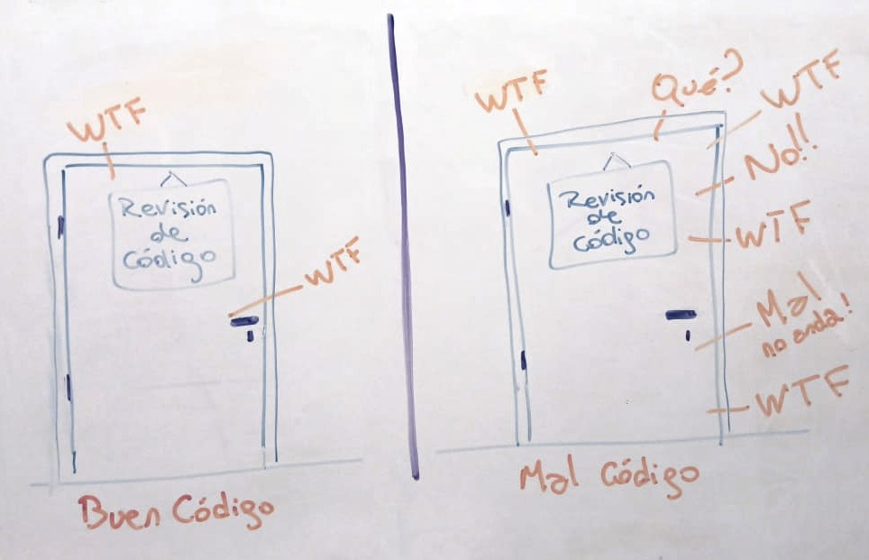

[Contenidos](../Contenidos.md) \| [Anterior (5 Contratos: Especificación y Documentación)](05_Especificacion_y_Documentacion.md) \| [Próximo (7 La biblioteca matplotlib)](07_Matplotlib.md)

# 7.6 Estilos de codeo

## PEP 8 - La guía de estilo para Python

La comunidad de usuaries de Python ha adoptado una guía de estilo que facilita la lectura del código y la consistencia entre programas de distintos usuaries. Esta guía no es de seguimiento obligatorio, pero es altamente recomendable. El documento completo se denomina PEP 8 y está escrito originalmente en [inglés](https://www.python.org/dev/peps/pep-0008/), aunque hay alguna traducción al [castellano](http://recursospython.com/pep8es.pdf). 

A continuación presentamos un resumen con solo algunas recomendaciones.

### Indentación
Utilizar siempre 4 espacios y nunca mezclar tabuladores y espacios.

Si se continúa una línea hay dos opciones aceptables:

```python
# Correcto
# opción 1, indentar a la apertura del paréntesis:
foo = funcion_que_crea_bar(variable_1, variable2,
                           variable_3, variable_4)

# opcion 2, agregar 4 espacios:
foo = funcion_que_crea_bar(
    variable_1, variable2,
    variable_3)
```

```python
# Incorrecto, en cualquier lado.
foo = funcion_que_crea_bar(variable_1, variable2,
              variable_3)
```

### Tamaño máximo de línea
Las líneas deben limitarse a un máximo de 79 caracteres.

### Líneas en blanco
Separar las definiciones de las clases y funciones con dos líneas en blanco. Los métodos dentro de clases se separan con una línea en blanco. Se recomienda utilizar líneas en blanco para separar partes del código, por ejemplo dentro de una función, que realizan tareas diferenciadas.

### Imports
Los imports de distintos módulos deben estar en líneas diferentes:

```python
# Sí: 
import os
import sys
```

```python
# No:
import os, sys
```

Sí se pueden poner en una línea los elementos que se importan de un mismo módulo:

```python
from subprocess import Popen, PIPE
```

Los imports deben ponerse siempre al principio del archivo, justo después de los comentarios y de la documentación del archivo y antes de la definición de las variables globales y las constantes.

Los imports deben agruparse en el siguiente orden:

1. bibliotecas o módulos estándar. 
2. bibliotecas o módulos de terceros.
3. bibliotecas o módulos locales o propios.

Cada grupo de imports debe estar separado por una línea en blanco.

### Espacios en blanco en expresiones
Evitar espacios en blanco extra en:

Dentro de paréntesis, corchetes o llaves.
```python
# Sí: 
spam(ham[1], {eggs: 2})
```

```python
# No:  
spam( ham[ 1 ], { eggs: 2 })
```

Antes de una coma.
```python
# Sí: 
if x == 4: print x, y; x, y = y, x 
```

```python
# No: 
if x == 4 : print x , y ; x , y = y , x
```

Antes del paréntesis de una llamada a una función.
```python
# Sí: 
spam(1)
```

```python
# No, ese espacio es espantoso
spam (1)
```

Antes del corchete de un índice o clave.
```python
# Sí: 
dict['key'] = list[index]
```

```python
# No, ese espacio es igual de espantoso que el anterior
dict ['key'] = list [index]
```

Siempre separá los operadores binarios con un espacio simple a ambos lados: asignación (=), asignación aumentada (+=, -= , etc.), comparación (==, <, >, !=, <>, <=, >=, in, not in, is, is not), booleanos (and, or, not).

Usá espacios alrededor de operadores artiméticos:

```python
# Sí:
i = i + 1
submitted += 1
x = x * 2 - 1
hypot2 = x * x + y * y
c = (a + b) * (a - b)
```

```python
# No:
i=i+1
submitted +=1
x = x*2 - 1 #no es recomendado pero a veces lo usamos
hypot2 = x*x + y*y
c = (a+b) * (a-b)
```


### Convenciones de nombres

Las convenciones de nombres en Python son un lío y probablemente nunca lograremos que todo sea consistente. Sin embargo, te damos algunas de las recomendaciones actuales sobre nombres. Los nuevos módulos deberían ser escritos respetándolos, aunque la consistencia interna es preferible para bibliotecas que ya tengan partes hechas...

### Estilos de nombres

Hay muchos estilos para nombrar variable, funciones, etc. Es útil reconocer qué estilo se está usando, independientemente de para qué se está usando.

Éstos son algunos estilos:

* b (una sola letra, en minúscula)
* B (una sola letra, en mayúscula)
* minusculas
* minusculas_con_guiones_bajos
* MAYUSCULAS
* MAYUSCULAS_CON_GUIONES_BAJOS
* PalabrasConMayusculas (también llamado estilo camello por las jorobas)
* mixedCase (difiere del camello en la inicial)
* Con_Mayusculas_Y_Guiones_Bajos (horrible!)

Se recomienda no usar acentos ni caracteres especiales de ningún tipo para evitar problemas de compatibilidadd. Los nombres de funciones y variables deberían estar escritos en minúsculas, eventualmente usando guiones bajos para mejorar la legibilidad. 

### Hay mucho más!

Esto es solo un breve resumen, mirá el [PEP 8](https://www.python.org/dev/peps/pep-0008/) para tener toda la información sobre estilo recomendado en Python.

## El código no es solo leído: el código de percibe

Más allá de los gustos por los diferentes estilos posibles, es importante recordar que hay una métrica que no falla nunca para evaluar la calidad de un código: _la cantidad de puteadas por minuto de un lector externo_. 



Las reglas de estilo pueden ser discutidas, acatadas o no, en diferentes contextos. Es importante entender que un programador enfrentado a un código en Python no solo lee el código sino que percibe su diseño en el espacio, el uso de bloques y espacios, de indentaciones y mayúsculas. El diseño gráfico del código es una parte importante de las herramientas de transmisión de la información que permite nuestro archivo.

Creeamos estas ideas con tres citas en inglés, extraídas de [este excelente artículo](https://optimal-codestyle.github.io/) de Aleksandr Skobelev que expresan la convicción de que el código en un lenguaje de programación no se escribe solamente para ser ejecutado por una computadora sino principalmente para ser leído y _percibido_ por otras personas:

> Usually, when evaluating the text of a program in terms of its _ease of perception_, the term _readability_ is used. Strictly speaking, they are not exactly the same thing, because, as will be shown later, the process of *perceiving a program* is more than just reading. 
> -- <cite> Aleksandr Skobelev, Fundamentals of Optimal Code Style. </cite>

> First, we want to establish the idea that a computer language is not just a way of getting a computer to perform operations but rather that it is a novel formal medium for expressing ideas about methodology. Thus, programs must be written for people to read, and only incidentally for machines to execute.
> -- <cite>Harold Abelson and Gerald Jay Sussman, Structure and Interpretation of Computer Programs. </cite>

> Indeed, the ratio of time spent reading vs. writing is well over 10:1… Because this ratio is so high, we want the reading of code to be easy, even if it makes the writing harder.
> -- <cite>Robert C. Martin, Clean Code: A Handbook of Agile Software Craftsmanship. </cite>


## Zen de Pyhton

Ya que estamos hablando de los PEPs, queremos mencionar el PEP 20 (PEP viene de Python Enhancement Proposals), también conocido como el [Zen de Python](https://es.wikipedia.org/wiki/Zen_de_Python)

El Zen de Python es una colección de principios de software que influyen en el diseño del lenguaje. El texto, que copiamos a continuación se puede encontrar en el sitio oficial de Python y también se incluye como sorpresa en  el intérprete de Python al escribir la instrucción `import this`.​

**Zen de Pyhton**

>Bello es mejor que feo.

>Explícito es mejor que implícito.

>Simple es mejor que complejo.

>Complejo es mejor que complicado.

>Plano es mejor que anidado.

>Espaciado es mejor que denso.

>La legibilidad es importante.

>Los casos especiales no son lo suficientemente especiales como para romper las reglas.

>Sin embargo la practicidad le gana a la pureza.

>Los errores nunca deberían pasar silenciosamente.

>A menos que se silencien explícitamente.

>Frente a la ambigüedad, evitá la tentación de adivinar.

>Debería haber una, y preferiblemente solo una, manera obvia de hacerlo.

>A pesar de que esa manera no sea obvia a menos que seas Holandés.

>Ahora es mejor que nunca.

>A pesar de que nunca es muchas veces mejor que *justo* ahora.

>Si la implementación es difícil de explicar, es una mala idea.

>Si la implementación es fácil de explicar, puede que sea una buena idea.

>Los espacios de nombres son una gran idea, ¡hagamos más de ellos!


[Contenidos](../Contenidos.md) \| [Anterior (5 Contratos: Especificación y Documentación)](05_Especificacion_y_Documentacion.md) \| [Próximo (7 La biblioteca matplotlib)](07_Matplotlib.md)

