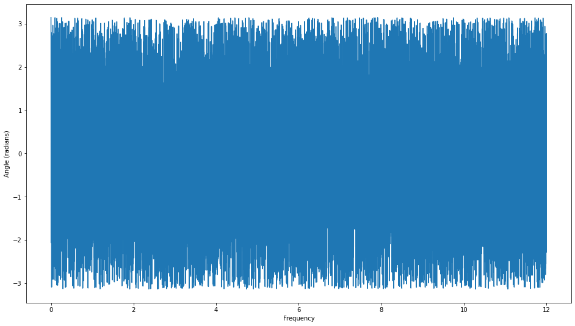
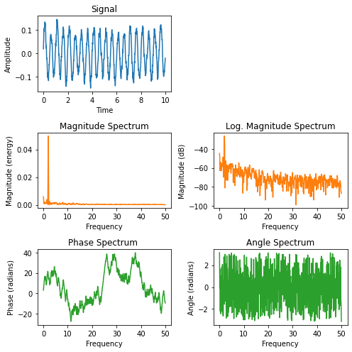

[Contenidos](../Contenidos.md) \| [Anterior (4 Introducción a Pandas)](04_Pandas_basico.md) \| [Próximo (6 Cierre de la séptima)](06_Cierre.md)

# 7.5 Detección de patrones periódicos

## Tema Optativo: Series temporales

Autor: [Octavio Bruzzone](https://inta.gob.ar/personas/bruzzone.octavio)
Octavio da dos cursos de posgrado sobre Series Temporales altamente recomendados para los que tienen que analizar datos temporales.

Para comenzar, copiate [el archivo](./OBS_SHN_SF-BA.csv) con datos de mareas en los puertos de San Fernando y Buenos Aires a tu carpeta 'Datos/'

En este práctico vamos a visualizar los datos de mareas


## Análisis por medio de transformadas de fourier

La transformada de Fourier descompone una señal en una suma de sinusoides con diferente frecuencia.


Para cada frecuencia, la señal está descompuesta en un componente real (coseno) y uno imaginario (seno). La magnitud (o amplitud, o potencia) de la señal en esa frecuencia es la suma vectorial de ambos componentes.


La fase (o posición del máximo respecto del origen de las coordenadas), es el ángulo entre el componente real y el imaginario.


## Lectura de datos con un bucle para verificar un archivo desconocido

Alternativamente puede usarse la función `loadtxt()`.

```python
%pylab inline
#lectura de  datos
def leedatos():
    #nombre del archivo con los datos
    txt = "OBS_SHN_SF-BA.csv"
    #array vacio donde meter los datos
    serie = []
    
    for linea in open(txt):
        linea = linea.split(',')
        hsf = -1
        hba = -1
        try:
            hsf = float(linea[1])
        except ValueError:
            print("\r Dato no valido en hsf", end = '')
        try:
            hba = float(linea[2])
        except ValueError:
            print("\r Dato no valido en hba", end = '\r')
        serie.append([hsf, hba])
    serie = array(serie)
    serie = ma.masked_less(serie, -1)
    #luego de graficar la serie
    #retorno la parte de la serie donde ambas series son continuas
    return serie[4500:24500]


```

    Populating the interactive namespace from numpy and matplotlib


```python
#grafico las series
figsize(16,9)
serie = leedatos()
plot(serie[:,0])
plot(serie[:,1], alpha = 0.5)
#xlim(4500,24500)
show()
```

     Dato no valido en hsf


```python
#importo modulos para procesar señales
from scipy import signal
from scipy import fftpack, fft
```


```python
#se le quita la tendencia a la serie
sdt0 = detrend_linear(serie[:,0])
#espectro de potencia (amplitud de los sinusoides)
#parametros: serie de datos y frecuencia de muestreo (24/dia)
(mg0, frc0, linea0) = magnitude_spectrum(sdt0, 24.)
#se buscan lospicos del espectro de potencia
picos0 = signal.find_peaks(mg0, prominence=4, distance = 10)[0]
#verificar los picos con un print
#se ve la prominencia de ser necesario
#print(signal.peak_prominences(mg0, picos0))
#se grafican los picos como circulitos rojos
scatter(frc0[picos0], mg0[picos0], facecolor='r')
show()
#idem para la segunda serie
sdt1 = detrend_linear(serie[:,1])
(mg1, frc1, linea1) = magnitude_spectrum(sdt1, 24.)
picos1 = signal.find_peaks(mg1, prominence=4, distance = 10)[0]
#print(signal.peak_prominences(mg1, picos1))
scatter(frc1[picos1], mg1[picos1], facecolor='r')
show()
```


```python
set_printoptions(precision=4,suppress=True,linewidth=180)
#se obtiene elespectro de angulos
#parametros: serie de datos y frecuencia de muestreo (1/hora o 24/dia)
ang0, frec0, lin0 = angle_spectrum(sdt0, 24.)
#vemos la fase de los picos en horas
print("Frecuencia",frec0[picos0])
print("Angulo",ang0[picos0] / (2 * pi) * 1/frec0[picos0])
show()
ang1, frec1, lin1 = angle_spectrum(sdt1, 24.)
print("Frecuencia",frec1[picos1])
print("Angulo",ang1[picos1] / (2 * pi) * 1/frec1[picos1])
show()
#ver la diferencia de fase entre los picos de la misma frecuencia
```

    Frecuencia [0.0024 0.06   0.1404 0.93   1.896  1.932 ]
    Angulo [-137.1708    6.7523    3.5428   -0.4326   -0.0325   -0.0334]





    Frecuencia [0.06   0.1404 0.93   1.896  1.932 ]
    Angulo [ 7.0631 -3.5528 -0.402   0.0014 -0.0031]


```python
#hacer lo mismo con la frecuencia en días
ang0, frec0, lin0 = angle_spectrum(sdt0, 1.)
#vemos la fase de los picos en horas
print(ang0[picos0] / (2 * pi) * 1/frec0[picos0])
show()
ang1, frec1, lin1 = angle_spectrum(sdt1, 1.)
print(ang1[picos1] / (2 * pi) * 1/frec1[picos1])
show()
```

    [-3292.0991   162.0544    85.0273   -10.3817    -0.7797    -0.8008]


    [169.5149 -85.2664  -9.6469   0.0325  -0.0749]


```python
#ejemplo importado de la documentación de matplotlib

import matplotlib.pyplot as plt
import numpy as np


np.random.seed(0)

dt = 0.01  # sampling interval
Fs = 1 / dt  # sampling frequency
t = np.arange(0, 10, dt)

# generate noise:
nse = np.random.randn(len(t))
r = np.exp(-t / 0.05)
cnse = np.convolve(nse, r) * dt
cnse = cnse[:len(t)]

s = 0.1 * np.sin(4 * np.pi * t) + cnse  # the signal

fig, axs = plt.subplots(nrows=3, ncols=2, figsize=(7, 7))

# plot time signal:
axs[0, 0].set_title("Signal")
axs[0, 0].plot(t, s, color='C0')
axs[0, 0].set_xlabel("Time")
axs[0, 0].set_ylabel("Amplitude")

# plot different spectrum types:
axs[1, 0].set_title("Magnitude Spectrum")
axs[1, 0].magnitude_spectrum(s, Fs=Fs, color='C1')

axs[1, 1].set_title("Log. Magnitude Spectrum")
axs[1, 1].magnitude_spectrum(s, Fs=Fs, scale='dB', color='C1')

axs[2, 0].set_title("Phase Spectrum ")
axs[2, 0].phase_spectrum(s, Fs=Fs, color='C2')

axs[2, 1].set_title("Angle Spectrum")
axs[2, 1].angle_spectrum(s, Fs=Fs, color='C2')

axs[0, 1].remove()  # don't display empty ax

fig.tight_layout()
plt.show()
```





```python

```


[Contenidos](../Contenidos.md) \| [Anterior (4 Introducción a Pandas)](04_Pandas_basico.md) \| [Próximo (6 Cierre de la séptima)](06_Cierre.md)

