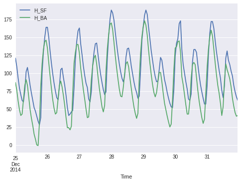
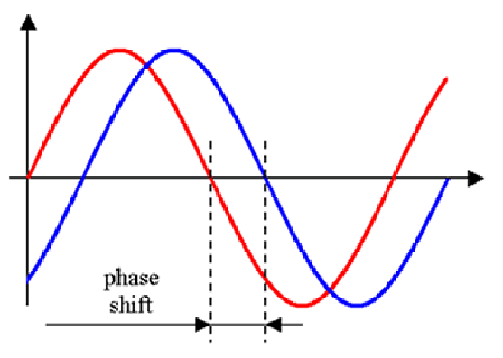

[Contenidos](../Contenidos.md) \| [Anterior (4 Introducción a Pandas)](04_Pandas.md) \| [Próximo (6 Cierre de la séptima)](06_Cierre.md)

# 7.5 Series temporales

Autores: [Octavio Bruzzone](https://inta.gob.ar/personas/bruzzone.octavio) y Rafael Grimson

* Octavio da dos cursos de posgrado excelentes sobre Series Temporales en Python. Uno se enfoca en los análisis en el dominio del tiempo y el otro en el dominio de las frecuencias. Generosamente escribió algunas ideas para este trabajo práctico.


## Análisis y visualización de series temporales.

En este práctico vamos a visualizar y analizar datos de mareas en el Río de la Plata. Tiene una primera parte que esperamos que todos hagan y una segunda parte, más larga y compleja, optativa.

Para comenzar, copiate [el archivo](./OBS_SHN_SF-BA.csv) con datos de mareas en los puertos de San Fernando y Buenos Aires a tu carpeta 'Datos/'

## Lectura de archivos temporales


```python
import pandas as pd

df=pd.read_csv('Data/OBS_SHN_SF-BA.csv')
```

Observá los datos:
    
```python
>>> df.head()
                  Time  H_SF   H_BA
0  2011-01-01 00:00:00   NaN   92.0
1  2011-01-01 01:00:00   NaN  110.0
2  2011-01-01 02:00:00   NaN  124.0
3  2011-01-01 03:00:00   NaN  132.0
4  2011-01-01 04:00:00   NaN  136.0

>>> df.index
RangeIndex(start=0, stop=35064, step=1)
```

Este archivo tiene alturas del agua en el puerto de San Fernando (columna 'H_SF') y en el puerto de Buenos Aires (columna 'H_BA') medidas en centímetros.
Tiene un dato por hora durante (columna 'Time') cuatro años.
En los primeros registros se observa algo muy frecuente con este tipo de archivos: tiene muchos datos faltantes.

Por otra parte, no es del todo razonable que el índice de esta DataFrame sea un simple rango numérico. El índice debería ser el instante en le que se tomó cada muestra ('Time'). 

Para esto tenemos que decirle a la función `read_csv` dos cosas: 
* por una lado que use la columna 'Time' como índice (index_col=['Time']) y
* por el otro que la interprete como un timestamp (parse_dates=True).


```python
df=pd.read_csv('Data/OBS_SHN_SF-BA.csv',index_col=['Time'],parse_dates=True)
```

Observá la diferencia:
    
```python
>>> df.head()
                     H_SF   H_BA
Time                            
2011-01-01 00:00:00   NaN   92.0
2011-01-01 01:00:00   NaN  110.0
2011-01-01 02:00:00   NaN  124.0
2011-01-01 03:00:00   NaN  132.0
2011-01-01 04:00:00   NaN  136.0

>>> df.index
DatetimeIndex(['2011-01-01 00:00:00', '2011-01-01 01:00:00',
               ...
               '2014-12-31 22:00:00', '2014-12-31 23:00:00'],
              dtype='datetime64[ns]', name='Time', length=35064, freq=None)
```

Que el índice sea temporal nos da una versatilidad genial para trabajar con estos datos.
Probá por ejemplo los siguientes comandos:
    
```python
>>> df['1-18-2014 9:00':'1-18-2014 18:00']
                     H_SF  H_BA
Time                           
2014-01-18 09:00:00  85.0  67.0
2014-01-18 10:00:00  79.0  60.0
2014-01-18 11:00:00  73.0  49.0
2014-01-18 12:00:00  65.0  43.0
2014-01-18 13:00:00  59.0  36.0
2014-01-18 14:00:00  53.0  29.0
2014-01-18 15:00:00  48.0  22.0
2014-01-18 16:00:00  42.0  18.0
2014-01-18 17:00:00  36.0  33.0
2014-01-18 18:00:00  40.0  67.0
```

Probá también `df['2-19-2014']` (observá que el formato de fechas que se usa es el de EEUU), y `df['12-25-2014':]`.

## Mareas en el Río de la Plata

Grafiquemos estos últimos datos:
    
```python
df['12-25-2014':].plot()
```



Aca se ven tres fenómenos interesantes: 
* Hay 14 picos en 7 días, esto corresponde a la frecuencia _semidiurna_ de las mareas. Cada poco más de 12hs tenemos un ciclo con pleamar y bajamar. Dos ciclos por día.
* Por otra parte, se ve que las mareas en San Fernando están retrasadas respecto a las de Buenos Aires. 
Esto se debe a que las ondas de marea vienen del océano atlántico y se propagan por el estuario del rio de la Plata, 
pasando primero por Buenos Aires y llegando luego, con retraso, a San Fernando. En ciertas condiciones esta onda de mareas puede llegar a la ciudad de Rosario, aunque se va atenuando en su viaje desde el atlántico.
* Finalmente, hay una marcada diferencia entre la altura registrada en San Fernando y la de Buenos Aires. Esto se debe a que las dos escalas, a partir de las que se registran los datos, tienen ceros que no están nivelados.

En este práctico nos proponemos estudiar la propagación de esta *onda de marea*.

## Tormentas y sudestadas en el Río de la Plata

Si miramos un gráfico un poco más extendido en el tiempo vamos a ver que las alturas no solo fluctuan con las mareas semidiurnas sino que la componente meteorológica (vientos principalmente, que generan *ondas de tormenta*) modifican las alturas de manera muy considerable.

El siguiente comando genera un gráfico entre el 15 de octubre de 2014 y el 15 de diciembre del mismo año. 
```python
df['10-15-2014':'12-15-2014'].plot()
```


Se puede observar cómo una sudestada a principios de noviembre elevó el nivel del estuario más de un metro durante casi tres días. Las siguientes fotos son de esa sudestada. Fueron tomadas el primero de Noviembre del 2014 por Gustavo Castaing.

 


También los vientos del norte o el oeste impactan en la altura del agua generando bajantes. En las siguientes dos fotos puede verse una bajante tomada por Juan Carlos Martínez Bigozzi el 19 de junio del 2019. 

 


### Ejercicio 7.10: 
Trabajemos con una copia de este fragmento:

```python
dh=df['12-25-2014':].copy()
```

Podemos desplazar (shift en inglés) una serie temporal usando el método `ds.shift(pasos)`. Podemos subir o bajar su gráfico sumando una constante a todas las mediciones `ds + cte`.

Finalmente podemos unir dos series en un en un DataFrame de manera muy simple, para poder graficarlas juntas. Si concatenamos estas operaciones obtenemos algo así:

```python
delta_t = 0 #tiempo que tarda la marea entre ambos puertos
delta_h = 0 #diferencia de los ceros de escala entre ambos puertos
pd.DataFrame([dh['H_SF'].shift(delta_t)-delta_h,dh['H_BA']]).T.plot()
```


Buscá los valores de `delta_t` (entero, son pasos) y `delta_h` (puede tener decimales, es un float) que hacen que los dos gráficos se vean lo más similares posible.

Guardá tu código en el archivo `mareas_a_mano.py` para entregar.

## Parte optativa

En lo que sigue vamos a usar herramientas matemáticas para hacer un análisis similar al que hicimos recién de manera *artesanal*. Para una onda sinusoidal, el desplazamiento horizontal corresponde a una diferencia de fase y el desplazamiento vertical es simplente una contante aditiva. Vamos a descomponer la serie de alturas observadas del agua por medio de la transformada de Fourier. 

**Lo que sigue es optativo**.

## Análisis por medio de transformadas de Fourier

La transformada de Fourier descompone una señal en una suma de senos y cosenos (sinusoides) con diferentes frecuencias y amplitudes.

Este gráfico ilustra gráficamente el proceso de la tranformada de Fourier.


La transofrmada da, para cada frecuencia, un número complejo `a + bi` que puede pensarse como un vector `(a,b)` en el plano. La parte real va a multiplicar un coseno con la frecuencia indicada y la parte imaginaria un seno con la misma frecuencia. La magnitud (o amplitud, o potencia) de la señal en esa frecuencia se corresponde con el largo del vector `(a,b)`.


La fase (o desplazamiento del máximo respecto del origen de las coordenadas), se corresponde con ángulo que forma este vector `(a,b)` con el semieje de los reales positivos.



Aquí, la variable tita representa el desplazamiento de fase de la curva azul (respecto a la roja que tiene desplazamiento nulo). Esta *fase* suele medirse en radianes, correspondiendo 2*pi a un ciclo completo de desfazaje.

Vamos a aplicar estas herramientas al análisis de la propagación de la onda de marea por el estuario del plata. La onda de marea se genera por


### Preparación de módulos y datos

Vamos a usar los siguientes módulos:

```python
#importar el módulo de scipy para procesar señales
from scipy import signal
import matplotlib.pyplot as plt
```

Seleccionemos las dos series como vectores de numpy (con la instrucción `values` de pandas).

```python
HSF=df['2014-1':'2014-06']['H_SF'].values
HBA=df['2014-1':'2014-06']['H_BA'].values
```

### Espectro de potencia y de ángulos para San Fernando

El espectro de potencia nos permite ver la amplitud de los sinusoides para cada frecuencia. el módulo pyplot de matplotlib nos permite calcularlo y graficarlo en un solo paso. Recibe como parámetros la serie de datos y frecuencia de muestreo (en nuestro caso es de 24 muestras por dia).

```python
mgSF, frecSF, lineasSF = plt.magnitude_spectrum(HSF, Fs =24.)
```


La variable `mgSF` guarda las magnitudes correspondientes a las frecuencias almacenadas en `frecSF`. La variable `lineasSF` guarda simplemente información del gráfico.

A simple vista se obervan dos picos, uno en fecuencia 0 (constante relacionada con el cero de escala) y otro pico cercano a la frecuencia 2 (frecuencia semidiurna) que está relacionado con la onda de mareas. 

El pico en la primera posición efectivamente se corresponde con la frecuencia 0 y su amplitud es:

```python
>>> frecSF[0]
0.0
>>> mgSF[0]
112.40499716091024
```

A partir de esto podemos decir que las altura del río en San Fernando durante este período oscilan alrededor de los 112.4cm de altura.

Para analizar precisamente el pico semidiurno podemos usar `find_peaks` del módulo `signal` para evitar hacerlo a ojo.

```python
>>> print(signal.find_peaks(mgSF, prominence=8))
(array([350]), {'prominences': array([12.2833]), 'left_bases': array([275]), 'right_bases': array([1802])})
```

Esta respuesta nos indica que hay un pico con la prominencia solicitada (al menos 8), que tiene un magnitud de 12.2833 y que corresponde a la posición 350 del vector. 

```python
>>> frecSF[350]
1.9337016574585635
```

La frecuencia relacionada con esa posición es cercana a dos, como ya habíamos observado en el gráfico. Podemos distinguir los picos agregando un punto rojo:

```python
mgSF, frecSF, lineasSF = plt.magnitude_spectrum(HSF, Fs =24.)
plt.xlim(0,3)
plt.ylim(0,15)
picosSF = signal.find_peaks(mgSF, prominence=8)[0]
#se grafican los picos como circulitos rojos
plt.scatter(frecSF[picosSF], mgSF[picosSF], facecolor='r')
plt.show()
```


Lo que se observa en estos gráficos es que si descomponemos la curva de alturas en San Fernando como suma de sinusoidales, el sinusoide con frecuencia 1.93 tiene una magnitud considerablemente llamativa. Se trata de la frecuencia de las mareas lunares justamente. Si conocemos las fases de estas componentes es dos puertos distintos, podremos estimar el tiempo que tarda en desplazarse la marea de uno a otro.

Por otra parte, con el comando

```python
angSF, frecSF, linSF = plt.angle_spectrum(HSF, 24.)
```

podemos calcular el espectro de ángulos. `angSF[350]` entonces nos dará información sobre la fase de esa componente de la transformadad de Fourier.

```python
>>> angSF[350]
1.5094504268950777
```

Obtenemos un valor cercano a pi/2. Recordemos que 2*pi corresponde a un desfazaje de un ciclo completo de la curva. Como nuestra curva de estudio tiene una frecuacia diaria ligeramente inferior a 2 (frecSF[350]~1.93), 2*pi corresponde a 24/1.93 horas. Por lo tanto la fase obtenida con angSF[350] corresponde a un retardo de 

```python
>>> angSF[350]*12/np.pi/frecSF[350]
2.9816781201906313
```
poco menos de 3hs respecto al seno que comienza a medianoche.

### Espectro de potencia y de ángulos para Buenos Aires

Repitamos velozmente el procedimiento para el puerto de Buenos Aires y analicemos las diferencias.

```python
mgBA, frecBA, lineasBA = plt.magnitude_spectrum(HBA, Fs =24.)
plt.xlim(0,3)
plt.ylim(0,15)
picosBA = signal.find_peaks(mgBA, prominence=8)[0]
#se grafican los picos como circulitos rojos
plt.scatter(frecBA[picosBA], mgBA[picosBA], facecolor='r')
plt.show()
```


Si buscamos la constante alrededor de la que oscilan las mareas según el nivel del puerto de Buenos Aires obtenemos.

```python
>>> mgBA[0]
88.40835357673745
```

Con este resultado es sencillo obtener una estimación para la diferencia de de alturas de los ceros de escala entre ambos puertos.

Por otra parte, observamos que el espectro de potencia y sus picos son súmamente similares.

```python
>>> print(signal.find_peaks(mgBA, prominence=8))
(array([350]), {'prominences': array([13.657]), 'left_bases': array([167]), 'right_bases': array([739])})
```

Las mareas de Buenos Aires tiene una componente de máxima amplitud en la misma frecuencia y con una magnitud de 13.657. Resta estudiar la fase de la curva en estas frecuencias para poder determinar con precisión la diferencia de fase entre ambos puertos. Primero calculamos el espectro de ángulos:

```python
angBA, frecBA, linBA = plt.angle_spectrum(HBA, 24.)
```
La variable `angBA[350]` contiene la fase de la curva para la frecuencia de interés. Convertida a horas da

```python
>>> angBA[350]*12/np.pi/frecBA[350]
3.9013844071274755
```

Por lo tanto, el retardo de la onda de mareas puede calcularse usando
```python
angBA[350]*12/np.pi/frecBA[350]-angSF[350]*12/np.pi/frecSF[350]
```

### Ejercicio 7.11: Desfazajes
¿A cuántos minutos corresponde aproximadamente tiempo que tarda la onda de mareas en llegar del puerto de Buenos Aires al de San Fernando?
Estimá la diferencia en los ceros de escala de ambos puertos. Usá estos datos para volver a hacer el gráfico del [Ejercicio 7.10](../07_datetime_SO_Pandas_sns/05_Series_Temporales.md#ejercicio-710) (vas a tener que redondear a horas enteras el delay temporal).

## Un poco más avanzados:

### Ejercicio 7.12: Otros puertos
Usando el [archivo con datos del Puerto de Zárate](./OBS_Zarate_2013A.csv), estimá el tiempo (expresado en horas y minutos) que le toma a la onda de marea llegar de Buenos Aires a Zárate. 

Obviamente la onda llega atenuada a Zárate. ¿Cómo se expresa este hecho en los la transformada? ¿Cuánto se atenúo respecto a Buenos Aires?

### Ejercicio 7.13: Otros períodos
Este análisis se realizó con el primer semestre del 2014 ya que no tiene ni datos faltantes ni outliers. ¿Se puede realizar el mismo análisis en otros semestres? ¿Es posible utilizar la serie completa? ¿Cuál es el mayor intervalo que podés usar para realizar estos cálculos aprovechar al máximo los datos pero evitando problemas?


[Contenidos](../Contenidos.md) \| [Anterior (4 Introducción a Pandas)](04_Pandas.md) \| [Próximo (6 Cierre de la séptima)](06_Cierre.md)

