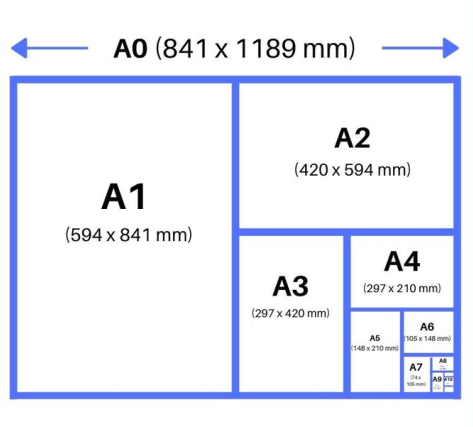

[Contenidos](../Contenidos.md) \| [Anterior (2 Diseño de algoritmos recursivos)](02_Diseno_Recursivo.md) \| [Próximo (4 Regresión lineal)](04_Regresion_Lineal.md)

# 10.3 Práctica de Recursión

## Ejercicios


### Ejercicio 10.2: Números triangulares
Escribí una función que calcule recursivamente el n-ésimo número
triangular (es decir, el número *1 + 2 + 3 + ... + n*).

Fijate que este ejercicio es un caso particular de la función `sumar_enteros(desde, hasta)` que implementaste en el [Ejercicio 6.6](../06_Plt_Especificacion_y_Documentacion/04_Especificacion_y_Documentacion.md#ejercicio-66-sumas). La implementación que hiciste en el primer inciso de ese ejercicio es una forma de reemplazar la recursión por un ciclo. La implementación que hiciste en el segundo inciso es mucho más eficiente.


### Ejercicio 10.3: Dígitos
Escribí una función recursiva que reciba un número positivo, n, y devuelva
la cantidad de dígitos que tiene.


### Ejercicio 10.4: Potencias
Escribí una función recursiva que reciba 2 enteros, *n* y *b*, y devuelva
`True` si *n* es potencia de *b*.

Ejemplos:

```python
es_potencia(8, 2) -> True
es_potencia(64, 4) -> True
es_potencia(70, 10) -> False
es_potencia(1, 2) -> True
```


### Ejercicio 10.5: Subcadenas
Escribí una funcion recursiva que reciba como parámetros dos cadenas *a* y
*b*, y devuelva una lista con las posiciones en donde se encuentra *b*
dentro de *a*.

Ejemplo:

```python
posiciones_de('Un tete a tete con Tete', 'te') -> [3, 5, 10, 12, 21]
```

### Ejercicio 10.6: Paridad
Escribí dos funciones mutualmente recursivas `par(n)` e `impar(n)` que
determinen la paridad del numero natural dado, usando solo que:

* 1 es impar.
* Un número mayor que uno es impar (resp. par) si su antecesor es par (resp. impar).


### Ejercicio 10.7: Máximo
Escribí una funcion recursiva que encuentre el mayor elemento de una lista (sin usar `max()`).


### Ejercicio 10.8: Replicar
Escribí una función recursiva para replicar los elementos de una lista
una cantidad n de veces. Por ejemplo:

```python
replicar([1, 3, 3, 7], 2) -> ([1, 1, 3, 3, 3, 3, 7, 7])
```

_Sugerencia: hacé la recursión en el largo de la lista._

### Ejercicio 10.9: Pascal
El [triángulo de Pascal](https://es.wikipedia.org/wiki/Tri%C3%A1ngulo_de_Pascal) es un arreglo triangular de números que se define de la siguiente manera: Las filas se enumeran desde *n = 0*, de arriba hacia
abajo. Los valores de cada fila se enumeran desde *k = 0* (de izquierda a
derecha). Los valores que se encuentran en los bordes del triángulo son todos unos. Cualquier otro valor se calcula sumando los dos valores contiguos de
la fila de arriba.


Escribí la función recursiva `pascal(n, k)` que calcula el valor que se
encuentra en la fila `n` y la columna `k`. Guardá tu función en el archivo `larenga.py` para entregar.

Ejemplo:
```python
>>> pascal(5, 2)
10
```


### Ejercicio 10.10: Combinatorios

Escribí una función recursiva que reciba una lista de caracteres únicos,
y un número *k*, e imprima todas las posibles cadenas de longitud *k* formadas
con los caracteres dados (permitiendo caracteres repetidos).

Ejemplo: 

```python
>>> combinaciones(['a', 'b', 'c'], 2)
aa ab ac ba bb bc ca cb cc
```


### Ejercicio 10.11: Búsqueda binaria
Escribí una función recursiva que implemente la búsqueda binaria de un elemento `e` en una lista ordenada `lista`. La función debe devolver simplemente `True` o `False` indicando si el elemento está o no en a lista. Para esto completá el siguiente código:

```python
def bbinaria_rec(lista, e):
    if len(lista) == 0:
        res = False
    elif len(lista) == 1:
        res = lista[0] == e
    else:
        medio = len(lista)//2

        # completar

    return res
```

Guardá tu solución en el archivo `bbin_rec.py`.

### Ejercicio 10.12: Envolviendo a Fibonacci
Como vimos, la implementación recursiva inmediata del cálculo del número de Fibonacci (F(n) = F(n-1) + F_(n-2), F(0) = 0, F(1)= 1) es ineficiente porque muchas de las ramas calculan reiteradamente los mismos valores.

Escribí una función `fibonacci(n)` que calcule el *n*-ésimo número
de Fibonacci de forma recursiva pero que utilice un diccionario para almacenar
los valores ya computados y no computarlos más de una vez.

_Observación_: Será necesario implementar una función *wrapper* (es decir, una función que envuelva a otra) para cumplir con la firma de la función pedida. Podés trabajar en un script en blanco o completar el siguiente código.

```python
def fibonacci(n):
    """
    Toma un entero positivo n y
    devuelve el n-ésimo número de Fibonacci
    donde F(0) = 0 y F(1) = 1.
    """
    def fibonacci_aux(n, dict_fibo):
        """
        Calcula el n-ésimo número de Fibonacci de forma recursiva
        utilizando un diccionario para almacenar los valores ya computados.
        dict_fibo es un diccionario que guarda en la clave 'k' el valor de F(k)
        """
        if n in dict_fibo.keys():
            F = dict_fibo[n]
        else:
            ?? # completar
        return ?? # completar
    
    dict_fibo = {0:0, 1:1} 
    F, dict_fibo = fibonacci_aux(n, dict_fibo)
    return F 
```

Guardala en el archivo `fibonacci_envuelto.py`.

### Ejercicio 10.13: Hojas ISO y recursión
La norma ISO 216 especifica tamaños de papel. Es el estándar que define el popular tamaño de papel A4 (210mm de ancho y 297mm de largo). Las hojas A0 miden 841mm de ancho y 1189mm de largo. A partir de la A0 las siguientes medidas, digamos la A(N+1), se definen doblando al medio la hoja A(N). Siempre se miden en milímetros con números enteros: entonces la hoja A1 mide 594mm
de ancho (y no 594.5) por 841mm de largo. 



Escribí una función recursiva que para una entrada N mayor
que cero, devuelva el ancho y el largo de la hoja A(N) calculada
recursivamente a partir de las medidas de la hoja A(N−1), usando la
hoja A0 como caso base.

Guardala en el archivo `hojas_ISO.py`.

[Contenidos](../Contenidos.md) \| [Anterior (2 Diseño de algoritmos recursivos)](02_Diseno_Recursivo.md) \| [Próximo (4 Regresión lineal)](04_Regresion_Lineal.md)

