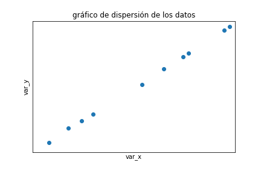
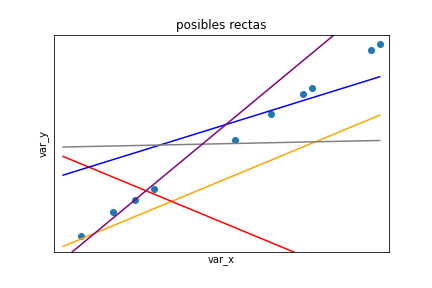
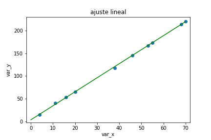
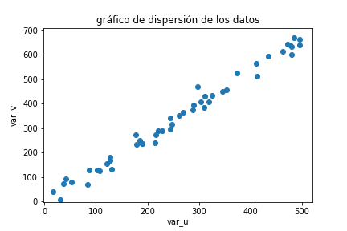
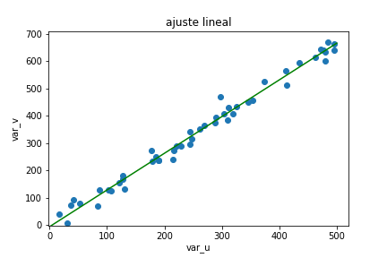
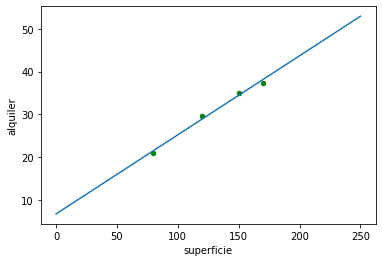
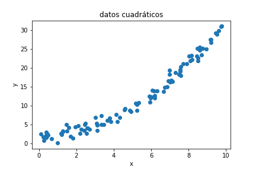
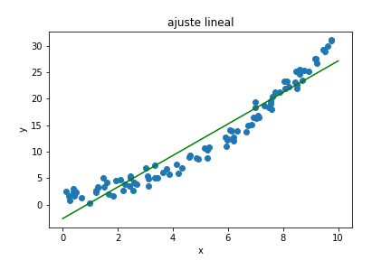
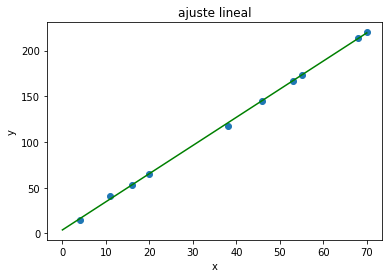

[Contenidos](../Contenidos.md) \| [Anterior (3 Práctica de Recursión)](03_EjerciciosRec.md) \| [Próximo (5 Cierre de la clase de Recursión)](05_Cierre.md)

# 10.4 Regresión lineal

En esta sección vamos a trabajar con **regresión lineal**. No es una clase con todos los fundamentos del tema, sino un acercamiento práctico a las técnicas y sus formas de uso en Python. Para un desarrollo más profundo te recomendamos por ejemplo las notas de [Andrew Ng](http://cs229.stanford.edu/notes/cs229-notes1.pdf).

## Regresión lineal simple.

Supongamos que queremos modelar la relación entre dos variables reales mediante un modelo lineal. Y que vamos a ajustar los parámetros de ese modelos a partir de ciertos valores conocidos (mediciones, digamos). Es decir que vamos a estar pensando que las variables tienen una relación lineal, `Y = a*X + b`, donde `X` es la variable *explicativa* (sus componentes se denominan *independientes* o *regresores*), e `Y` es la variable *a explicar* (también denominada *dependiente* o *regresando*).

A partir de un conjunto de datos de tipo `(x,y)`, planteamos el modelo `Y = a*X + b`.

En general el modelo no va a ser exacto, es decir, no se va a complir que `y_i = a*x_i + b` para los valores `(x_i,y_i)`, salvo que justamente estén sobre una línea recta.
Vamos a tener que `y_i = a*x_i + b + r_i` donde, los valores `r_i`, llamados _residuos_, representan las diferencias entre los valores de la recta en cada valor de `x` que tenemos y los valores de `y` asociados.

El problema de regresión lineal consiste en elegir los parámetros `a, b` de para la recta (es decir, su pendiente y ordenada al origen), de manera que la recta sea la que *mejor* se adapte a los datos disponibles.


```python
import numpy as np
import matplotlib.pyplot as plt

var_x = np.array([55.0, 38, 68, 70, 53, 46, 11, 16, 20, 4])
var_y = np.array([173.0, 118, 214, 220, 167, 145, 41, 53, 65, 15])
g = plt.scatter(x = var_x , y = var_y)
plt.title('scatterplot de los datos')
plt.savefig('ej0')
plt.show()

```



¿Qué quiere decir *mejor*? Vamos a considerar el criterio de cuadrados mínimos.

### Criterio de cuadrados mínimos

Vamos a elegir como mejor recta a la que minimice los residuos. Más precisamente, vamos a elegir la recta de manera tal que la suma de los cuadrados de los residuos sea mínima.



Analíticamente, buscamos `a, b` tales que se minimice la siguiente suma de cuadrados:

^2)


### Ejemplo

Para los datos que graficamos antes, ésta es la _mejor recta_, es decir, el ajuste lineal de los datos.



¿Cómo se encuentran estos coeficientes?

#### Una opción: derivando

Como buscamos el mínimo de la expresión `\Sigma_{i=1}^n (a*x_i + b - y_i)^2 ` podemos derivar respecto de los parámetros `a, b` e igualar a cero para despejarlos. De esta manera se obtienen las siguientes fórmulas para el ajuste:

```python
a = sum(((var_x - var_x.mean())*(var_y-var_y.mean()))) / sum(((var_x-var_x.mean())**2))
b = var_y.mean() - a*var_x.mean()
```
### Ejemplo

Veamos un ejemplo generado con datos sintéticos. Generamos 50 datos para la variable `u`, y determinamos a la variable `v` con una relación lineal más un error normal.

```python
import random

var_u = np.array(random.choices(range(500), k = 50))
var_r = np.array([random.normalvariate(0,25) for i in range(len(var_u))])
var_v = 1.3*var_u + 5 + var_r

g = plt.scatter(x = var_u , y = var_v)
plt.title('gráfico de dispersión de los datos')
plt.xlim([-2,520])
plt.ylim([-2,710])
plt.xlabel('var_u')
plt.ylabel('var_v')
plt.show()
```


Ahora ajustamos con las fórmulas que vimos antes:

```python
a = sum(((var_u - var_u.mean())*(var_v-var_v.mean()))) / sum(((var_u-var_u.mean())**2))
b = var_v.mean() - a*var_u.mean()

grilla_u = np.linspace(start=0, stop=500, num=1000)
grilla_v = grilla_u*a + b
g = plt.scatter(x = var_u , y = var_v)
plt.title('ajuste lineal')
plt.plot(grilla_u, grilla_v, c = 'green')
plt.xlim([-2,520])
plt.ylim([-2,710])

plt.xlabel('var_u')
plt.ylabel('var_v')

plt.show()

```



### Ejercicio 10.14: Alquiler y superficie
Consdieramos datos de precios de alquiler mensual de departamentos (en miles de pesos), y sus superficies (en metros cuadrados). Queremos ajustar un modelo que prediga el precio de alquiler a partir de la superficie.

```python
alquiler = [35.0, 29.6, 37.4, 21.0]
superficie = [150.0, 120.0, 170.0, 80.0]
deptos = {"alquiler": alquiler, "superficie": superficie}
data_deptos = pd.DataFrame(deptos)
data_deptos.plot(kind="scatter", x="superficie", y="alquiler")
x = data_deptos.superficie
y = data_deptos.alquiler
beta_1 = ((x - x.mean())*(y-y.mean())).sum() / ((x-x.mean())**2).sum()
beta_0 = y.mean() - beta_1*x.mean()
grilla_x = np.linspace(start=0, stop=250, num=1000)
y = beta_0 + beta_1*grilla_x
data_deptos.plot(kind="scatter", x="superficie", y="alquiler")
plt.plot(grilla_x,y)
```



Una forma de cuantificar cuán bien ajusta la recta, podemos considerar la suma de los errores cuadráticos.

```python
errores = data_deptos.alquiler - (beta_0 + beta_1*data_deptos.superficie)
print(errores)
print("Suma de errores:", (errores**2).sum())
```

### Ejemplo

Veamos qué pasa si los datos guardan en realidad una relación cuadrática.

```python
x = np.random.uniform(size=100, low=0, high=10)
y = 2 + 0.3*x**2 + np.random.normal(size=100, loc=0.0, scale=1.0)
plt.scatter(x,y)
plt.xlim([-0.5,10.5])
plt.ylim([-2,36])

plt.xlabel('x')
plt.ylabel('y')

plt.show()

```


Y ajutamos un modelo lineal a estos datos.

```python
a = sum(((x - y.mean())*(y-y.mean()))) / sum(((x-x.mean())**2))
b = y.mean() - a*x.mean()

grilla_x = np.linspace(start=0, stop=10, num=1000)
grilla_y = grilla_x*a + b
g = plt.scatter(x = x , y = y)
plt.title('ajuste lineal')
plt.plot(grilla_x, grilla_y, c = 'green')
plt.xlim([-0.5,10.5])
plt.ylim([-2,36])

plt.xlabel('x')
plt.ylabel('y')

plt.show()
```




```pyhon
errores = y - (x*a + b)
print("Suma de errores al cuadrado:", (errores**2).sum())
```

Un modelo alternativo es usar como variable explicativa `x^2` en vez de `x`.

```python
xc = x**2
ap = sum(((xc - y.mean())*(y-y.mean()))) / sum(((xc-xc.mean())**2))
bp = y.mean() - ap*xc.mean()
y_pred = (grilla_x**2)*ap + bp
plt.scatter(x,y)
plt.plot(grilla_x, grilla_y, c = 'green')

plt.plot(grilla_x, y_pred, c = 'red')

plt.xlim([-0.5,10.5])
plt.ylim([-2,36])

plt.xlabel('x')
plt.ylabel('y')

plt.show()
```


Y si queremos cuantificar el error en este modelo:

```pyhon
errores = y - ((x**2)*ap + bp)
print("Suma de errores al cuadrado:", (errores**2).sum())
```

### Scikit-Learn

La librería Scikit-Learn tiene herramientas muy útiles para el análisis de datos. En particular para regresión lineal tiene el módulo *linear_model*. En este ejemplo mostramos cómo se usa.

```python
from sklearn import linear_model
import pandas as pd

var_x = [55.0, 38, 68, 70, 53, 46, 11, 16, 20, 4]
var_y = [173.0, 118, 214, 220, 167, 145, 41, 53, 65, 15]
datosxy = pd.DataFrame({'x': var_x, 'y': var_y})

ajus = linear_model.LinearRegression() # llamo al modelo de regresión lineal
ajus.fit(datosxy.x.to_frame(), datosxy.y) # ajusto el modelo

a = ajus.coef_[0][0] # el método coef_ devuelve un array con los coeficientes
b = ajus.intercept_[0] # intercept devuelve la ordenada al origen

grilla_x = np.linspace(start=0, stop=70, num=1000)
grilla_x_df = pd.DataFrame(grilla_x)
grilla_y = ajus.predict(grilla_x_df)

g = plt.scatter(x = var_x , y = var_y)
plt.title('ajuste lineal')
plt.plot(grilla_x, grilla_y, c = 'green')

plt.xlabel('x')
plt.ylabel('y')

plt.show()
```



El modelo tiene también un método *predict* que, a partir de un valor de la variable explicativa devuelve la predicción de la variable explicada según el ajuste que se hizo.

```python
>>> ajus.predict([[10]])[0][0] # predicción para 10
34.597
>>> ajus.predict([[30]])[0][0] # predicción para 30
96.165
```

## Regresión Lineal Múltiple

La regresión lineal múltiple tiene un planteo similar, pero con más variables explicativas. El modelo es el siguiente.

`y = \b_0 + \sum_{j=1}^k \b_j x_j`

### Ejemplo

Trabajamos nuevamente con los departamentos, ahora también conociendo su antigüedad, y la tomamos como otra variable explicativa.

```python
alquiler = [35.0, 29.6, 37.4, 21.0]
superficie = [150.0, 120.0, 170.0, 80.0]
antigüedad = [50.0, 5.0, 25.0, 70.0]
deptos = {'alquiler': alquiler, 'superficie': superficie, 'antigüedad': antigüedad}
data_deptos = pd.DataFrame(deptos)


X = pd.concat([data_deptos.superficie,data_deptos.antigüedad], axis = 1)
y = data_deptos.alquiler
ajuste_deptos = linear_model.LinearRegression()
ajuste_deptos.fit(X,y)

ajuste_deptos.predict(X)
plt.scatter(y, ajuste_deptos.predict(X))


errores = data_deptos.alquiler - (ajuste_deptos.predict(X))
print(errores)
print("Suma de errores:", (errores**2).sum())
```

### Ejercicio 10.15: 
Queremos estimar el peso específico de un metal (es decir, peso divido volumen, en unidades de kg/m³). Para esto, disponemos de barras de dicho metal, con base de 1cm² y largos diversos, y de una balanza que tiene pequeños errores de medición (desconocidos). Vamos a estimar el peso específico _R_ del metal de la siguiente manera.

Sabemos que el volumen de una barra de largo `l` es `l`cm³, o sea `l/1000000` en metros cúbicos, así que su peso es `R*l/1000000`, y queremos estimar `R`. Utilizando la balanza, tendremos los pesos aproximados de distintas barras, con ciertos errores de medición. Si ajustamos un modelo lineal a los datos de volumen y peso aproximado, y predecimos el largo para una barra de volumen 1m³, vamos a tener una buena aproximación para `R`.

R = 7200 por cada m³

```python
#longitudes = [10.2, 25.6, 7.2, 15.2, 12.9] # en cm
longitudes = [14.8, 11.1, 29.3, 10.6, 28.7, 10.4, 22.1, 24.2, 29.8, 7.1, 18.2, 11.0, 29.9, 7.9, 13.2, 26.6, 6.6, 21.8, 19.1, 13.0, 5.4, 11.3, 10.9, 12.1, 28.5, 10.5, 5.2, 21.6, 21.2, 26.9, 11.9, 13.4, 25.7, 14.6, 21.1, 22.6, 24.4, 7.1, 15.7, 9.8, 28.7, 28.0, 8.6, 15.1, 6.7, 23.7, 27.1, 12.0, 19.8, 12.9, 23.2, 26.8, 21.8, 5.3, 29.6, 19.5, 7.8, 8.4, 26.8, 24.4, 5.3, 6.2, 28.3, 16.0, 26.2, 8.1, 26.9, 11.8, 24.6, 25.6, 28.6, 8.6, 16.3, 25.2, 5.7, 21.7, 16.0, 17.6, 11.8, 16.3, 27.4, 20.3, 21.4, 13.6, 29.1, 26.6, 15.3, 25.0, 16.5, 28.5, 15.8, 15.0, 16.2, 13.0, 13.4, 11.5, 10.1, 27.0, 23.1, 15.8]

pesos = [round(long*7200/1000000+random.normalvariate(0,0.002),2) for long in longitudes] # en kg
pesos = [0.09, 0.08, 0.2, 0.06, 0.2, 0.09, 0.16, 0.21, 0.22, 0.09, 0.12, 0.05, 0.2, 0.04, 0.1, 0.21, 0.04, 0.14, 0.17, 0.07, 0.0, 0.05, 0.09, 0.11, 0.22, 0.07, 0.03, 0.14, 0.15, 0.2, 0.09, 0.11, 0.22, 0.06, 0.15, 0.15, 0.16, 0.05, 0.1, 0.12, 0.22, 0.17, 0.04, 0.12, 0.03, 0.18, 0.21, 0.08, 0.16, 0.1, 0.16, 0.22, 0.16, 0.01, 0.21, 0.13, 0.09, 0.09, 0.21, 0.15, 0.04, 0.05, 0.19, 0.13, 0.21, 0.04, 0.22, 0.11, 0.17, 0.16, 0.22, 0.08, 0.12, 0.22, 0.02, 0.14, 0.1, 0.14, 0.05, 0.13, 0.19, 0.16, 0.14, 0.08, 0.19, 0.18, 0.1, 0.19, 0.16, 0.21, 0.12, 0.12, 0.11, 0.1, 0.11, 0.07, 0.08, 0.16, 0.18, 0.1]

pesos_posta = [round(long*7200/1000000,2) for long in longitudes] # en kg

data_pesos = pd.DataFrame({'longitudes': longitudes, 'pesos': pesos})
ajuste_pesos = linear_model.LinearRegression()
ajuste_pesos.fit(data_pesos.longitudes.to_frame(), data_pesos.pesos)
ajuste_pesos.fit(data_pesos.longitudes.to_frame(), pesos_posta)

ajuste_pesos.predict([[1]])
ajuste_pesos.intercept_

::::AJUSTAR LOS NUMERITOS::::


```

### Ejercicio 10.16: Altura y diámetro de árboles.
Considerá los datos de arbolado porteño que tenés en el archivo 'Data/arbolado-en-espacios-verdes.csv'. Cargalos en un DataFrame `data_arbolado_p`. Seleccioná los datos correspondientes a Jacarandás y realizá un ajuste lineal para explicar la altura de un Jacarandá a partir de su diámetro. Graficá el scatterplot de los datos junto con la recta de regresión lineal. Guardá el código de este ejercicio en un archivo `ajuste_arboles.py`.

```
import seaborn as sns
data_arbolado_p = pd.read_csv('Data/arbolado-en-espacios-verdes.csv')

data_arbolado_p.columns
datos_jac_p = data_arbolado_p[data_arbolado_p['nombre_com'] == 'Jacarandá']

ajuste_jac = linear_model.LinearRegression()
ajuste_jac.fit(datos_jac_p['diametro'].to_frame(), datos_jac_p['altura_tot'])

plt.scatter(x = datos_jac_p['diametro'], y = datos_jac_p['altura_tot'])


grilla = np.linspace(0,160,1000)
grilla_df = pd.DataFrame(grilla)
grilla_pred = ajuste_jac.predict(grilla_df)

sns.scatterplot(x = datos_jac_p['diametro'], y = datos_jac_p['altura_tot'])
sns.lineplot(x = grilla, y = grilla_pred, color = 'green')
```


*Observación: Como podrás ver en el gráfico, para árboles más anchos hay mayor variabilidad de alturas. Esto implica que el modelo va a ser más sensible a datos de árboles anchos, que a datos de árboles chicos. Esta caraceterística se llama **heterocedasticidad** y muchas veces es un problema para realizar una regresión lineal. En este caso lo estamos aplicando igual, y no nos trae problemas porque contamos con una gran cantidad de datos.*

Se puede corregir este problema estimando las varianzas y ajustando con pesos. SEGUIR ESTA IDEA SI PODEMOS

### Sobreajuste (_Overfitting_)

Cuando disponemos de muchas variables explicativas para explicar `y`, podemos armar un modelo más complejo, que en general llevará a minimizar el error. ¿Esto significa que el modelo va a ser mejor? El sobreajuste es un tema muy importante en el análisis de datos y el aprendizaje automático. Para verlo gráficamente, consideremos que en vez de ajustar linealmente con más o menos variables, consideramos polinomios de mayor o menor grado, para ajustar valores en el plano.


### _Train - Test_

### _Cross validation_

### Datos atípicos (_Outliers_)


[Contenidos](../Contenidos.md) \| [Anterior (3 Práctica de Recursión)](03_EjerciciosRec.md) \| [Próximo (5 Cierre de la clase de Recursión)](05_Cierre.md)

