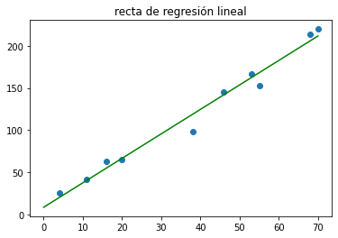
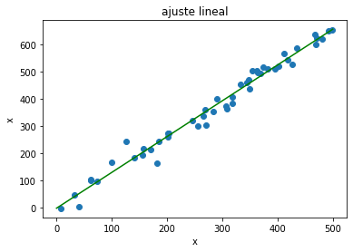

[Contenidos](../Contenidos.md) \| [Anterior (3 Práctica de Recursión)](03_EjerciciosRec.md) \| [Próximo (5 Cierre de la clase de Recursión y Regresión)](05_Cierre.md)

# 10.4 Regresión lineal

En esta sección vamos a trabajar con **regresión lineal**. No es una clase con todos los fundamentos del tema, sino un acercamiento práctico a las técnicas y sus formas de uso en Python. Para un desarrollo más profundo te recomendamos por ejemplo las notas de [Andrew Ng](http://cs229.stanford.edu/notes2020spring/cs229-notes1.pdf).


## Regresión lineal simple

Supongamos que queremos modelar la relación entre dos variables reales mediante un modelo lineal. Y que vamos a ajustar los parámetros de ese modelos a partir de ciertos valores conocidos (mediciones, digamos). Es decir que vamos a estar pensando que las variables tienen una relación lineal, `Y = a*X + b`, donde `X` es la variable *explicativa* (sus componentes se denominan *independientes* o *regresores*), e `Y` es la variable *a explicar* (también denominada *dependiente* o *regresando*).

A partir de un conjunto de datos de tipo `(x_i, y_i)`, planteamos el modelo `Y = a*X + b`.

En general el modelo no va a ser exacto, es decir, no se va a complir que `y_i = a*x_i + b` para los valores `(x_i, y_i)` (salvo que estén, justamente, todos los valores sobre una línea recta). En general, decíamos, vamos a tener que `y_i = a*x_i + b + r_i` donde, los valores `r_i`, llamados _residuos_, representan las diferencias entre los valores de la recta en cada valor de `x` que tenemos y los valores de `y` asociados.

El problema de regresión lineal consiste en elegir los parámetros `a, b` de la recta (es decir, su pendiente y ordenada al origen), de manera que la recta sea la que *mejor se adapte* a los datos disponibles.


```python
import numpy as np
import matplotlib.pyplot as plt

x = np.array([55.0, 38, 68, 70, 53, 46, 11, 16, 20, 4])
y = np.array([153.0, 98, 214, 220, 167, 145, 41, 63, 65, 25])
g = plt.scatter(x = x, y = y)
plt.title('scatterplot de los datos')
plt.show()

```


¿Qué quiere decir *mejor*? Vamos a considerar el criterio de cuadrados mínimos.

### Criterio de cuadrados mínimos

Vamos a elegir como mejor recta a la que minimice los residuos. Más precisamente, vamos a elegir la recta de manera tal que la suma de los cuadrados de los residuos sea mínima.


Analíticamente, buscamos `a, b` tales que minimicen la siguiente suma de cuadrados:

^2)

Usar cuadrados mínimos tiene múltiples motivaciones que no podemos detallar adecuadamente acá. Solo mencionaremos dos hechos importantes relacionados con su frecuente elección:

- Por un lado, minimizar el error cuadrático medio puede resolverse derivando la fórumla del error. Los que sepan algo de análisis matemático, recordarán que la derivada nos permite encontrar mínimos y que la derivada de una función cuadrática es una función lineal. Por lo tanto, encontrar la recta que mejor ajusta los datos se reduce a buscar el cero de una derivada que en el fondo se reduce a resolver un sistema lineal, algo que sabemos hacer muy bien y muy rápido. Si en lugar de minimizar la suma de los cuadrados de los residuos planteáramos, por ejemplo, minimizar la suma de los valores absolutos de los residuos no podríamos encontrar la recta que mejor ajusta tan fácilmente.
- Otro argumento muy fuerte, de naturaleza estadística en este caso, es que si uno considera que los residuos son por ejemplo errores de medición y que tienen una distribución normal (una gaussiana), entonces puede mostrarse que la recta que da el método de los cuadrados mínimos es _la recta de máxima verosimilitud_.

Estas cosas se explican muy bien en [el apunte de Andrew Ng](http://cs229.stanford.edu/notes2020spring/cs229-notes1.pdf) que citamos antes.

Recordá que en la [Sección 4.3](../04_Random_Plt_Dbg/03_NumPy_Arrays.md#fórmulas-matemáticas) vimos que calcular el promedio de estos errores cuadráticos es muy sencillo en numpy. También podés usar la función `mean_squared_error` del módulo `sklearn.metrics` que trae muchas métricas muy útiles.

### Ejemplo: el modelo de cuadrados mínimos

Para los datos que graficamos antes, ésta es _la mejor recta_, es decir, la que minimiza la suma de los cuadrados de los residuos. Vamos a decir que esta recta es **el ajuste lineal de los datos**.



¿Cómo se encuentran estos coeficientes?

### Ajuste del modelo de cuadrados mínimos

Como buscamos el mínimo de la expresión ^2)
 podemos derivar respecto de los parámetros `a, b` e igualar a cero para despejarlos. No es una cuenta díficil. El único cero que va a tener la derivada se corresponde con un mínimo (porque la recta se puede ajustar *tan mal como uno quiera*). De esta manera se obtienen las siguientes fórmulas para el ajuste:

```python
def ajuste_lineal_simple(x,y):
    a = sum(((x - x.mean())*(y-y.mean()))) / sum(((x-x.mean())**2))
    b = y.mean() - a*x.mean()
    return a, b
```
### Ejemplo: datos sintéticos

Veamos un ejemplo generado con datos sintéticos. Generamos 50 datos para la variable `x`, y determinamos a la variable `y` con una relación lineal más un error normal.

```python
import numpy as np

N = 50
minx = 0
maxx = 500
x = np.random.uniform(minx, maxx, N)
r = np.random.normal(0, 25, N) # residuos simulados
y = 1.3*x + r

g = plt.scatter(x = x, y = y)
plt.title('gráfico de dispersión de los datos')
plt.xlabel('x')
plt.ylabel('y')
plt.show()
```


Ahora ajustamos con las fórmulas que vimos antes:

```python
a, b = ajuste_lineal_simple(x, y)

grilla_x = np.linspace(start = minx, stop = maxx, num = 1000)
grilla_y = grilla_x*a + b

g = plt.scatter(x = x, y = y)
plt.title('y ajuste lineal')
plt.plot(grilla_x, grilla_y, c = 'green')
plt.xlabel('x')
plt.ylabel('y')

plt.show()
```



### Ejercicio 10.14: precio_alquiler ~ superficie
Consideramos datos de precios (en miles de pesos) de alquiler mensual de departamentos en el barrio de Caballito, CABA, y sus superficies (en metros cuadrados). Queremos modelar el precio de alquiler a partir de la superficie para este barrio. A veces este modelo se nota con *precio_alquiler ~ superficie*.

 + Usando la función que definimos antes, ajustá los datos con una recta.
 + Graficá los datos junto con la recta del ajuste.

```python
superficie = np.array([150.0, 120.0, 170.0, 80.0])
alquiler = np.array([35.0, 29.6, 37.4, 21.0])
```

Una forma de cuantificar cuán bien ajusta la recta es considerar el promedio de los errores cuadráticos, llamado *error cuadrático medio*.

```python
errores = alquiler - (a*superficie + b)
print(errores)
print("ECM:", (errores**2).mean())
```
 + Calculá el error cuadrático medio del ajuste que hiciste recién.

Guardá tu código en el archivo `alquiler.py` para entregar.


### Ejemplo: relación cuadrática

Veamos qué pasa si los datos guardan en realidad una relación cuadrática. Generemos aletoriamente variables independientes y dependientes con este tipo de relación.

```python
np.random.seed(3141) # semilla para fijar la aleatoriedad
N=50
indep_vars = np.random.uniform(size = N, low = 0, high = 10)
r = np.random.normal(size = N, loc = 0.0, scale = 8.0) # residuos
dep_vars = 2 + 3*indep_vars + 2*indep_vars**2 + r # relación cuadrática
```

Grafiquemos los datos obtenidos y, por comodidad, llamémoslos `x` e `y`.

```python
x = indep_vars
y = dep_vars
plt.scatter(x,y)
plt.title('scatterplot de los datos')
plt.show()
```


Y ajutemos un modelo lineal (notado: *y ~ x*) a estos datos.

```python
a, b = ajuste_lineal_simple(x, y)

grilla_x = np.linspace(start = 0, stop = 10, num = 1000)
grilla_y = grilla_x*a + b
g = plt.scatter(x = x , y = y)
plt.title('ajuste lineal')
plt.plot(grilla_x, grilla_y, c = 'green')
plt.show()
```


Veamos cuánto vale el error cuadrático medio.

```pyhon
errores = y - (x*a + b)
print("ECM", (errores**2).mean())
```


## Parte optativa:

Ahora vamos a profundizar en algunos conceptos y a ver maneras alternativas de hacer las cosas. Lo que sigue es optativo.

### Ejemplo: precómputo de atributos adecuados

Es natural pensar que aproximar una parábola con un modelo lineal no es lo más sensato. Un modelo alternativo es usar como variable explicativa `x^2` en vez de `x`. El cómputo de `xc = x^2` se realiza en un paso previo de forma que el modelo sigue siendo lineal (ahora lineal en `x^2`). Esto significa que el formalismo matemático para encontrar los coeficientes del nuevo modelo es el mismo que antes.

```python
xc = x**2
ap, bp = ajuste_lineal_simple(xc, y)
grilla_y_p = (grilla_x**2)*ap + bp
plt.scatter(x,y)
plt.plot(grilla_x, grilla_y, c = 'green')
plt.plot(grilla_x, grilla_y_p, c = 'red')
plt.title('ajuste lineal con x^2')
plt.show()
```


Y si queremos cuantificar el error en este modelo:

```pyhon
yhat = (x**2)*ap + bp       # valores estimados
residuos = y - yhat         # diferencia entre el valor original y el estimado
ecm = (residuos**2).mean()  # error cuadrático medio
print("ECM:", ecm)
```

Al usar `x^2` en lugar de `x` mejora sustancialmente la bondad de ajuste del modelo (notado: *y ~ x^2*). Veremos próximamente que podemos usar ambas `x` y `x^2` como variables explicativas y obtener un ajuste aún mejor de los datos.

**Raíz del error cuadrático medio**: Una alternativa al error cuadrático medio es su raíz cuadrada, conocida como _root mean squared error_ (RMSE). La ventaja de esta medida de la bondad de ajuste de un modelo a los datos radica en que ésta se expresa en las misma unidades que la variable a explicar, y, mientras que el ECM (MSE) se expresa en _unidades al cuadrado_. Siendo la raíz una función monótona, minimizar una métrica o la otra es equivalente.

### Scikit-Learn

La biblioteca [scikit-learn](https://scikit-learn.org/stable/) tiene herramientas muy útiles para el análisis de datos y el desarrollo de modelos de aprendizaje automático, aunque se mantiene relativamente alejada de la inferencia estadística. En particular, para regresión lineal tiene el módulo `linear_model`, y en el siguiente ejemplo mostramos cómo puede usarse. Para les que estén habituades al lenguaje R, quizás les conviene usar la biblioteca [stastmodels](https://www.statsmodels.org/stable/regression.html) que tiene un funcionamiento más cercano.

Al igual que el modelo de clustering que usamos en el [Ejercicio 8.19](../08_Clases_y_Objetos/05_Teledeteccion.md#ejercicio-819-clasificación-automática) de teledetección, el objeto de tipo `LinearRegression` de `sklearn.liearmodel` también tiene un método `fit()` que permite ajustar el modelo a los datos y otro `predict()` que permite usar el modelo ajustado con nuevos datos.

Acá rehacemos el primer ejemplo que dimos ([Sección 10.4](../10_Recursion/04_Regresion_Lineal.md#ejemplo-el-modelo-de-cuadrados-mínimos)), usando pandas y el módulo `linear_model`.

```python
import pandas as pd
from sklearn import linear_model

x = np.array([55.0, 38, 68, 70, 53, 46, 11, 16, 20, 4]) # mismos datos x, y
y = np.array([153.0, 98, 214, 220, 167, 145, 41, 63, 65, 25])
datosxy = pd.DataFrame({'x': x, 'y': y}) # paso los datos a un dataframe

ajus = linear_model.LinearRegression() # llamo al modelo de regresión lineal
ajus.fit(datosxy[['x']], datosxy['y']) # ajusto el modelo

grilla_x = np.linspace(start = 0, stop = 70, num = 1000)
grilla_y = ajus.predict(grilla_x.reshape(-1,1))

datosxy.plot.scatter('x','y')
plt.title('ajuste lineal usando sklearn')
plt.plot(grilla_x, grilla_y, c = 'green')
plt.show()
```


Usamos el método `fit()` para ajustar el modelo y el método `predict()` para obtener los valores de `y` de la recta. Fijate que al método `fit` le pasamos el Dataframe `datosxy[['x']]` y no la serie `datosxy['x']` ya que el método está preparado para trabajar con regresiones múltiples (es decir, tenés muchos regresores).


## Regresión Lineal Múltiple

La regresión lineal múltiple tiene un planteo similar, pero con más variables explicativas. El modelo es el siguiente.


### Ejemplo: superficie y antigüedad

Trabajamos nuevamente con los departamentos, ahora también conociendo su antigüedad, y la tomamos como otra variable explicativa. Ajustaremos un modelo que tenga en cuenta ambas variables, y lo notaremos: *precio_alquiler ~ superficie + antigüedad*

```python
superficie = np.array([150.0, 120.0, 170.0, 80.0])
alquiler = np.array([35.0, 29.6, 37.4, 21.0])
antigüedad = [50.0, 5.0, 25.0, 70.0]

data_deptos = pd.DataFrame({'alquiler': alquiler, 'superficie': superficie, 'antigüedad': antigüedad})

X = pd.concat([data_deptos.superficie,data_deptos.antigüedad], axis = 1)

ajuste_deptos = linear_model.LinearRegression()
ajuste_deptos.fit(X,data_deptos.alquiler)

errores = data_deptos.alquiler - (ajuste_deptos.predict(X))
print(errores)
print("ECM:", (errores**2).mean()) # error cuadrático medio
```

Usando los atributos `intercept_` y `coef_` de `ajuste_deptos` escribí a mano la fórmula de la regresión múltiple obtenida y respondé las siguientes preguntas respecto al modelo obtenido:
- A mayor superficie, ¿aumenta o disminuye el precio?
- A mayor antigüedad, ¿aumenta o disminuye el precio?
- ¿Cuánto vale la ordenada al origen del modelo?

### Ejercicio 10.15: Peso específico
Queremos estimar el peso específico de un metal (es decir, peso divido volumen, en unidades de g/cm³). Para esto, disponemos de barras de dicho metal, con base de 1cm² y largos diversos, y de una balanza que tiene pequeños errores de medición (desconocidos). Vamos a estimar el peso específico _R_ del metal de la siguiente manera:

Sabemos que el volumen de una barra de largo `m` es `m`cm³, por lo que su peso debería ser `R*m`. Queremos estimar `R`. Utilizando la balanza, tendremos los pesos aproximados de distintas barras, con ciertos errores de medición. Si ajustamos un modelo lineal a los datos de volumen y peso aproximado vamos a tener una buena aproximación para `R` (la pendiente de la recta).

Los datos de longitudes y pesos se encuentran en el archivo [disponible acá]('https://raw.githubusercontent.com/python-unsam/UNSAM_2020c2_Python/master/Notas/10_Recursion/longitudes_y_pesos.csv').

* Cargá los datos directamente con el enlace usando el siguiente código.

```python
import requests
import io

enlace = 'https://raw.githubusercontent.com/python-unsam/UNSAM_2020c2_Python/master/Notas/10_Recursion/longitudes_y_pesos.csv'
r = requests.get(enlace).content
data_lyp = pd.read_csv(io.StringIO(r.decode('utf-8')))
```

* Hacé una regresión lineal simple con `sklearn`, con variable explicativa `longitud` y variable explicada `peso` (*peso ~ longitud*).

* Estimá el peso específico del metal mirando el coeficiente obtenido.

* Graficá los datos junto con la recta del ajuste, y calculá el error cuadrático medio.

* Guardá el código en un archivo `peso_especifico.py`.

*Cuidado:* por cómo planteamos el problema, estamos ajustando una recta con ordenada al origen igual a cero. Para esto tendrás que usar el parámetro `fit_intercept = False` en la declaración de tu modelo.

### Ejercicio 10.16: Modelo cuadrático
Volvamos ahora al ejemplo cuadrático de antes. La relación entre `x` (`indep_vars`) e `y` (`dep_vars`) estaba dada por `y = 2 + 3*x + 2*x**2 + r`. Ya tratamos de ajustar regresiones simples tipo `y = a*x + b` y `y = a*x^2 + b`. Ajustemos ahora una regresión lineal múltiple, usando como regresores a `x` y a `x^2`. 

Nos gustaría no generar datos aleatorios nuevamente sino usar los anteriores, ya generados, para poder comparar (los errores cuadráticos medios de) los tres modelos.

```python
x = indep_vars
xc = x**2
y = dep_vars
```

Para preparar los datos a usar como regresores (en este caso múltiple serán `x` y `x^2`) podés usar:

```python
X = np.concatenate((x.reshape(-1,1),xc.reshape(-1,1)),axis=1)
```

Si te fijás, el array `X` tiene un shape de `(50, 2)`. Esto se corresponde a cincuenta datos con dos atributos.

* Usá un objeto `lm = linear_model.LinearRegression()` para comparar los ajustes obtenidos usando `x` como única variable regresora, `xc` (los cuadrados) como única variable regresora, o ambas en un modelo múltiple (notado: *y ~ x + x^2*). Imprimí para cada uno de los tres modelos, el error cuadrático medio y los coeficientes (ordenada al orígen y coeficientes de los regresores) obtenidos. ¿Qué modelo ajusta mejor? ¿Cuál da coeficientes más similares a los originales? ¿Qué pasaría si usáramos un modelo de grado tres o cuatro?
* Graficá los datos originales y los tres ajustes en un solo gráfico indicando adecuadamente los nombres de los modelos.


### Navaja de Ockham

Al agregar covariables (regresores) a un modelo, el ajuste tiende a mejorar. Si ajusto un modelo con variables `x1, x2, x3` para explicar una variable `y` no puedo obtener un peor ajuste que si lo ajusto usando solo las variables `x1` y `x2` ya que todo modelo con las dos variables es un caso particular del modelo con las tres (simplemente hay que poner el coeficiente de la tercera variable igual a cero). Por eso, en general, al agregar variables a un modelo, su error cuadrático disminuye. Sin embargo un modelo con mejor ajuste no es _necesariamente_ mejor. 

El principio metodológico conocido como la [navaja de Ockham](https://es.wikipedia.org/wiki/Navaja_de_Ockham) nos indica que de un conjunto de variables explicativas debe seleccionarse la combinación más reducida y simple posible. 

Esto ayuda a evitar fenómenos como el **sobreajuste** que causa [problemas muy serios y a veces graciosos](https://twitter.com/electricfuture5/status/1309688641157906433).

### Ejercicio 10.17: Modelos polinomiales para una relación cuadrática
Vimos en el [Ejercicio 10.16](../10_Recursion/04_Regresion_Lineal.md#ejercicio-1016-modelo-cuadrático) que los datos de ese ejercicio se ajustan mejor con una regresión múltiple (usando `x` y `x^2`) que una regresión simple (basada un una sola variable). Te proponemos ahora que te fijes qué ocurre si seguimos aumentando el grado de las potencias de `x` que admitimos en la regresión múltiple (es decir, usar `x`, `x^2`,..., etc. hasta `x^n`). ¿Sigue bajando el error cuadrático medio? ¿Pueden considerarse _mejores_ los modelos obtenidos?

Para `n` entre 1 y 8 realizá un ajuste con un polinomio de grado `n` (que tiene `n+1` parámetros, por la ordenada al orígen) e imprimí una salida como esta:

```
-------------------------
Grado del polinomio: 1
Cantidad de parámetros: 2
ECM: 201.194
------------------------
Grado del polinomio: 2
Cantidad de parámetros: 3
ECM: 36.325
...
...
```

Te recomendamos usar la siguiente función `pot()` para generar las primeras potencias de `x`:

```python
def pot(x,n):
    X=x.reshape(-1,1)
    for i in range(n-1):
        X=np.concatenate((X,(x**(i+2)).reshape(-1,1)),axis=1)
    return X
```

### Ejercicio 10.18: selección de modelos
El [criterio de información de Akaike](https://es.wikipedia.org/wiki/Criterio_de_informaci%C3%B3n_de_Akaike) es una medida de la calidad relativa de un modelo estadístico, para un conjunto dado de datos. Como tal, el AIC proporciona un medio para la comparación de modelos. AIC maneja un trade-off entre la bondad de ajuste del modelo y la complejidad del mismo (medido en cantidad de parámetros). 


En el caso de la regresión lineal múltiple, puede computarse con la siguiente función:

```python
def AIC(k, ecm, num_params):
    '''Calcula el AIC de una regresión lineal múltiple de 'num_params' parámetros, ajustada sobre una muestra de 'k' elementos, y que da lugar a un error cuadrático medio 'ecm'.'''
    aic = k * np.log(ecm) + 2 * num_params
    return aic
```

Agregá al código del ejercicio anterior el cómputo del AIC para cada modelo. 

```
-------------------------
Grado del polinomio: 1
Cantidad de parámetros: 2
ECM: 201.194
AIC: 269.213
------------------------
Grado del polinomio: 2
Cantidad de parámetros: 3
ECM: 36.325
AIC: 185.626
...
...
```

Cuando complejizamos el modelo mejorando el error cuadrático medio, pero sin disminuir el AIC, es probable que el modelo se esté [sobreajustando](https://es.wikipedia.org/wiki/Sobreajuste) a los datos de entrenamiento.

Si seleccionamos el modelo ya no por su bondad de ajuste (ECM) sino buscando el mínimo AIC ¿Qué modelo queda seleccionado? Respodé esta pregunta usando el comando [`np.argmin()`](https://numpy.org/doc/stable/reference/generated/numpy.argmin.html) para encontrar el grado del polinomio que minimiza el AIC y comentá adecuadamente tu código. Guardalo en el archivo `selección_modelos.py` para entregar.

### Ejercicio 10.19: Datos para la evaluación
Otra alternativa para comparar modelos es evaluarlos en un conjunto de datos diferente al que usamos para entrenarlos. La próxima clase vamos a ver que `sklearn` tiene funciones que permiten partir automáticamente los datos en conjuntos de *entrenamiento* y *evalaución*. Por ahora supongamos que nos dan los siguientes datos frescos:

```python
N=50
#genero datos para evaluar 
x_test = np.random.uniform(size = N, low = 0, high = 10) 
r_test = np.random.normal(size = N, loc = 0.0, scale = 8.0) # residuos
y_test = 2 + 3*x_test + 2*x_test**2 + r_test # misma relación cuadrática
```

Evaluá los modelos que armaste antes usando el ECM sobre estos datos frescos. ¿Qué modelo da un mejor ajuste?

Estas técnicas de selección de modelos usando datos de entrenamiento y evaluación separados o usando el criterio de información de Akaike tratan de evitar usar modelos que se sobreajusten a los datos de entrenamiento. Este fenómeno, conocido como *overfitting*, puede causar problemas muy serios.


### Ejercicio 10.20: Altura y diámetro de árboles.
Queremos comparar las formas de las siguientes especies de árboles en los parques de Buenos Aires:

- Jacarandá,
- Palo borracho rosado,
- Eucalipto, y
- Ceibo.

Vamos a trabajar nuevamente con el archivo de arbolado porteño en parques que tenés en el archivo 'Data/arbolado-en-espacios-verdes.csv'.

+ Cargá los datos en un DataFrame `data_arbolado_parques`.

+ Para cada especie, seleccioná los datos correspondientes, realizá un ajuste lineal (sin ordenada al orígen) de la altura dependiendo del diámetro a la altura del pecho. Realizá un scatterplot de los datos de la especie junto con la recta de regresión lineal. 

+ Realizá un gráfico comparando los cuatro modelos obtenidos.

+ Guardá el código de este ejercicio en un archivo `ajuste_arboles.py`.


*Observación*: Como podés ver en los scatterplots, para árboles más anchos hay mayor variabilidad de alturas que para árboles angostos. Esto implica que el modelo va a ser más sensible a datos de árboles anchos que a datos de árboles angostos. Esta caraceterística se llama _heterocedasticidad_ y muchas veces es un problema para usar regresiones lineales. Por ejemplo, no es posible aplicar directamente tests de hipótesis a los resultados obtenidos. 

Para explicarlo con un ejemplo: imaginá que tenemos tres pares de datos (_DAP_ y _altura_ para un árbol angosto, para un árbol mediano y para un árbol muy ancho) y supongamos que hay una relación lineal _real_ que es la que estamos buscando estimar a partir de los datos. La altura del arbol angosto va a variar unos pocos centímetros respecto a este modelo ideal mientras que la altura del árbol ancho puede variar muchos metros. Esto hace que el _residuo_ del árbol grueso respecto al modelo ideal sea mucho mayor que el residuo del árbol angosto y, por lo tanto, que su infuencia en los coeficientes estimados sea mayor también (recordemos que estamos minimizando la suma de estos residuos al cuadrado). Esto viola una de las hipótesis de la regresión lineal (la *homocedasticidad*) que dice que todos los residuos tienen la *misma* distribución.

En este caso contamos con una gran cantidad de datos y podemos aplicar de todas formas la regresión en el marco de un análsis exploratorio de los datos.

### Ejercicio 10.21: Gráficos de ajuste lineal con Seaborn
 + Seleccioná los datos correspondientes a las especies: Jacarandá, Palo borracho rosado, Eucalipto y Ceibo, todas en un mismo DataFrame, usando el siguiente filtro.

 ```Python
 filtro = data_arbolado_parques['nombre_com'].isin(esp_selec)
 ```

 + Explorá el comando de seaborn `sns.regplot()`, que ajusta el modelo lineal y lo grafica sin pasar por scikit learn. El parámetro `order` te permite hacer ajustes polinomiales. El `ci` se refiere al intervalo de confianza a sombrear.

 + Para facilitar la comparación que hiciste en el ejercicio anterior, graficá todos los ajustes juntos usando:

 ```python
 g = sns.FacetGrid(datos_selec_p, col = 'nombre_com')
 g.map(sns.regplot, 'diametro', 'altura_tot')
 ```

*Observación*: Nos quedaron afuera de esta clase temas importantes como sobreajuste (_Overfitting_), partición de los datos en conjuntos de entrenamiento y evaluación, validación cruzada, presencia de datos atípicos (outliers), tests de hipótesis, selección de modelos... No era nuestra idea dar estos contenidos sino mostrar un acercamiento práctico desde Python al problema de la regresión lineal.


[Contenidos](../Contenidos.md) \| [Anterior (3 Práctica de Recursión)](03_EjerciciosRec.md) \| [Próximo (5 Cierre de la clase de Recursión y Regresión)](05_Cierre.md)

