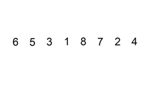

[Contenidos](../Contenidos.md) \| [Próximo (2 Divide y reinarás)](02_Divide_and_Conquer.md)

# 11.1 Ordenamientos sencillos de listas


El problema del ordenamiento es tan fundamental que, a pesar de que Python ya lo hace con su método `sort()` por ejemplo, nos interesa discutirlo. Hay una diversidad de soluciones para ordenar listas. Vamos a empezar viendo las más sencillas de escribir (que en general suelen ser las más caras).

## Ordenamiento por selección
El método de *ordenamiento por selección* se basa en la siguiente idea:


La siguiente animación muestra un algoritmo de ordenamiento por selección (que busca el menor en cada paso, en lugar del mayor):


Una implementación en Python puede verse en el siguiente código.

```python
def ord_seleccion(lista):
    """Ordena una lista de elementos según el método de selección.
       Pre: los elementos de la lista deben ser comparables.
       Post: la lista está ordenada."""

    # posición final del segmento a tratar
    n = len(lista) - 1

    # mientras haya al menos 2 elementos para ordenar
    while n > 0:
        # posición del mayor valor del segmento
        p = buscar_max(lista, 0, n)

        # intercambiar el valor que está en p con el valor que
        # está en la última posición del segmento
        lista[p], lista[n] = lista[n], lista[p]
        print("DEBUG: ", p, n, lista)

        # reducir el segmento en 1
        n = n - 1

def buscar_max(lista, a, b):
    """Devuelve la posición del máximo elemento en un segmento de
       lista de elementos comparables.
       La lista no debe ser vacía.
       a y b son las posiciones inicial y final del segmento"""

    pos_max = a
    for i in range(a + 1, b + 1):
        if lista[i] > lista[pos_max]:
            pos_max = i
    return pos_max
```

La función principal, `ord_seleccion()` es la encargada de recorrer
la lista, ubicando el mayor elemento al final del segmento y luego
reduciendo el segmento a analizar.

La función `buscar_max()` busca el mayor elemento de un segmento de
la lista y devuelve su posición.

A continuación, algunas ejecuciones de prueba de ese código:

```python
>>> lista = [3, 2, -1, 5, 0, 2]
>>> ord_seleccion(lista)
DEBUG:  3 5 [3, 2, -1, 2, 0, 5]
DEBUG:  0 4 [0, 2, -1, 2, 3, 5]
DEBUG:  1 3 [0, 2, -1, 2, 3, 5]
DEBUG:  1 2 [0, -1, 2, 2, 3, 5]
DEBUG:  0 1 [-1, 0, 2, 2, 3, 5]
>>> lista
[-1, 0, 2, 2, 3, 5]
>>> lista = []
>>> ord_seleccion(lista)
>>> l = [1]
>>> ord_seleccion(lista)
>>> lista
[1]
>>> lista = [1, 2, 3, 4, 5]
>>> ord_seleccion(lista)
DEBUG:  4 4 [1, 2, 3, 4, 5]
DEBUG:  3 3 [1, 2, 3, 4, 5]
DEBUG:  2 2 [1, 2, 3, 4, 5]
DEBUG:  1 1 [1, 2, 3, 4, 5]
```


Podés observar que incluso cuando la lista ya está ordenada, se la recorre buscando los mayores elementos y ubicándolos en la misma posición en la que se
encuentran.

### Invariante en el ordenamiento por selección

Todo ordenamiento tiene un invariante que permite asegurarse de que cada
paso que se toma va en la dirección de obtener una lista ordenada.

En el caso del ordenamiento por selección, el invariante es que los
elementos en las posiciones desde `n + 1` hasta el final de la lista están ordenados y son mayores que los elementos ubicados de `0` a `n`; es decir
que ya están en su posición definitiva.

### ¿Cuánto cuesta ordenar por selección?

Como se puede ver en el código de la función `buscar_max`, para
buscar el máximo elemento en un segmento de lista se debe recorrer todo ese
segmento, por lo que en nuestro caso debemos recorrer en el primer paso `N`
elementos, en el segundo paso `N-1` elementos, en el tercer paso `N-2`
elementos, etc. Cada visita a un elemento implica una cantidad constante y
pequeña de comparaciones (que no depende de `N`). Por lo tanto tenemos que

`T(N) ~  c * (2 + 3 + ... + N) ~ c * N * (N+1)/2 ~ N^2`

O sea que ordenar por selección una lista de tamaño `N` insume tiempo del
orden de `N^2`.  Como ya mencionamos, este tiempo es independiente de si la
lista estaba previamente ordenada o no.

En cuanto al espacio utilizado, sólo se tiene en memoria la
lista que se desea ordenar y algunas variables de tamaño 1.

## Ordenamiento por inserción

El método de *ordenamiento por inserción* se basa en la siguiente idea:




Una posible implementación en Python de este algoritmo se incluye en el
siguiente código:

```python
def ord_insercion(lista):
    """Ordena una lista de elementos según el método de inserción.
       Pre: los elementos de la lista deben ser comparables.
       Post: la lista está ordenada."""

    for i in range(len(lista) - 1):
        # Si el elemento de la posición i+1 está desordenado respecto
        # al de la posición i, reubicarlo dentro del segmento [0:i]
        if lista[i + 1] < lista[i]:
            reubicar(lista, i + 1)
        print("DEBUG: ", lista)

def reubicar(lista, p):
    """Reubica al elemento que está en la posición p de la lista
       dentro del segmento [0:p-1].
       Pre: p tiene que ser una posicion válida de lista."""

    v = lista[p]

    # Recorrer el segmento [0:p-1] de derecha a izquierda hasta
    # encontrar la posición j tal que lista[j-1] <= v < lista[j].
    j = p
    while j > 0 and v < lista[j - 1]:
        # Desplazar los elementos hacia la derecha, dejando lugar
        # para insertar el elemento v donde corresponda.
        lista[j] = lista[j - 1]
        j -= 1

    lista[j] = v
```

La función principal, `ord_insercion()`, recorre la lista desde el
segundo elemento hasta el último, y cuando uno de estos elementos no está
ordenado con respecto al anterior, llama a la función auxiliar
`reubicar()`, que se encarga de colocar el elemento en la posición
que le corresponde.

En la función `reubicar()` se busca la posición correcta donde debe
colocarse el elemento, a la vez que se van corriendo todos los elementos un
lugar a la derecha, de modo que cuando se encuentra la posición, el valor a
insertar reemplaza al valor que se encontraba allí anteriormente.

En las siguientes ejecuciones puede verse que funciona correctamente.

```python
>>> lista = [3, 2, -1, 5, 0, 2]
>>> ord_insercion(lista)
DEBUG:  [2, 3, -1, 5, 0, 2]
DEBUG:  [-1, 2, 3, 5, 0, 2]
DEBUG:  [-1, 2, 3, 5, 0, 2]
DEBUG:  [-1, 0, 2, 3, 5, 2]
DEBUG:  [-1, 0, 2, 2, 3, 5]
>>> lista
[-1, 0, 2, 2, 3, 5]
>>> lista = []
>>> ord_insercion(lista)
>>> lista = [1]
>>> ord_insercion(lista)
>>> lista
[1]
>>> lista = [1, 2, 3, 4, 5, 6]
>>> ord_insercion(lista)
DEBUG:  [1, 2, 3, 4, 5, 6]
DEBUG:  [1, 2, 3, 4, 5, 6]
DEBUG:  [1, 2, 3, 4, 5, 6]
DEBUG:  [1, 2, 3, 4, 5, 6]
DEBUG:  [1, 2, 3, 4, 5, 6]
>>> lista
[1, 2, 3, 4, 5, 6]
```

### Invariante del ordenamiento por inserción

En el ordenamiento por inserción, en cada paso se satisface que los
elementos que se encuentran en el segmento de `0` a `i` están ordenados, de
manera que agregar un nuevo elemento implica colocarlo en la posición
correspondiente y el segmento seguirá ordenado.

### ¿Cuánto cuesta ordenar por inserción?

Del código de `ord_insercion()` se puede ver que la función principal avanza por la lista de izquierda a derecha, mientras que la función `reubicar()`
cambia los elementos de lugar de derecha a izquierda.

Lo peor que le puede pasar a un elemento que está en la posición
`j` es que deba ser ubicado al principio de la lista.  Y lo peor que le
puede pasar a una lista es que todos sus elementos deban ser reubicados.

Por ejemplo, en la lista `[10, 8, 6, 2, -2, -5]`, todos los
elementos deben ser reubicados al principio de la lista.

En el primer paso, el segundo elemento se debe intercambiar con el primero;
en el segundo paso, el tercer elemento se compara con el segundo y el
primer elemento, y se ubica adelante de todo; en el tercer paso, el cuarto
elemento se compara con el tercero, el segundo y el primer elemento, y se
ubica adelante de todo; etc...

` T(N) ~  c * (2 + 3 + *s + N) ~ c * N * (N+1)/2 ~ N^2 `

Es decir que ordenar por inserción una lista de tamaño `N` puede insumir
(en el peor caso) tiempo del orden de `N^2` (*O(N^2)*). En cuanto al espacio
utilizado, nuevamente sólo se tiene en memoria la lista que se desea
ordenar y algunas variables de tamaño 1.

### Inserción en una lista ordenada

Resulta interesante observar que cuando la lista de entrada se encuentra
ordenada, este algoritmo no hace ningún movimiento de elementos. Simplemente compara cada elemento con el anterior, y si es mayor sigue
adelante.

Es decir que para el caso de una lista de `N` elementos que se encuentra
ordenada, el tiempo que insume el algoritmo de inserción es:

`T(N) ~ N`.

## Resumen

* El *ordenamiento por selección* es uno de los más sencillos, pero es
bastante ineficiente: se basa en la idea de *buscar el máximo* en una secuencia, ubicarlo al final y seguir analizando la secuencia sin el último elemento.

Tiene como ventaja que hace una baja cantidad de intercambios (`N`), pero
como desventaja que necesita una alta cantidad de comparaciones (`N^2`).
Siempre tiene el mismo comportamiento.

* El *ordenamiento por inserción* es un algoritmo bastante intuitivo y se
suele usar para ordenar en la vida real. Se basa en la idea de ir *insertando
ordenadamente*: en cada paso se considera la inserción de un elemento más de
secuencia y la inserción se empieza a hacer desde el final de los datos ya
ordenados.

Tiene como ventaja que en el caso de tener los datos ya ordenados no hace
ningún intercambio (y hace sólo `N-1` comparaciones). En el peor caso, cuando
la secuencia está invertida, se hace una gran cantidad de intercambios y
comparaciones (`N^2`). Si bien es un algoritmo ineficiente, para secuencias
cortas el tiempo de ejecución es bastante bueno.

## Ejercicios

### Ejercicio 11.1: 
Describí los pasos del ordenamiento de la lista `[0, 9, 3, 8, 5, 3, 2, 4]`
con los algoritmos de inserción y selección.

### Ejercicio 11.2: burbujeo


El ordenamiento por burbujeo se basa en una idea bastante sencilla. El algoritmo compara dos elementos contiguos de la lista y, si el orden es adecuado, los deja como están, si no, los intercambia. La repetición de este *paso elemental* (una burbuja) a lo largo de la lista (recorriéndola desde el comienzo hasta el final) garantiza llevar el mayor elemento al final de la lista, pero no garantiza que el menor elemento haya quedado en el primer lugar. De hecho, el menor elemento solo se mueve un paso hacia la izquierda en una recorrida completa de la lista. Es por esto que estas recorridas se repiten sucesivas veces (¿cuántas hace falta?) de manera de garantizar que el lista quede completamente ordenada. 

Como en el primer paso tenemos la garantía de que el mayor elemento quedó al final de la lista, la segunda recorrida puede evitar llegar hasta esa última posición. Así, cada recorrida es más corta que la anterior. En cada recorrida se comparan todos los pares de elementos sucesivos (en el rango correspondiente) y se intercambian si no están ordenados.

Programá una función `ord_burbujeo(lista)` que implemente este método de ordenamiento. ¿Cuántas comparaciones realiza esta función en una lista de largo n?

Probá tu código con las siguientes listas.

```python
lista_1 = [1, 2, -3, 8, 1, 5]
lista_2 = [1, 2, 3, 4, 5]
lista_3 = [0, 9, 3, 8, 5, 3, 2, 4]
lista_4 = [10, 8, 6, 2, -2, -5]
lista_5 = [2, 5, 1, 0]
```

Guardá tu solución en el archivo `burbujeo.py` comentando la complejidad del algoritmo y cómo la calculaste.

_Extra:_ ¿Podés escribir una versión recursiva de este algoritmo?

### Ejercicio 11.3: ordernar a mano
Elegí dos listas de las 5 del ejercicio anterior y ordenalas a mano (con papel y lápiz) con los 3 métodos: selección, inserción y burbujeo.

### Ejercicio 11.4: experimento con 3 métodos
Hacé una función `generar_lista(N)` que genere una lista aleatoria de largo N con números enteros del 1 al 1000 (puede haber repeticiones).

Modificá el código de las tres funciones para que cuenten cuántas comparaciones entre elementos de la lista realiza cada una. Por ejemplo, `ord_seleccion` realiza comparaciones (entre elementos de la lista) sólo cuando llama a `buscar_max(lista, a, b)` y en ese caso realiza `b-a` comparaciones. 

Realizá un experimento que genere una lista de largo `N` y la ordene con los tres métodos (burbujeo, inserción y selección).

Para N = 10, realizá k = 100 repeticiones del siguiente experimento. Generar una lista de largo `N`, ordenarlas con los tres métodos y guardar la cantidad de operaciones. Al final, debe imprimir el promedio de comparaciones realizado por cada método.

_Cuidado_: usá las mismas listas para los tres métodos así la compración es justa.


### Ejercicio 11.5: comparar métodos gráficamente
Vamos a tratar de comparar visualmente la cantidad de comparaciones que hacen estos algoritmos para diferentes largos de listas. Hacé un programa `comparaciones_ordenamiento.py` que para `N` entre 1 y 256 genere una lista de largo `N` con números enteros del 1 al 1000, calcule la cantidad de comparaciones realizadas por cada método y guarde estos resultados en tres vectores de largo 256: `comparaciones_seleccion`, `comparaciones_insercion` y `comparaciones_burbujeo`. 

Graficá estos tres vectores. Si las curvas se superponen, graficá una de ellas con línea punteada para poder verlas bien. ¿Cómo dirías que crece la complejidad de estos métodos? ¿Para cuáles depende de la lista a ordenar y para cuáles solamente depende del largo de la lista?

Guardá `comparaciones_ordenamiento.py` para seguir trabajando sobre él y para entregarlo.

¿Se te ocurre un algoritmo de ordenamiento que sea sustancialmente mejor que estos? Ese será el tema de la próxima sección.

_Extra:_ ¿Las curvas de complejidad quedaron suaves? ¿Se te ocurre cómo hacer para suavizarlas?

[Contenidos](../Contenidos.md) \| [Próximo (2 Divide y reinarás)](02_Divide_and_Conquer.md)

