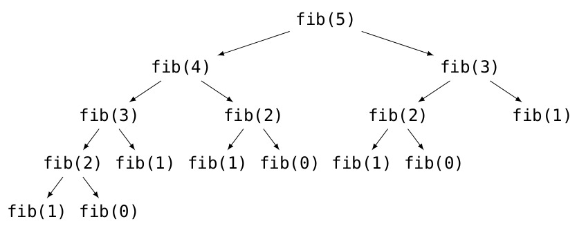

[Contenidos](../Contenidos.md) \| [Próximo (2 Recursión)](02_EjerciciosRec.md)

# 11.1 Intro a la Recursión


## La recursión y cómo puede ser que funcione

Estamos acostumbrados a escribir funciones que llaman a otras funciones.
Pero lo cierto es que nada impide que en Python (y en muchos otros
lenguajes) una función se llame a sí misma. Y lo más interesante es que
esta propiedad, que se llama *recursión*, permite en muchos casos
encontrar soluciones muy elegantes para determinados problemas.

En materias de matemática se estudian los razonamientos por inducción para
probar propiedades de números enteros, la recursión no es más que una
generalización de la inducción a más estructuras: las listas, las cadenas
de caracteres, las funciones, etc.


A continuación estudiaremos diversas situaciones en las cuales aparece la
recursión, veremos cómo es que esto puede funcionar, algunas situaciones en
las que es conveniente utilizarla y otras situaciones en las que no.


## Una función recursiva matemática

Es muy común tener definiciones inductivas de operaciones, como por ejemplo:

```
0! = 1 \\
x! = x*(x-1)! si x>0
```

Este tipo de definición se traduce naturalmente en una función en Python:

```python
def factorial(n):
    """Precondición: n entero >= 0
       Devuelve: n`"""
    if n == 0:
        return 1
    return n * factorial(n - 1)
```

Esta es la ejecución del factorial para `n = 0` y para `n = 3`.

```python
>>> factorial(0)
1
>>> factorial(3)
6
```

El sentido de la instrucción
`n * factorial(n - 1)` es exactamente el mismo que el de la
definición inductiva: para calcular el factorial de `n` se debe multiplicar
`n` por el factorial de `n-1`.

Dos piezas fundamentales para garantizar el funcionamiento de este programa
son:

* Que se defina un *caso base* (en este caso la indicación *no recursiva* de cómo calcular `factorial(0)`).
* Que el argumento de la función respete la precondición de que `n` debe ser un entero mayor o igual que 0.


No es increible que esto pueda funcionar adecuadamente en un lenguaje
de programación.


### Ejercicio 11.1: 
Para poder analizar qué sucede a cada paso de la ejecución de la función,
utilizaremos una versión más detallada del mismo código, en la que el resultado
de cada paso se asigna a una variable.

```python
def factorial(n):
    if n == 0:
        r = 1
        return r

    f = factorial(n-1)
    r = n * f
    return r
```

Esta porción de código funciona exactamente igual que la anterior, pero nos
permite ponerles nombres a los resultados intermedios de cada operación
para poder estudiar qué sucede a cada paso. Analizá con tu debugger la ejecución de `factorial(3)`.


## Algoritmos recursivos y algoritmos iterativos*

Llamaremos *algoritmos recursivos* a aquellos que realizan llamadas
recursivas para llegar al resultado, y *algoritmos iterativos* a
aquellos que llegan a un resultado a través de una iteración mediante un
ciclo definido o indefinido.

Todo algoritmo recursivo puede expresarse como iterativo y viceversa.  Sin
embargo, según las condiciones del problema a resolver podrá ser preferible
utilizar la solución recursiva o la iterativa.

Una posible implementación iterativa de la función `factorial`
vista anteriormente sería:

```python
def factorial(n):
    """Precondición: n entero >= 0
       Devuelve: n`"""
    fact = 1
    for num in range(n, 1, -1):
        fact *= num
    return fact
```

Se puede ver que en este caso no es necesario incluir un caso base, ya que
el mismo ciclo incluye una condición de corte, pero que sí es necesario
incluir un acumulador, que en el caso recursivo no era necesario.

Por otro lado, si hiciéramos el seguimiento de esta función, como se hizo
para la versión recursiva, veríamos que la pila de ejecución siempre tiene un
único marco, en el cual se van modificando los valores de `num` y
`fact`.

Es por esto que, en general, las versiones recursivas de los algoritmos
utilizan más memoria (ya que la pila de ejecución se guarda en
memoria) pero suelen ser más elegantes.

## Un ejemplo de recursión elegante*

Consideremos ahora otro problema que puede ser resuelto de forma elegante
mediante un algoritmo recursivo.

La función `potencia(b, n)`, vista en unidades anteriores,
realizaba `n` iteraciones para poder obtener el valor de `b^n`.
Sin embargo, es posible optimizarla teniendo en cuenta que:

```
b^n = b^(n/2) * b^(n/2)                si n es par, y
b^n = b^((n-1)/2) * b^((n-1)/2) * b    si n es impar.
```

Antes de programar cualquier función recursiva es necesario decidir cuál
será el *caso base* y cuál el *caso recursivo*.  Para esta función,
tomaremos `n=0` como el caso base, en el que devolveremos `1`; y el caso
recursivo tendrá dos partes, correspondientes a los dos posibles grupos de
valores de `n`.

```python
def potencia(b,n):
    """Precondición: n >= 0
       Devuelve: b^n."""

    if n <= 0:
        # caso base
        return 1

    if n % 2 == 0:
        # caso n par
        p = potencia(b, n // 2)
        return p * p
    else:
        # caso n impar
        p = potencia(b, (n - 1) // 2)
        return p * p * b
```

El uso de la variable `p` en este caso no es optativo, ya que
es una de las ventajas principales de esta implementación: se aprovecha el
resultado calculado en lugar de tener que calcularlo dos veces. Vemos que
este código funciona correctamente:

```python
>>> potencia(2, 10)
1024
>>> potencia(3, 3)
27
>>> potencia(5, 0)
1
```

El orden de las llamadas, haciendo un seguimiento simplificado de la
función será:

```
potencia(2, 10)
  potencia(2, 5)
    potencia(2, 2)
      potencia(2, 1)
        potencia(2, 0)
          return 1
        return 1 * 1 * 2
      return 2 * 2
    return 4 * 4 * 2
  return 32 * 32
return 1024
```

Se puede ver, entonces, que para calcular `2^10` se realizaron 5 llamadas a
`potencia`, mientras que en la implementación más sencilla se
realizaban 10 iteraciones. Y esta optimización será cada vez más importante
a medida que aumenta `n`: por ejemplo para `n = 100` se
realizarán 8 llamadas recursivas, y para `n = 1000` 11 llamadas.

Es posible transformar este algoritmo recursivo en un algoritmo iterativo. Para ello es necesario *simular* la pila de llamadas a funciones mediante una pila que almacene los valores que sean necesarios.  En este caso, lo que apilaremos será si el valor de `n` es par o no.

```python
def potencia(b, n):
    """Precondición: n >= 0
       Devuelve: b^n."""

    pila = []
    while n > 0:
        if n % 2 == 0:
            pila.append(True)
            n //= 2
        else:
            pila.append(False)
            n = (n - 1) // 2

    p = 1
    while pila:
        es_par = pila.pop()
        if es_par:
            p *= p
        else:
            p *= p * b

    return p
```

Como se puede ver, este código es mucho más complejo que la versión recursiva.
Esto se debe a que utilizando recursión el uso de la pila de llamadas a
funciones oculta el proceso de apilado y desapilado y permite concentrarse
en la parte importante del algoritmo.

## Un ejemplo de recursión poco eficiente

Del ejemplo anterior se podría deducir que siempre es mejor utilizar algoritmos
recursivos; sin embargo ---como ya se dijo--- cada situación debe ser analizada por separado.

Un ejemplo clásico en el cual la recursión tiene un resultado muy poco
eficiente es el de los números de Fibonacci.  La sucesión de Fibonacci está
definida por la siguiente relación:

```
F(0) = 0
F(1) = 1
F(n) = F(n - 1) + F(n - 2)  si n > 1
```

Los primeros números de esta sucesión son: `0`, `1`, `1`, `2`, `3`, `5`, `8`,
`13`, `21`, `34`, `55`.

Dada la definición recursiva de la sucesión, puede resultar muy tentador
escribir una función que calcule en valor de `fib(n)` de la siguiente
forma:

```python
def fib(n):
    """Precondición: n >= 0.
       Devuelve: el número de Fibonacci número n."""
    if n == 0 or n == 1:
        return 1
    return fib(n - 1) + fib(n - 2)
```

Si bien esta implementación es muy sencilla y elegante, también es extremadamente poco eficiente: para calcular `fib(n - 1)` es necesario calcular
`fib(n - 2)`, que luego volverá a ser calculado para obtener el valor
`fib(n)`.

Por ejemplo, una simple llamada a `fib(5)`, generaría
recursivamente todas las llamadas ilustradas en el siguiente gráfico. Puede verse que muchas de estas llamadas están repetidas, generando un
total de 15 llamadas a la función `fib`, sólo para devolver el
valor `F(5)`.




En este caso, será mucho más conveniente utilizar una versión iterativa,
que vaya almacenando los valores de las dos variables anteriores a medida
que los va calculando.

```python
def fib(n):
    """Precondición: n >= 0.
       Devuelve: el número de Fibonacci número n."""
    if n == 0 or n == 1:
        return n
    ant2 = 0
    ant1 = 1
    for i in range(2, n + 1):
        fibn = ant1 + ant2
        ant2 = ant1
        ant1 = fibn
    return fibn
```

Vemos que el caso base es el mismo para ambos algoritmos, pero que en el
caso iterativo se calcula el número de Fibonacci de forma incremental, de
modo que para obtener el valor de `fib(n)` se harán `n-1`
iteraciones.

_Observación_: En definitiva, vemos que un algoritmo recursivo **no** es necesariamente mejor que uno iterativo, ni viceversa. En cada situación será conveniente analizar cuál algoritmo provee la solución al problema de forma más clara y eficiente. 


## Diseño de algoritmos recursivos

Hasta el momento vimos que hay muchas funciones matemáticas que se definen
o que pueden desarrollarse de forma recursiva, pero puede aplicarse recursividad a muchos problemas que no sean explicitamente recursivos. Diseñar un algoritmo recursivo es un proceso sistematizable.

En general en el proceso para plantear un algoritmo recursivo necesitamos
resolver estos tres problemas:

1. **Caso base:** Necesitamos definir uno o más casos bases de acuerdo a
nuestro problema. Como regla general tratamos de pensar como caso base a
las condiciones sobre las cuales es más fácil resolver nuestro problema.
Por ejemplo, si estruviéramos trabajando sobre listas o cadenas probablemente
sepamos la respuesta a nuestro problema si tuviéramos una secuencia vacía,
o si estuviéramos trabajando sobre conjuntos de elementos probablemente la
respuesta fuera evidente cuando tengamos un solo elemento.
2. **Caso recursivo** o caso general: Este es el caso que va a efectuar
la llamada recursiva. La idea de este caso es reducir el problema a un
problema más sencillo, del cual se hará cargo la llamada recursiva, y luego
poder ensamblar la solución al problema original. Ampliaremos esto más adelante.
3. **Convergencia:** Necesitamos que la reducción que se haga en el caso
recursivo converja hacia los casos bases, de modo que la recursión alguna
vez termine. Esto es, si dijimos que el caso base se resolvía cuando teníamos
una lista vacía, las operaciones del caso recursivo tienen que reducir
reiteradamente la lista hasta que la misma quede vacía.

Si podemos hacer estas tres cosas, tendremos un algoritmo recursivo para
nuestro problema.

## Un primer diseño recursivo

Supongamos que queremos programar una función `sumar(lista)` que
determine en forma recursiva la suma de una secuencia `lista` de
números.

Como caso base debemos elegir un caso sencillo de verificar. El caso más
sencillo de verificar es uno en el que ni siquiera necesitamos
computar algo: Si la lista está vacía es evidente que la suma da cero.

Nuestro caso base será algo así como:

```python
    if len(lista) == 0:
        return 0
```

Queremos converger a que dada cualquier lista de la reducción de nuestro
problema terminemos en el caso base. Hay muchas maneras de reducir una lista
para terminar teniendo cero elementos pero para este caso vamos a proponer la
más fácil: si cada llamada recursiva saca un elemento, tarde o temprano
covergeremos a una lista vacía.

Nuestra llamada recursiva podría ser algo así como:

```python
sumar(lista[1:])
```

Lo más complejo ahora es pensar el caso general.

Dijimos que íbamos a retirar un elemento de la lista por vez y hacer una
llamada recursiva. Olvidémonos por un momento de la recursividad e imaginemos
que *ya* tenemos una función `sumar2` que sabe sumar los elementos de una
`lista` y que lo hace bien.  Intentemos resolver el problema inverso: si
agregamos un elemento `x` al principio de la lista (obteniendo `[x] + lista`),
¿podemos calcular la suma de la nueva lista?  ¿Podemos resolver el problema más
grande con la solución al problema más pequeño? La solución es sencilla: La
suma de la lista ampliada será `x` más la suma de la lista original (que podemos calcular como `sumar2(lista)`).

Es decir, la solución al problema este que planteamos sería así:
```python
def sumar(lista):
   """Precondición: len(lista) >= 1.
      Devuelve: La suma de los elementos en la lista."""
   return lista[0] + sumar2(lista[1:])
```

Podemos ver que si tuviéramos implementada `sumar2` entonces
`sumar` funcionaría bien. Volvamos ahora a recursividad: Si sabemos
resolver el caso general en función a la solución del caso simplificado de la
llamada recursiva, si existen casos bases que cortan la recursión y si además
la recursión converge hacia los casos bases tenemos resuelto el problema
completo. La función que asumimos que funcionaba *es la misma* que
acabamos de implementar.

Cuando diseñamos una función recursiva tenemos que dar este *salto de fé*:
asumir que la función del paso recursivo ya funciona; nosotros lo que vamos a implementar es una función que logra concatenar el resultado del subproblema y ensamblarlo con nuestro problema mayor. Si hacemos esto bien entonces todo funciona.

Finalmente nuestra primera función recursiva quedaría:
```python
def sumar(lista):
   """Devuelve la suma de los elementos en la lista."""
   if len(lista) == 0:
       return 0
   return lista[0] + sumar(lista[1:])
```

## Pasaje de la información

Dentro de los problemas recursivos no siempre es inmediato establecer cómo
se va a propagar la información entre las llamadas recursivas, es decir, la
reducción de la solución de los subproblemas en la solución del problema
general.

En todos los ejemplos presentados hasta el momento la información del resultado
se propagó desde las hojas del árbol de llamadas (los casos bases) hacia las
funciones invocantes (mediante la instrucción `return`). Por ejemplo, para
resolver el resultado de Fibonacci `F(5)` se utilizan únicamente los resultados
computados por `F(4)` y `F(3)`, y no se recibe ningún dato adicional de la función invocante (más allá del parámetro `n=5`).
Esto no siempre es así, en algunos problemas sí se hace necesario propagar
información "hacia abajo". Y en otros casos, si bien no es necesario,
puede tener ventajas adicionales.

Por ejemplo, podríamos reescribir la función `sumar()` de esta forma:
```python
def sumar(lista, suma=0):
    """Devuelve la suma de los elementos en la lista."""
    if len(lista) == 0:
        return suma
    return sumar(lista[1:], lista[0] + suma)
```

Puede observarse que en esta implementación en vez de *esperar* a que se
resuelva el cómputo de la parte recursiva para ensamblar la solución e ir
resolviendo los cálculos parciales desde el final de la lista hacia el
principio, le *pasamos* la solución parcial a la llamada recursiva.
Finalmente el caso base devuelve la suma de los cálculos que se realizaron
de principio a final y cada llamada recursiva devuelve este resultado.

No profundizaremos más en el tema, pero la particularidad de que lo último
que se realice en el caso general sea la llamada recursiva (sin realizar
ninguna operación adicional sobre el resultado de esta llamada) se conoce como
*recursividad de cola*. La recursividad de cola es de interés porque
implica muy poco esfuerzo reescribir una versión iterativa y no recursiva
del algoritmo. Esto es inmediato: como lo último que se hace es la llamada
recursiva entonces no hace falta seguir *recordando* el contexto de la
llamada anterior cuando se hace la siguiente, entonces no es necesario utilizar
la pila de ejecución. El código anterior puede reescribirse como

```python
def sumar(lista):
    """Devuelve la suma de los elementos en la lista."""
    suma = 0
    while True:
        if len(lista) == 0:
            return suma
        lista, suma = lista[1:], lista[0] + suma
```

tan solo reemplazando la recursión por un bucle y actualizando las
variables según los parámetros de la llamada recursiva.

## Modificación de la firma

La *firma* de una función es su nombre, más los
parámetros que recibe, más los valores que devuelve. Para invocar una función
cualquiera, es suficiente con saber cómo es su firma, y no es necesario saber
cómo es la implementación interna. Ahora bien, si cambiamos la lista
de parámetros o el tipo de dato del valor de retorno de la función, estamos
cambiando su firma, y eso nos obliga a cambiar cualquier lugar del código
que contenga alguna llamada a la función.

En el ejemplo de `sumar` implementada con recursividad de cola nos
vimos obligados a modificar la firma de la función agregando el parámetro
`suma` que no formaba parte del problema inicial. Pudimos hacerlo
elegantemente utilizando un valor por omisión (`suma=0`), pero la firma de
todos modos quedó confusa.

Hay casos en los que no podemos salvar un cambio en la firma.  Por ejemplo,
supongamos que queremos diseñar una función recursiva que calcule el promedio
de una secuencia de números.

Como ya sabemos diseñar funciones recursivas intuimos que el caso base será
cuando la lista esté vacía y que la reduciremos sacando de a un elemento por
vez. El cuerpo de nuestra función será algo así:
```python
def promediar(lista):
    if len(lista) == 0:
        return ???
    promediar(lista[1:]) ???
```
Ahora bien, con esto no alcanza para resolver el problema.

Para calcular un promedio necesitamos computar tanto una suma como contar
la cantidad de elementos. Las funciones van a estar computando dos valores
cuando el resultado del problema es evidentemente uno solo. Si bien puede
elaborarse una solución similar a la que ya ensayamos con `sumar`
complicaría innecesariamente el código. Es preferible modificar la firma
de la función.

Implementemos el problema resolviendo primero la llamada recursiva (en una
función diferente que llamaremos `_promediar()`) y luego ensamblando:

```python
def _promediar(lista):
    if len(lista) == 0:
        return 0, 0
    suma, cantidad = _promediar(lista[1:])
    return lista[0] + suma, cantidad + 1
```
Puede verse que esta función cumple con las reglas de diseño de recursividad
que describimos antes. Con lo que no cumple esta función es con la firma
natural de la función `promediar()` que queríamos diseñar, ya que `_promediar()` devuelve dos cosas y no una.

Esto no invalida nuestra solución, pero la misma está incompleta. Lo que
debemos hacer es implementar una función *wrapper* (envoltorio) que lo
que haga es operar como *cara visible* para el usuario de la función que
hace realmente el trabajo. A esta función sí la vamos a llamar `promediar`, ya
que va a cumplir con la firma deseada:

```python
def promediar(lista):
   """Devuelve el promedio de los elementos de una lista de números."""
   suma, cantidad = _promediar(lista)
   return suma / cantidad
```

Notar que si bien la función visible `promediar` no es recursiva, sí lo
es la función `_promediar` que es la que realiza el trabajo, por
lo que el conjunto se considera recursivo.

Además de para adaptar la firma de la función recursiva, las funciones wrapper
se suelen utilizar para simplificar el código de las funciones recursivas. Por
ejemplo, si quisiéramos hacer validaciones de los parámetros, no
querríamos que las mismas se reiteraran en cada iteración recursiva porque
consumirían recursos innecesarios. Entonces las podemos resolver en la función
wrapper, antes de empezar la recursión.

Por ejemplo, en la sección~\ref{recursion_potencia* implementamos la potencia
en forma recursiva con la restricción `n \geq 0`. Pero dado que `b^n = (1/b)^(-n)` podemos aprovechar el código implementado para
resolver para cualquier `n` entero. Podríamos modificar el código de `potencia()` para incluir este caso, pero se reiteraría la comprobación en cada recursión. Para un caso así sería más sencillo construir una función wrapper
e incluir ahí todo lo que consideremos necesario.
Habiendo renombrado la función original como `_potencia`, nuestro wrapper sería:

```python
def potencia(b, n):
    """Precondición: n es entero
       Devuelve: b^n."""
    if n < 0:
        b = 1 / b
        n = -n
    return _potencia(b, n)
```

## Limitaciones

Si creamos una función sin *caso base*, obtendremos el equivalente
recursivo de un bucle infinito.  Sin embargo, como cada llamada recursiva
agrega un elemento a la pila de llamadas a funciones y la memoria de
nuestras computadoras no es infinita, el ciclo deberá terminarse cuando se
agote la memoria disponible.

En particular, en Python, para evitar que la memoria se termine, la pila de
ejecución de funciones tiene un límite. Es decir, que si se ejecuta un
código como el que sigue:

```python
def inutil(n):
    return inutil(n - 1)
```

Se obtendrá un resultado como el siguiente:

```python
>>> inutil(1)
  File "<stdin>", line 2, in inutil
  File "<stdin>", line 2, in inutil
  (...)
  File "<stdin>", line 2, in inutil
RecursionError: maximum recursion depth exceeded
```

El límite por omisión es de 1000 llamadas recursivas. Es posible modificar
el tamaño máximo de la pila de recursión mediante la instrucción
`sys.setrecursionlimit(n)`.  Sin embargo, si se está alcanzando
este límite suele ser una buena idea pensar si realmente el algoritmo
recursivo es el que mejor resuelve el problema.

### Sabías que
Existen algunos lenguajes *funcionales*, como Haskell, ML, o Scheme, en
los cuales la recursión es la única forma de realizar un ciclo.  Es
decir, no existen construcciones `while` ni `for`.

Estos lenguajes cuentan con optimización de recursión de cola,
una optimización para que cuando se identifique que la recursión es de cola,
no se apile el estado de la función
innecesariamente, evitando el consumo adicional de memoria mencionado
anteriormente.

La ejecución de todas las funciones con recursión de cola vistas en esta
unidad podrían ser optimizada por el compilador o intérprete del lenguaje.
\end{sabias_que*

## Resumen*


* A medida que se realizan llamadas a funciones, el estado cada
función se almacena en la *pila de ejecución*.
* Esto permite que sea posible que una función se llame a sí misma,
pero que las variables dentro de la función tomen distintos valores.
* La *recursión* es el proceso en el cual una función se invoca a
sí misma.  Este proceso permite crear un nuevo tipo de ciclos.
* Siempre que se escribe una función recursiva es importante considerar
el *caso base* (el que detendrá la recursión) y el *caso
recursivo* (el que realizará la llamada recursiva).  Una función recursiva
sin caso base es equivalente a un bucle infinito.
* Una función no es mejor ni peor por ser recursiva.  En cada situación
a resolver puede ser conveniente utilizar una solución recursiva o una
iterativa.  Para elegir una o la otra será necesario analizar las
características de elegancia y eficiencia.
* Al diseñar funciones recursivas muchas veces puede ser útil
implementar una función *wrapper*, por ejemplo para adaptar
la firma de la función, validar parámetros, inicializar datos o manejar excepciones.


[Contenidos](../Contenidos.md) \| [Próximo (2 Recursión)](02_EjerciciosRec.md)

